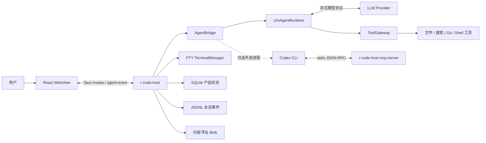
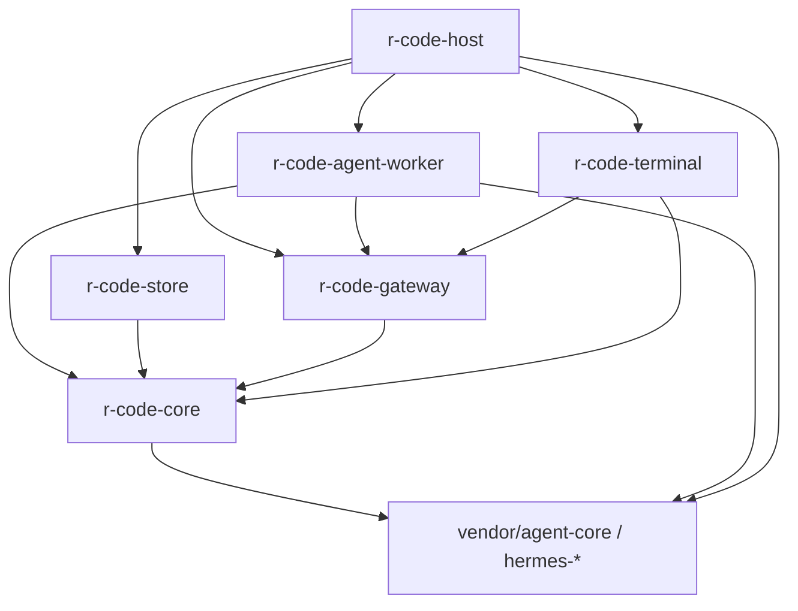
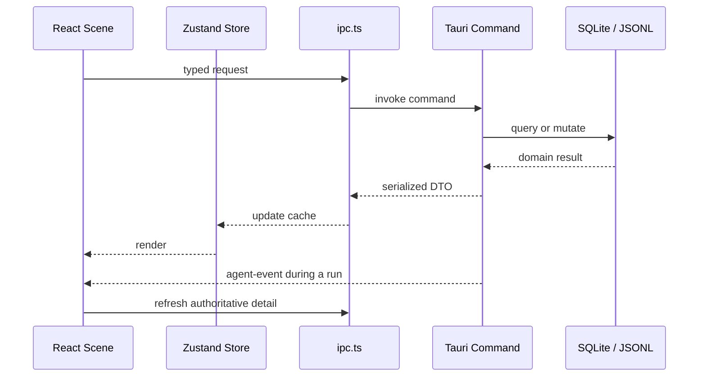
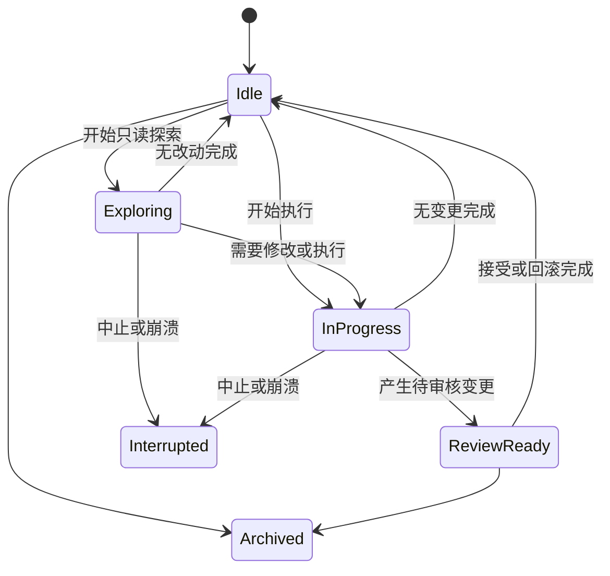
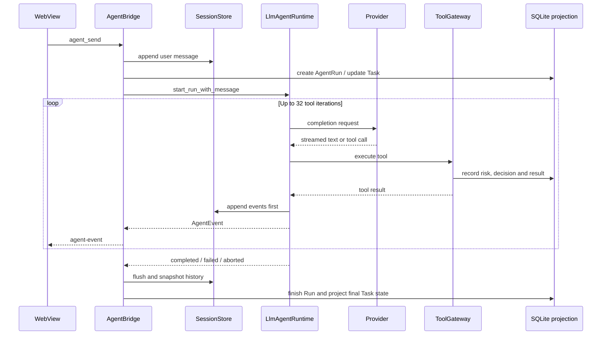
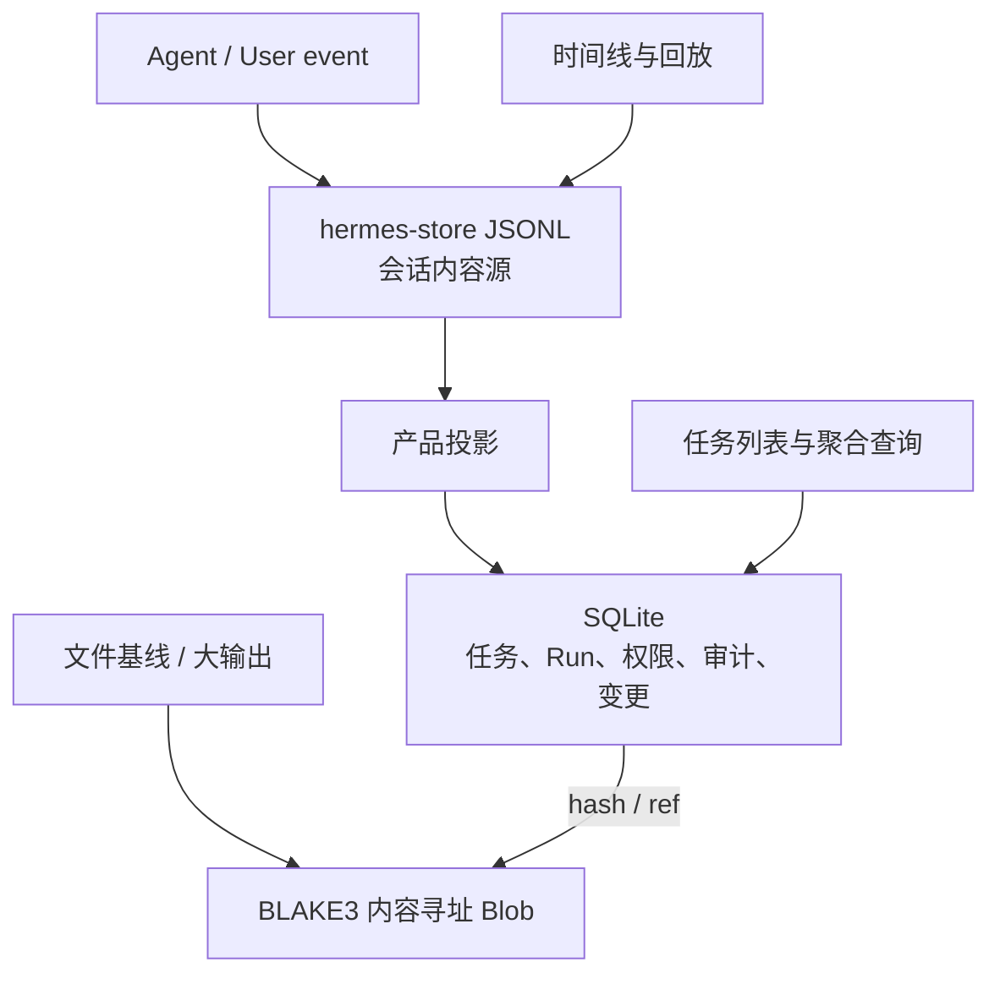
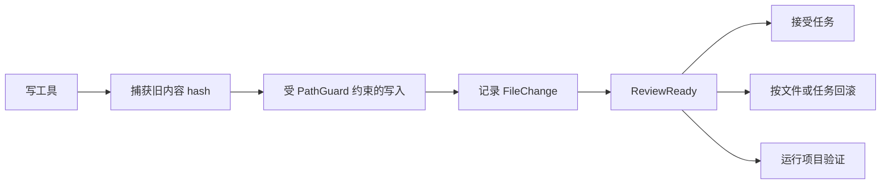

# R-Code 架构与实现细节

本文描述当前代码的实际结构，而不是历史设计目标。它面向维护者、评审者和需要扩展 R-Code 的开发者；发布操作另见 [RELEASING.md](./RELEASING.md)。

## 1. 系统概览

R-Code 是一个 session-first 的 AI 编程桌面应用。核心原则是：对话是长期会话，模型执行是可审计的 Run，本地改动必须经过统一工具边界，用户可以在任务、分支、变更、验证和回放之间追溯完整因果链。

正常桌面模式下，Host、原生 Agent runtime、Tool Gateway 和存储服务是同一 Rust 进程内的逻辑模块；React 运行在 Tauri WebView 中。Codex CLI、Codex MCP stdio server 等外部集成才会创建额外进程。因此，不应再把当前实现描述为固定的“Host / Worker / Renderer 三独立进程”。



### 1.1 运行边界

| 边界 | 实现 | 说明 |
| --- | --- | --- |
| 桌面 Host | `src-tauri/src/main.rs`、`tauri_commands.rs` | 进程入口、窗口、插件、命令注册、事件出口和系统集成 |
| 应用服务 | `src-tauri/src/commands.rs` 及同目录模块 | 任务编排、Provider、Codex、MCP、恢复、搜索、设置等产品逻辑 |
| 原生 Agent | `crates/r-code-agent-worker/` | 多轮模型循环、Steer、子智能体、质量复核 |
| 工具安全边界 | `crates/r-code-gateway/` | 工具注册、路径绑定、风险分类、权限等待、审计 |
| 产品存储 | `crates/r-code-store/` | SQLite、变更基线、Blob、Git、验证、审核和备份 |
| 终端 | `crates/r-code-terminal/` | PTY、OSC 133、增量输出、外部 CLI transcript |
| 产品 DTO 与安全 | `crates/r-code-core/` | 状态机、请求/响应类型、密钥、路径边界 |
| 公共合同 | `vendor/agent-core/` | `hermes-*` 会话、模型、配置、IPC、MCP 与 Tauri 合同；Git 子模块 |
| Renderer | `src-tauri/frontend/` | React 场景、Zustand 状态、typed IPC、流式时间线与工作台 |

## 2. 启动与运行模式

### 2.1 桌面模式

`r-code-host` 不带 `mcp-server` 参数时进入 Tauri 桌面模式：

1. 初始化结构化日志和内存日志缓冲。
2. 注册 updater、dialog 插件并创建 WebView。
3. 在应用数据目录创建 `r-code/{db,blobs,sessions,config}`。
4. 尝试把旧 `config.toml` 中的 Provider 明文密钥迁移到操作系统凭据库。
5. 打开 `db/r-code.db` 并执行 SQLite migration，目前 schema 版本为 13。
6. 创建 `CommandState`，装配 SessionStore、PermissionEngine、TerminalManager、ToolGateway 和 AgentBridge。
7. 把 Agent 事件出口绑定为 Tauri 的 `agent-event`，供 WebView 增量消费。
8. 启用真实 Provider runtime；没有有效配置时，发送消息会返回可见错误。
9. 后台启动兼容性 `hermes_ipc::IpcServer`。它当前使用内存数据库，只注册 `ping` 和 `task.create`，不是桌面主数据通路。

应用数据目录由 Tauri 的 `app_data_dir` 决定，而不是仓库目录。卸载、备份或问题排查时要区分用户数据与工作区源代码。

### 2.2 MCP stdio 模式

以下命令会在日志初始化前切换到纯 stdio MCP server：

```text
r-code-host mcp-server [--data-dir <path>]
```

该顺序是协议不变量：stdout 上任何普通日志都可能破坏 JSON-RPC。这个模式主要由 Codex 配置和拉起，入口位于 `src-tauri/src/mcp_server.rs`。

## 3. Rust workspace 分层

### 3.1 依赖方向



产品 crate 通过根 `Cargo.toml` 的 workspace dependencies 共享版本和依赖。`vendor/agent-core` 是构建必需子模块；`.agents` 只提供仓库内开发技能，不进入产品构建。

### 3.2 `CommandState`

`CommandState` 是 Tauri command 的共享依赖容器，主要持有：

- SQLite `Database`、数据库路径、Blob 和 Session 目录；
- `SessionStore`，负责 JSONL 会话事件；
- `PermissionEngine` 和统一 `ToolGateway`；
- `TerminalManager`；
- Provider 配置目录和当前项目根；
- `AgentBridge`，维护任务到 runtime session、活动分支和存储 ID 的映射；
- 外部 Agent、Codex MCP 连接和启动恢复状态；
- 向 WebView 发送 `agent-event` 的回调。

初始化时注册的模型工具包括 `read_file`、`list_files`、`search`、`glob`、`git_status`、`load_skill`、`edit`、`apply_patch`、`create_file`、`delete_file` 和 `bash`。所有调用都必须走 Gateway；直接在 Agent loop 中访问文件系统会绕过路径、审批和审计不变量。

## 4. Renderer 与 Host 通信

前端不直接持有数据库或文件句柄。`src-tauri/frontend/src/lib/ipc.ts` 为 Tauri commands 提供 typed wrapper，参数使用 Tauri v2 的 camelCase 约定；Rust 侧 wrapper 位于 `src-tauri/src/tauri_commands.rs`，业务实现位于 `commands.rs`。



前端状态分为两类：

- `store/app.ts`：纯 UI 状态，如 scene、当前 Room、工作台 tab、主题、缩放和搜索。
- `store/tasks.ts`：任务、详情、工作区、仪表盘和活动流缓存；权威数据仍在 Host。

运行中的文本和工具事件通过 `agent-event` 低延迟推送；任务状态、权限、审核等权威聚合通过 IPC 重新拉取。`usePoll` 只在窗口可见且聚焦时运行，并防止重入；Room、Deck、Dashboard 等场景按各自节奏补偿丢失事件或后台变化。浏览器原型环境可切换到 `browser-mock-runtime.ts`，但正式构建使用 Tauri IPC。

## 5. 任务、会话与 Run 模型

### 5.1 主要实体

| 实体 | 作用 | 主要存储 |
| --- | --- | --- |
| `Task` | 用户可见工作单元，关联工作区、Provider、模型和状态 | SQLite `tasks` |
| `SessionBranch` | 会话分支；重发、编辑历史或 fork 时创建 | SQLite 元数据 + 独立 JSONL storage ID |
| `AgentRun` | 一次主 Agent 或子智能体执行 | SQLite `agent_runs` |
| `TaskEvent` | 产品活动投影，如启动、完成、审核 | SQLite `task_events` |
| `SessionEvent` | 完整消息、流式文本、工具和生命周期事件 | JSONL SessionStore |
| `QueuedMessage` | 不能立即执行的用户消息 | SQLite `queued_messages` |
| `PermissionRequest` | 等待用户决定的工具调用 | 内存等待器 + SQLite 投影 |
| `ToolCall` | 工具输入、风险、状态、摘要和耗时 | SQLite `tool_calls` |
| `FileBaseline` / `FileChange` | 写入前基线与变更结果 | SQLite + Blob |
| `Verification` | 测试/验证命令及输出引用 | SQLite + Blob |

### 5.2 任务状态

常规主路径是：



Run 与 Task 状态不同：一个 Task 可以包含多个主 Run 和子 Run，也可以在不同 SessionBranch 上继续。UI 不应仅凭最后一条流式事件推断最终状态，应刷新 `TaskDetail`。

### 5.3 分支、重发和队列

- 编辑或重发旧消息时创建子分支，保留父分支 JSONL，不原地改写历史。
- 每个分支拥有独立 storage ID；主 Run、子 Run和队列项都带 branch ID。
- 原生 Provider 的物理 runtime 当前在整个应用内串行化，避免多个任务共用事件队列时串流。
- 忙碌时消息可按 `Auto`、`Steer`、`Queue` 或 `SendNow` 处理。队列按优先级和创建时间取下一条；切换到新分支时旧分支待处理消息会取消。
- 附件只允许在启动新 Run 时进入，数量和总体积均有限制，并执行扩展名、MIME 与 magic bytes 校验。

这一串行约束只针对应用内原生主 runtime；外部 Codex 子任务有自己的进程和生命周期。

## 6. 原生 Agent 执行链路

`LlmAgentRuntime` 基于 `hermes-llm::LlmProvider`，执行 model → tool → feedback → model 的多轮循环。



Host 的 drain loop 大约每 40 ms 拉取 runtime 事件，先保持 JSONL 会话可恢复性，再更新 SQLite 产品投影并通知 WebView。完成时会刷新完整历史、等待外部子智能体、收束流式文本，并根据是否存在变更进入 `ReviewReady` 或 `Idle`。

### 6.1 运行上限

当前防失控上限定义在 `llm_runtime.rs`：

| 限制 | 当前值 |
| --- | ---: |
| 主 Run 工具迭代 | 32 |
| 并行子智能体 | 3 |
| 单个主 Run 的子智能体总数 | 8 |
| 原生子智能体工具迭代 | 12 |
| 回传父 Agent 的子智能体摘要 | 3,000 字符 |

达到上限后 runtime 会产生明确事件并停止继续调用，不应在 UI 层静默重试。

### 6.2 模式和质量循环

- 无工作区时只允许聊天能力；附加工作区后才装配本地工具。
- `TaskMode::Ask` 即使有工作区也使用只读工具策略。
- Steer 消息在下一次模型请求前合入，而不是篡改已发出的 Provider 请求。
- 编排策略包含委派路由、是否允许跨引擎、质量循环模式、Reviewer 和最大轮数。
- 质量循环可以关闭、自动或总是运行；Reviewer 返回 `PASS` 或 `REVISE`，修订意见会进入下一轮可见草稿。

## 7. 子智能体与 Codex 协作

子智能体由 `SubagentSupervisor` 管理，后端可以是：

- **R-Code**：复用当前 Provider，使用独立消息历史和受限工具集，不递归委派。
- **Codex**：通过 Host bridge 拉起/连接 Codex CLI，可使用 exec JSON 事件或 MCP 协作路径。

默认访问模式是 `read_only`；只有父 Agent 明确委派 `full_access` 才能使用写入和命令工具。每个子 Run 有稳定 ID、独立 JSONL 事件和 SQLite `agent_runs` 行，父上下文只接收受长度限制的总结，避免整段 transcript 膨胀主会话。

Codex 集成包含 CLI 探测、安装、登录状态、模型偏好、MCP 注册和权限映射。CLI 和 MCP 都是可选能力：不可用时原生 R-Code 路径仍应工作，路由策略需要给出可解释的降级原因。

## 8. Tool Gateway、安全与权限

### 8.1 单一执行入口

Gateway 的执行顺序是：工具查找 → 输入路径绑定 → 动态风险分类 → 权限规则 → 执行/等待 → 审计完成。读写工具、Shell 工具和子智能体都使用同一入口。

路径参数不是普通字符串透传。每个工具声明哪些字段是路径、是否要求目标已存在；`PathGuard` 会：

1. 把工作区根 canonicalize；
2. 对现存目标解析 `..` 和符号链接；
3. 对新目标先 canonicalize 最近的现存祖先，再拼接尾段；
4. 在 canonical 结果上再次检查 containment；
5. 遇到权限、IO 或无法证明安全的情况 fail-closed。

### 8.2 风险等级

| 风险 | 含义 | 示例行为 |
| --- | --- | --- |
| R0 | 纯只读、无外发 | 工作区内读取、搜索 |
| R1 | 低风险，可能泄露信息 | 受控外部交互 |
| R2 | 修改本地状态或一般命令执行 | 编辑文件、常规 shell |
| R3 | 高风险或仓库外副作用 | 删除、安装/发布包、网络命令、`git commit` |
| R4 | 策略前置拒绝 | 提权、`git push`、下载即执行、系统级破坏、凭据路径 |

项目访问模式的审批矩阵：

| 模式 | R0 | R1 | R2 | R3 | R4 |
| --- | --- | --- | --- | --- | --- |
| `request_approval` | 自动 | 询问 | 询问 | 询问 | 拒绝 |
| `risk_based` | 自动 | 自动 | 询问 | 询问 | 拒绝 |
| `full_access` | 自动 | 自动 | 自动 | 自动 | 拒绝 |

显式 deny rule 在所有模式下生效。`request_approval` 不接受既有 allow rule 绕过其严格承诺；R3/R4 不能保存为 standing allow。等待审批最长 10 分钟，并且可被 Run 中止信号打断。

### 8.3 密钥与日志

Provider API key 通过 `keyring` 写入操作系统凭据库，配置文件只保存非敏感 Provider 元数据。日志层会遮盖 API key、Bearer、Authorization、Cookie 和常见 token 参数。支持包仍应在上传前人工检查；不要把工作区源码或原始密钥写入问题单。

更完整的漏洞报告方式见根目录 [SECURITY.md](../SECURITY.md)。

## 9. 持久化与恢复

R-Code 使用双存储，而不是让 SQLite 和 JSONL 互相复制全部内容：



- JSONL 是对话和 SessionEvent 的 source of truth，写入优先以支持崩溃恢复。
- SQLite 是产品状态 source of truth，承担列表、筛选、权限、通知、审核和审计查询。
- Blob 以 BLAKE3 hash 为 key，用引用计数保存基线、大输出等内容。
- 启动恢复先扫描 JSONL/未结束 Run，再读取 SQLite 状态；孤儿 Run 和待审批请求会出现在恢复页。

### 9.1 SQLite migration

`crates/r-code-store/src/migrations.rs` 维护单调递增 migration。当前主要表包括：

`tasks`、`agent_runs`、`tool_calls`、`file_changes`、`file_baselines`、`blobs`、`permission_requests`、`workspaces`、`task_events`、`verifications`、`session_branches`、`queued_messages` 和 `notifications`。

新增 migration 时必须：

1. 添加下一个连续版本常量；
2. 把它加入 migration 列表；
3. 覆盖从空库和旧版本库升级的测试；
4. 不修改已经发布的 migration 文本；
5. 在破坏性数据变更前使用 `BackupManager` 验证备份。

当前没有自动 downgrade migration。发布后如需回退应用，应确认新 schema 能被旧二进制读取，否则只能前滚修复。

## 10. 文件变更、审核与验证

写工具执行前由 `ChangeService` 捕获基线并放入 Blob；成功后记录新 hash、工具调用和关联 Run。审核服务据此计算 change set、diff、接受条件和回滚目标。



`VerificationService` 根据项目特征选择验证配置，记录命令、状态和输出。验证记录服务于审核，不等价于发布 CI；发布前仍必须执行仓库级完整验证。

文件编辑 IPC 使用 revision hash 做乐观并发控制，避免 UI 用过期内容覆盖磁盘新版本。大文件和图片预览还有独立大小限制，外部图片只允许来自工作区或 Codex 生成目录。

## 11. 终端子系统

`r-code-terminal` 用 `portable-pty` 管理多个 PTY。Shell integration 为 Bash、Zsh、Fish 和 PowerShell 注入 OSC 133 标记：

- `A`：prompt 开始；
- `B`：命令输入开始；
- `C`：命令开始执行；
- `D;<exit>`：命令结束和退出码。

`BlockParser` 据此区分输入、输出、忙碌状态和退出码；没有标记的外部 CLI 仍可通过原始字节游标增量读取。`ReplayParser` 能解析 Codex/Claude JSONL transcript，`CliDetector` 使用进程名而不是不稳定的窗口标题。

Agent 操作终端仍受 Gateway 的风险分类和审批约束；终端本身不是绕过 Tool Gateway 的后门。

## 12. Provider、配置与模型发现

Provider 非敏感配置保存在应用 config 目录，密钥在系统凭据库。配置加载顺序支持全局配置叠加工作区设置，并在保存时校验协议和必填字段。

`provider_catalog.rs` 定义预设、允许协议、默认 endpoint、reasoning replay 能力等；`provider_models.rs` 负责模型发现。原生请求通过 `hermes-llm` 统一 Provider trait，任务可单独选择 Provider、模型和 inference options。

修改 Provider 时要同时检查：Catalog DTO、设置页表单、模型发现、配置指纹、runtime 重建条件，以及密钥迁移/删除行为。

## 13. 常见扩展路径

### 13.1 新增 Tauri command

1. 在 `commands.rs` 或专用服务模块实现可测试业务函数。
2. 在 `tauri_commands.rs` 添加薄 wrapper，只做参数/状态适配。
3. 在 `main.rs` 的 `generate_handler!` 注册。
4. 在前端 `lib/ipc.ts` 添加 typed wrapper，并在 `lib/types.ts` 维护 DTO。
5. 为成功、权限失败、空状态和序列化边界补测试。

### 13.2 新增 Agent 工具

1. 实现 Gateway 的 Tool trait，给出静态风险和必要的动态分类。
2. 显式声明所有路径字段及 existing/new 语义。
3. 决定只读子智能体是否可见；默认不加入只读 allowlist。
4. 在 `CommandState` 初始化中注册。
5. 覆盖路径逃逸、R4 拒绝、审批等待、中止和审计测试。

### 13.3 新增前端场景

1. 在 `store/app.ts` 扩展 `Scene` 和导航动作。
2. 新建 scene 组件，并在 `App.tsx` 注册。
3. 权威数据通过 `ipc.ts` 和 `tasks.ts` 获取，不在组件中复制领域状态机。
4. 轮询使用 `usePoll`，流式 Run 使用 `onAgentEvent`，卸载时取消 listener。
5. 同时验证深色/亮色、缩放、键盘导航和失焦恢复。

## 14. 测试与质量门

本地最小验证：

```bash
node --test scripts/release.test.mjs
node scripts/release.mjs check
cargo fmt --all -- --check
cargo clippy --workspace --all-targets -- -D warnings
cargo test --workspace --all-features
cd src-tauri/frontend
npm ci
npm run test:dev-server
npm run test:popover
npm run build
```

CI 在 Linux 检查格式、Clippy、前端和依赖策略，在 macOS/Windows 运行 Rust workspace 测试。发布工作流会再次验证 tag、版本与 CHANGELOG，然后在三个平台构建安装包。

## 15. 已知约束与维护风险

- `src-tauri/src/commands.rs` 同时承载大量应用服务和 Codex 适配，文件体积较大；新增领域优先拆到专用模块，避免继续集中。
- 原生 Provider 主 Run 目前全局串行，适合保证事件隔离，但会限制多任务并发吞吐。
- 后台 `hermes_ipc` server 是兼容路径，只有少量 handler，不能视为完整远程控制 API。
- SQLite migration 只前滚；发布 schema 后必须把兼容性纳入回退方案。
- 发布矩阵当前只覆盖 Windows x64、macOS Apple Silicon、Linux x64；新增架构需要同时更新构建、updater manifest 和文档。
- updater 签名与操作系统代码签名是两套机制。当前仓库能生成 Tauri updater 签名，但生产环境的 Apple notarization / Windows publisher signing 仍依赖维护者配置证书和 Secrets，详见 [RELEASING.md](./RELEASING.md)。
- `packaging.rs` 已有 SPDX/许可证 inventory 生成器，但尚未接入发布产物；公开分发前需要完成 SBOM 和第三方 notices 链路。

## 16. 代码导航索引

| 想了解什么 | 首要入口 |
| --- | --- |
| 进程启动和命令注册 | `src-tauri/src/main.rs` |
| 应用共享状态和 Run 编排 | `src-tauri/src/commands.rs` |
| 原生 Agent loop | `crates/r-code-agent-worker/src/llm_runtime.rs` |
| 工具执行顺序 | `crates/r-code-gateway/src/gateway.rs` |
| 风险与审批 | `crates/r-code-gateway/src/classifier.rs`、`permission.rs` |
| 路径边界 | `crates/r-code-core/src/security.rs` |
| SQLite schema | `crates/r-code-store/src/migrations.rs` |
| 双存储说明 | `crates/r-code-store/src/lib.rs` |
| 会话回放 | `src-tauri/src/replay.rs` |
| Codex/MCP | `src-tauri/src/commands.rs`、`codex_mcp.rs`、`mcp_server.rs` |
| PTY 与 OSC 133 | `crates/r-code-terminal/src/manager.rs`、`block.rs` |
| 前端 IPC | `src-tauri/frontend/src/lib/ipc.ts` |
| 前端状态 | `src-tauri/frontend/src/store/app.ts`、`tasks.ts` |
| Room 实现 | `src-tauri/frontend/src/components/scenes/RoomScene.tsx` |

当本文与代码冲突时，以已测试的当前代码为准，并在同一个变更中更新本文。
