# R-Code 发布手册

本文是维护者从“准备版本”到“GitHub Release 可下载、客户端可更新”的唯一操作入口。架构背景见 [ARCHITECTURE.md](./ARCHITECTURE.md)，用户可见变化见根目录 [CHANGELOG.md](../CHANGELOG.md)。

## 1. 发布链路

```mermaid
flowchart LR
    Work["合并功能与修复"] --> Changelog["维护 CHANGELOG Unreleased"]
    Changelog --> Prepare["release.mjs prepare X.Y.Z"]
    Prepare --> Verify["本地验证 + CI"]
    Verify --> Commit["release commit"]
    Commit --> Tag["annotated tag vX.Y.Z"]
    Tag --> Push["push main + tag"]
    Push --> Validate["Actions 校验 tag / version / changelog"]
    Validate --> Matrix["Windows / macOS / Linux 构建到 Draft Release"]
    Matrix --> Finalize["确认 latest.json 后发布 Draft"]
    Finalize --> Update["GitHub Release + Tauri updater"]
```



这条链路同时留下四层记录：

| 记录 | 回答的问题 |
| --- | --- |
| Git commit / PR | 具体实现如何变化 |
| `CHANGELOG.md` | 用户在每个版本会感知什么 |
| Git tag | 哪个不可变 commit 对应版本 |
| GitHub Release + Actions run | 分发了哪些产物、由哪次构建产生 |

## 2. 当前发布目标

| 平台 | 架构 | 产物 |
| --- | --- | --- |
| Windows | x86_64 MSVC | NSIS `.exe`、WiX `.msi` |
| macOS | Apple Silicon `aarch64` | `.app`、`.dmg` |
| Linux | x86_64 GNU | `.AppImage`、`.deb` |

发布工作流还会上传 Tauri updater 归档、`.sig` 签名和聚合的 `latest.json`。当前未构建 Intel macOS、Windows ARM 或 Linux ARM；添加平台时必须同步更新 updater 验收清单和 README。

## 3. 一次性仓库配置

### 3.1 GitHub Actions 权限

`.github/workflows/release.yml` 对构建和最终发布 job 声明 `contents: write`。如果组织级策略禁止 `GITHUB_TOKEN` 写 Release，需要在仓库 Settings → Actions → General 中允许工作流写入，或按组织策略改用受控的发布 App/token。

不要把长期 PAT 写入 workflow 文件。当前流程不需要 `PAT_TOKEN` 拉取构建子模块；`vendor/agent-core` 使用父仓记录的 gitlink。

### 3.2 Tauri updater 签名

仓库 Settings → Secrets and variables → Actions 至少需要：

- `TAURI_SIGNING_PRIVATE_KEY`：与 `src-tauri/tauri.conf.json` 中 `plugins.updater.pubkey` 配对的私钥内容或安全路径；
- `TAURI_SIGNING_PRIVATE_KEY_PASSWORD`：私钥密码；无密码密钥也应按实际 Action 行为验证空值。

私钥不能提交到 Git，也不能只保存在某一台开发机。请在受控密码库中做离线备份；丢失它后，已经安装的客户端无法验证由新密钥签出的更新。

首次发布前必须做一次配对验证：用同一私钥本地构建 updater artifact，确认 Tauri 能用仓库中的公钥验证。仅看到 workflow 变量存在，不等于密钥匹配。

### 3.3 操作系统代码签名

Updater 签名只保证应用更新包的完整性，不替代平台发行签名。当前仓库尚未包含以下生产凭据和完整 workflow 接线：

- macOS Developer ID Application 证书、Apple Team、notarization 和 stapling；
- Windows Authenticode 证书及其安全签名服务/时间戳配置。

公开发布前应把这两项视为上线门槛，否则 macOS Gatekeeper 和 Windows SmartScreen 会产生明显信任警告。凭据接入应单独评审，不能把证书或密码放入仓库。Linux 包签名是否启用则由分发渠道策略决定。

### 3.4 GitHub 安全入口

建议在仓库 Settings → Security 中启用 Private vulnerability reporting，使 [SECURITY.md](../SECURITY.md) 指向的私密报告入口可用。

## 4. 版本和 CHANGELOG 规则

根 `Cargo.toml` 的 `[workspace.package].version` 是产品版本基线。以下位置必须保持一致：

- `Cargo.toml`；
- `Cargo.lock` 中所有 `r-code-*` workspace package；
- `src-tauri/tauri.conf.json`；
- `src-tauri/frontend/package.json`；
- `src-tauri/frontend/package-lock.json` 根 package。

不要手工逐个修改。使用：

```bash
node scripts/release.mjs check
node scripts/release.mjs prepare 0.2.0
```

`check` 只读地检查一致性。`prepare` 会同步版本、刷新 `Cargo.lock`，并把 `CHANGELOG.md` 的 `[Unreleased]` 内容移动到带当天日期的版本节。版本参数不带 `v`，Git tag 带 `v`。

每个面向用户的合并都应在 `[Unreleased]` 下维护 `Added`、`Changed`、`Deprecated`、`Removed`、`Fixed` 或 `Security` 中适用的分类。提交标题推荐 Conventional Commits；但 CHANGELOG 是发布合同，不能只依赖自动生成的 commit 列表。

## 5. 正式发布步骤

以下示例发布 `0.1.0`。执行前先把版本号替换为实际目标。

### 5.1 冻结并准备版本

确保发布分支已经包含计划内容，工作区干净，构建子模块指针已经提交：

```bash
git switch main
git pull --ff-only origin main
git status --short
git submodule status vendor/agent-core
node scripts/release.mjs check
```

确认 `CHANGELOG.md` 的 `[Unreleased]` 完整后：

```bash
node scripts/release.mjs prepare 0.1.0
git diff -- Cargo.toml Cargo.lock src-tauri/tauri.conf.json \
  src-tauri/frontend/package.json src-tauri/frontend/package-lock.json CHANGELOG.md
```

### 5.2 验证候选版本

```bash
node --test scripts/release.test.mjs
node scripts/release.mjs check v0.1.0
cargo fmt --all -- --check
cargo clippy --workspace --all-targets -- -D warnings
cargo test --workspace --all-features

cd src-tauri/frontend
npm ci
npm run test:dev-server
npm run test:popover
npm run build
cd ../..
```

至少在目标平台做一次安装包 smoke test：安装、启动、创建纯聊天任务、打开工作区、触发一次审批、执行只读工具、验证 updater 检查不会报签名/manifest 错误。

### 5.3 提交、打 tag、推送

```bash
git add Cargo.toml Cargo.lock src-tauri/tauri.conf.json \
  src-tauri/frontend/package.json src-tauri/frontend/package-lock.json CHANGELOG.md
git commit -m "chore(release): v0.1.0"
git tag -a v0.1.0 -m "R-Code v0.1.0"
git push origin main
git push origin v0.1.0
```

若团队使用签名 Git tag，可把 `git tag -a` 换成 `git tag -s`。不要在 CI 失败后删除并重建同名 tag；修复发布代码后使用新的 patch 版本，保持已经公开的 tag 不可变。

### 5.4 观察 GitHub Actions

Tag push 后工作流按以下顺序运行：

1. `validate` checkout 该 tag，并校验 tag、各版本文件和 dated CHANGELOG section。
2. 三个平台并行构建，所有产物写入同一个 Draft Release。
3. `finalize` 确认 Draft 中存在 `latest.json`，随后发布并标为 latest。

任何平台失败时，`finalize` 不运行，用户不会看到一个缺平台的最新正式 Release。修复临时环境问题后，可对失败的 Actions run 使用 Re-run failed jobs；也可手动运行 Release workflow 并输入**已经存在**的 tag。`workflow_dispatch` 不是创建 tag 的替代品。

### 5.5 发布后验收

在 GitHub Release 页面检查：

- Release 不是 Draft，tag 和标题正确；
- Windows、macOS、Linux 目标产物都存在；
- updater 归档均有对应 `.sig`；
- `latest.json` 能通过 `https://github.com/foritin/r-code/releases/latest/download/latest.json` 获取；
- manifest 中 version、platform key、下载 URL 和 signature 正确；
- 从前一个已发布版本执行一次真实更新并能重新启动。

最后在 `main` 上重新运行 `node scripts/release.mjs check`，确认发布提交没有后续版本漂移。

## 6. 自动生成的 GitHub Release Notes

`.github/release.yml` 根据 PR labels 把自动生成的 Release Notes 分成 breaking changes、features、fixes、documentation 和 other changes。`skip-changelog`、`dependencies` 会从 GitHub 自动列表排除。

它与 `CHANGELOG.md` 的职责不同：

- GitHub Release Notes 便于跳转 PR 和贡献者；
- CHANGELOG 提供仓库内、可审阅、可比较的长期版本记录。

Release 发布后可以修正文案或补链接，但不要把用户可见的重要变化只留在 GitHub 页面而不回写 CHANGELOG。

## 7. 失败与恢复

### 7.1 构建失败，Release 仍是 Draft

优先重跑失败 job。若是代码或配置问题：

1. 不移动现有 tag；
2. 让失败 Draft 保持非公开，必要时在 GitHub UI 删除该 Draft；
3. 修复后准备新的 patch 版本；
4. 创建新 tag 重新发布。

### 7.2 已发布版本有严重问题

不要覆盖资产、强推 tag 或让相同版本号指向新 commit。立即：

1. 在 Release 文案标注已知问题；
2. 如果 updater 会造成损害，先把问题 Release 取消 latest/转为 prerelease，并评估暂时移除 `latest.json`；
3. 从修复 commit 发布新的 patch 版本；
4. 在新版本 CHANGELOG 的 `Fixed`/`Security` 中明确影响。

因为客户端通过 `/releases/latest/download/latest.json` 更新，Release 的 latest 状态和 manifest 可用性属于生产配置，修改前要确认用户回退/前滚路径。

### 7.3 签名密钥疑似泄露

停止发布，不要直接替换 `pubkey` 后继续。旧客户端只信任内置公钥，密钥轮换需要专门迁移设计和安全公告。通过 [SECURITY.md](../SECURITY.md) 的私密流程协调处置。

## 8. 首次发布额外清单

- [ ] 仓库还没有同名 tag，版本号和 `CHANGELOG.md` 已准备。
- [ ] `vendor/agent-core` gitlink 指向可访问且已审核的 commit。
- [ ] updater 私钥已备份，Secrets 与内置公钥配对验证通过。
- [ ] GitHub Actions 具有创建 Release 的权限。
- [ ] macOS 已签名并 notarize；Windows 已完成 Authenticode 签名，或已明确接受上线风险。
- [ ] README 的支持平台、安装入口和截图与实际 Release 一致。
- [ ] `SECURITY.md` 的私密报告入口可用。
- [ ] `PRIVACY.md` 已由产品/法务按实际发行地区、主体和 Provider 政策确认。
- [ ] 为二进制分发生成并复核 SBOM/第三方许可证清单；当前 `SbomGenerator` 尚未接入 Release workflow。
- [ ] 在干净机器/虚拟机完成安装、升级、卸载和用户数据保留测试。
- [ ] 明确 0.x 阶段的数据 schema 回退策略和支持范围。

## 9. 相关文件

| 文件 | 作用 |
| --- | --- |
| `.github/workflows/ci.yml` | 合并前质量门和版本漂移检查 |
| `.github/workflows/release.yml` | tag 校验、跨平台构建、Draft 聚合与发布 |
| `.github/release.yml` | GitHub 自动 Release Notes 分类 |
| `scripts/release.mjs` | 版本同步、CHANGELOG 盖章和 tag 一致性校验 |
| `src-tauri/tauri.conf.json` | Bundle、updater endpoint 和公钥 |
| `CHANGELOG.md` | 用户可见版本历史 |
