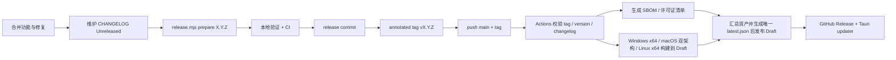

# R-Code 发布手册

本文是维护者从“准备版本”到“GitHub Release 可下载、客户端可更新”的唯一操作入口。架构背景见 [ARCHITECTURE.md](./ARCHITECTURE.md)，用户可见变化见根目录 [CHANGELOG.md](../CHANGELOG.md)。

## 1. 发布链路



这条链路同时留下四层记录：

| 记录 | 回答的问题 |
| --- | --- |
| Git commit / PR | 具体实现如何变化 |
| `CHANGELOG.md` | 用户在每个版本会感知什么 |
| Git tag | 哪个不可变 commit 对应版本 |
| GitHub Release + Actions run | 分发了哪些产物、由哪次构建产生 |

## 2. 当前发布目标

| 平台 | 架构 | 产物 |
| --- | --- | --- |
| Windows | x86_64 MSVC | 品牌安装器 `.exe`、NSIS updater `.exe`、WiX `.msi` |
| macOS | Apple Silicon `aarch64`、Intel `x86_64` | 各架构 `.app`、`.dmg` |
| Linux | x86_64 GNU | `.AppImage`、`.deb` |

发布工作流还会上传 Tauri updater 归档、`.sig` 签名、聚合的 `latest.json`、CycloneDX SBOM 和第三方许可证清单。当前未构建 Windows ARM 或 Linux ARM；添加平台时必须同步更新 updater 验收清单和 README。Intel 构建固定使用 GitHub 的 `macos-15-intel` runner，避免 `macos-latest` 架构漂移。

## 3. 一次性仓库配置

### 3.1 GitHub Actions 权限

`.github/workflows/release.yml` 的默认权限和 metadata 校验 job 都是 `contents: read`；只有需要上传发行资产或发布 Draft 的构建/finalize job 才声明 `contents: write`。如果组织级策略禁止 `GITHUB_TOKEN` 写 Release，需要在仓库 Settings → Actions → General 中允许工作流写入，或按组织策略改用受控的发布 App/token。所有 checkout 都设置 `persist-credentials: false`，避免 PAT 或 `GITHUB_TOKEN` 留在 runner Git 配置中。

不要把长期 PAT 写入 workflow 文件。`vendor/agent-core` 是私有子模块，仓库 Secret `PAT_TOKEN` 必须是一个只授予 `foritin/agent-core` **Contents: read** 的 fine-grained token；CI 和 Release 仅通过 `actions/checkout` 使用它，不把令牌写入脚本、日志或仓库。父仓 gitlink 负责锁定精确 commit，PAT 只负责让 runner 读取该 commit。Release 的 tag/版本/CI 质量校验 job 不读取 `PAT_TOKEN` 或 updater 私钥；这些 Secret 只在后续的发布前置校验和实际构建 job 中使用。

### 3.2 Tauri updater 签名

仓库 Settings → Secrets and variables → Actions 至少需要：

- `TAURI_SIGNING_PRIVATE_KEY`：与 `src-tauri/tauri.conf.json` 中 `plugins.updater.pubkey` 配对的私钥内容或安全路径；
- `TAURI_SIGNING_PRIVATE_KEY_PASSWORD`：私钥密码；无密码密钥也应按实际 Action 行为验证空值。

私钥不能提交到 Git，也不能只保存在某一台开发机。请在受控密码库中做离线备份；丢失它后，已经安装的客户端无法验证由新密钥签出的更新。

首次发布前必须做一次配对验证：用同一私钥本地构建 updater artifact，确认 Tauri 能用仓库中的公钥验证。仅看到 workflow 变量存在，不等于密钥匹配。

### 3.3 操作系统代码签名

Updater 签名只保证应用更新包的完整性，不替代平台发行签名。

macOS 的 Developer ID 签名、notarization 和 stapling 已接入 Release workflow。要生成平台信任的 macOS 安装包，仓库 Settings → Secrets and variables → Actions 需要配置：

- `APPLE_CERTIFICATE`：Developer ID Application `.p12` 的单行 Base64 内容；
- `APPLE_CERTIFICATE_PASSWORD`：导出 `.p12` 时设置的密码；
- `APPLE_SIGNING_IDENTITY`：例如 `Developer ID Application: Example Team (TEAMID)`；
- `APPLE_ID`：提交 notarization 的 Apple ID；
- `APPLE_PASSWORD`：该 Apple ID 的 app-specific password，不是账户登录密码；
- `APPLE_TEAM_ID`：Apple Developer Team ID。

完整配置时，release workflow 会把证书导入 runner 的临时 keychain，构建 `.app`/`.dmg`，并强制执行 `codesign`、Gatekeeper assessment 和 stapler 验证。缺少任一 Apple Secret 时，只将 macOS 构建降级为 ad-hoc 签名，不会阻断其他平台或稳定版发布；Release 标题和正文会公开警告该平台未完成 Developer ID 签名与公证。证书和密码不得提交到仓库。

本机测试可以运行 `bash ./scripts/build-macos.sh` 生成 ad-hoc 签名包；这种包只用于开发验证，不能替代 Developer ID。正式本地候选包需先把 Developer ID 导入 Keychain，并设置 `APPLE_SIGNING_IDENTITY` 及 Apple ID 三个 notarization 变量，再运行 `bash ./scripts/build-macos.sh --signed`。脚本也支持 App Store Connect API key 方式，具体变量见 `--help`。

Windows Authenticode 已接入 Release workflow。要生成平台信任的 Windows 安装包，仓库需要配置：

- `WINDOWS_CERTIFICATE`：代码签名 `.pfx` 的 Base64 内容（支持 `certutil -encode` 输出）；
- `WINDOWS_CERTIFICATE_PASSWORD`：PFX 导出密码；
- `WINDOWS_TIMESTAMP_URL`：证书颁发机构提供的 RFC 3161 时间戳地址。

完整配置时，workflow 会把证书导入 runner 的临时用户证书库，由 Tauri 在生成 updater/NSIS/MSI 前完成签名；品牌外层安装器生成后再由 `signtool` 签名。发布前会对品牌安装器、NSIS 和 MSI 逐一执行 Authenticode 验证。缺少任一 Windows Secret 时，只将 Windows 构建降级为未签名，不会阻断稳定版发布；Release 会公开 SmartScreen 风险警告。已经选择签名后若证书导入、签名或验签失败，构建仍会失败，不能静默降级。临时 PFX 和生成的 Tauri 覆盖配置在 job 结束时删除。Linux 包签名是否启用由分发渠道策略决定。

> [!WARNING]
> 稳定标签 `vX.Y.Z` 在缺少平台证书时仍可发布并成为 Latest，但 Release 会标记为 `unsigned build` 或 `partially unsigned`，正文顶部也会列出未签名平台。Windows 可能显示 SmartScreen 警告，macOS 可能触发 Gatekeeper。`PAT_TOKEN` 和 `TAURI_SIGNING_PRIVATE_KEY` 仍是硬门禁，确保私有子模块可读取且 updater 产物具备完整性签名。
>
> `vX.Y.Z-unsigned.N` 仍保留为显式测试预发布：它强制关闭 Windows/macOS 平台签名，始终是 prerelease、非 Latest，也不会进入正式自动更新入口。

### 3.4 供应链清单

`scripts/generate-supply-chain.mjs` 从锁定的 Cargo metadata 与 `package-lock.json` 生成：

- `r-code-sbom.cdx.json`：CycloneDX 1.5 SBOM；
- `THIRD_PARTY_LICENSES.md`：Cargo 与 npm 第三方依赖的声明许可证清单。

Release 的 `supply-chain` job 使用 `--strict`；任何依赖缺少许可证声明都会失败。需要本地复核时运行 `node scripts/generate-supply-chain.mjs target/supply-chain --strict`。清单用于发行审计，具体许可证文本仍以各依赖包自带文件为准。

### 3.5 GitHub 安全入口与仓库外控制

下列控制不在 Git 中，必须由仓库管理员在 GitHub 设置中单独确认；没有它们，workflow 文件本身不能构成完整的生产发布边界：

- 为 `main` 建立 ruleset/branch protection：限制直接推送和强推，要求审阅，并把完整 `CI` 作为必需状态检查；
- 为 `v*` 建立 tag protection/ruleset：限制创建、更新和删除发布标签的主体，禁止覆盖已公开 tag；
- 创建受审批保护的 `release` Environment，并把发布审批、`PAT_TOKEN`、Tauri updater 私钥和平台签名 Secret 按组织密钥策略纳入该环境；
- 在 Settings → Code security and analysis 中启用 GitHub Secret Scanning、Push Protection 和 Dependabot alerts；仓库内的 `.github/dependabot.yml` 只负责定期创建 Cargo、npm 与 GitHub Actions 更新 PR，不能替代 alerts 或人工审阅；
- 在 Settings → Security 中启用 Private vulnerability reporting，使 [SECURITY.md](../SECURITY.md) 指向的私密报告入口可用。

每次调整 ruleset、Environment 或 Secret 权限后，应使用一个无凭据的测试 tag 或 workflow dry-run 验证：未授权用户不能推进发布，获批的发布人仍能读取所需的最小权限凭据。不要把这些检查结果只留在口头约定中。

## 4. 版本和 CHANGELOG 规则

根 `Cargo.toml` 的 `[workspace.package].version` 是产品版本基线。以下位置必须保持一致：

- `Cargo.toml`；
- `Cargo.lock` 中所有 `r-code-*` workspace package；
- `src-tauri/tauri.conf.json`；
- `installer/tauri.conf.json`；
- `src-tauri/frontend/package.json`；
- `src-tauri/frontend/package-lock.json` 根 package。

不要手工逐个修改。使用：

```bash
node scripts/release.mjs check
node scripts/release.mjs prepare X.Y.Z
```

`check` 只读地检查一致性。`prepare` 会同步主应用和品牌安装器版本、刷新 `Cargo.lock`，并把 `CHANGELOG.md` 的 `[Unreleased]` 内容移动到带当天日期的版本节。版本参数不带 `v`，Git tag 带 `v`。

每个面向用户的合并都应在 `[Unreleased]` 下维护 `Added`、`Changed`、`Deprecated`、`Removed`、`Fixed` 或 `Security` 中适用的分类。提交标题推荐 Conventional Commits；但 CHANGELOG 是发布合同，不能只依赖自动生成的 commit 列表。

## 5. 正式发布步骤

以下命令用 `X.Y.Z` 表示待发布版本；执行前替换为实际版本号。

完成版本准备、验证、提交并推送 `main` 后，推荐由发布闸门脚本创建 tag、触发四平台构建、等待工作流并验收 Release：

```bash
# 只做预检，不创建 tag
node scripts/publish-release.mjs vX.Y.Z --dry-run

# 稳定版本：证书齐全时签名；缺失时降级并在 Latest 页面警告
node scripts/publish-release.mjs vX.Y.Z

# 尚未配置平台证书时的测试预发布
node scripts/publish-release.mjs vX.Y.Z-unsigned.1
```

脚本不会在当前电脑串行构建四个平台，而是把不可变 tag 推到 GitHub，再由 Release workflow 并行构建 Windows x64、macOS arm64/x64 和 Linux x64。它会拒绝脏工作区、非 `main`、未同步的 `origin/main`、重复 tag、未通过的当前提交 CI，以及缺失的基础 Actions Secrets。Release workflow 会独立验证 tag 的 peeled commit 已在默认分支历史中，并要求该**精确 commit**存在成功的完整 `CI` push run，且前端、依赖审计、secret 扫描、格式、Clippy、三平台测试、Cargo audit/deny 和子模块指针等全部质量 job 都成功。平台证书缺失会在本地预检和 Actions 日志中警告，并按平台降级；工作流成功后还会核对 Release 状态、公开警告、20 个发行资产，以及四平台基础项和安装器变体的 updater manifest。可信自动化可加 `--yes` 跳过手工输入 tag。`--no-wait` 会在远端工作流登记后立即返回，因而跳过本地对 Release、20 个资产和 updater manifest 的发布后验收；使用后必须再以默认等待模式或等价命令完成验收。

### 5.1 冻结并准备版本

确保发布分支已经包含计划内容，工作区干净，构建子模块指针已经提交：

```bash
git switch main
git pull --ff-only origin main
git status --short
git submodule status vendor/agent-core
node scripts/release.mjs check
```

确认 `CHANGELOG.md` 的 `[Unreleased]` 完整后：

```bash
node scripts/release.mjs prepare X.Y.Z
git diff -- Cargo.toml Cargo.lock src-tauri/tauri.conf.json installer/tauri.conf.json \
  src-tauri/frontend/package.json src-tauri/frontend/package-lock.json CHANGELOG.md
```

### 5.2 验证候选版本

```bash
node --test scripts/release.test.mjs scripts/release-quality-gate.test.mjs scripts/flaky-test-report.test.mjs
node scripts/release.mjs check vX.Y.Z
cargo fmt --all -- --check
cargo clippy --workspace --all-targets --all-features -- -D warnings
cargo test --workspace --all-features
cargo deny check advisories

cd src-tauri/frontend
npm ci
npm audit --package-lock-only --audit-level=high
npm test
npm run build
cd ../..

# Windows：构建最终品牌安装器（包含 NSIS payload）
./scripts/build-branded-installer.ps1

# Windows：同时实构建并核验 WiX MSI；PowerShell 中执行
Push-Location src-tauri
cargo tauri build --bundles msi --config tauri.local-package.conf.json
Pop-Location

# macOS：本机 ad-hoc 候选包；正式候选包追加 --signed
# Intel 本地包可追加 --target x86_64-apple-darwin
bash ./scripts/build-macos.sh
```

至少在目标平台做一次安装包 smoke test：安装、启动、创建纯聊天任务、打开工作区、触发一次审批、执行只读工具、验证 updater 检查不会报签名/manifest 错误。`0.3.x` 还必须覆盖 Codex 同树委派（不新增 session）、RequestApproval 下的 Bash 审批、逐个取消 child、公开 reasoning summary、文件链接右侧跳行、约 1 秒计时刷新，以及重启后的三态权限恢复。缺少外部 Provider 或 Codex 账号时，应在可用环境完成这组联网验收；本机至少验证能力不可用时会隐藏动态工具且主任务继续。

### 5.3 提交、打 tag、推送

推荐在发布提交已推送且 CI 通过后运行上述 `publish-release.mjs`。下列手工命令保留为故障恢复和理解底层流程的参考：

```bash
git add Cargo.toml Cargo.lock src-tauri/tauri.conf.json \
  installer/tauri.conf.json \
  src-tauri/frontend/package.json src-tauri/frontend/package-lock.json CHANGELOG.md
git commit -m "chore(release): vX.Y.Z"
git push origin main
# 等待该精确 main commit 的完整 CI 成功后，才创建和推送 tag。
git tag -a vX.Y.Z -m "R-Code vX.Y.Z"
git push origin vX.Y.Z
```

若团队使用签名 Git tag，可把 `git tag -a` 换成 `git tag -s`。不要在 CI 失败后删除并重建同名 tag；修复发布代码后使用新的 patch 版本，保持已经公开的 tag 不可变。

#### 未签名预发布

当平台签名凭据尚未配置、但需要发布可下载测试包时，使用带递增序号的显式标签：

```bash
git tag -a vX.Y.Z-unsigned.1 -m "R-Code vX.Y.Z unsigned prerelease 1"
git push origin vX.Y.Z-unsigned.1
```

Release workflow 会校验其基础版本仍是 `X.Y.Z`，跳过 Windows Authenticode 与 Apple Developer ID/公证步骤，保留 Tauri updater 签名，并在 Release 顶部写入未签名警告。该 Release 会发布为 prerelease，但不会被标记为 Latest；`/releases/latest/download/latest.json` 不会指向它。

同一基础版本需要重试时创建 `vX.Y.Z-unsigned.2`，不得移动或覆盖已经公开的标签。稳定标签 `vX.Y.Z` 会按当时可用的证书逐平台签名，并在所有平台完成后成为 Latest。

### 5.4 观察 GitHub Actions

维护机安装并登录 GitHub CLI 后，可以直接观察这次提交对应的运行：

```bash
gh auth status
gh run list --repo foritin/r-code --branch main --workflow CI --limit 5
gh run watch --repo foritin/r-code <run-id> --exit-status
```

Tag push 后工作流按以下顺序运行：

1. `validate` checkout 该 tag，校验 tag、各版本文件和 dated CHANGELOG section；再确认 tag 的 peeled commit 可从默认分支到达，并查询该精确 commit 的 `CI` push run 与所有必需 job 是否成功。
2. `release-prerequisites` 只检查后续特权 job 所需的基础 Secret 是否存在；metadata 校验阶段不读取 PAT 或 updater 私钥。
3. `supply-chain` 生成并严格校验 SBOM/许可证清单。
4. Windows x64、macOS arm64、macOS x64、Linux x64 并行构建；已配置证书的平台执行签名和验签，未配置的平台执行明确的未签名回退，所有二进制产物写入同一个 Draft Release。
5. `finalize` 在 Draft 发布前核对四个平台及各安装器 updater 项、当前 tag/repository 的资产 URL、非空签名与对应 `.sig` 文件内容，再上传供应链清单；稳定版随后发布并标为 Latest，若有平台降级则同时写入公开警告。

任何平台失败时，`finalize` 不运行，用户不会看到一个缺平台的最新正式 Release。若失败来自临时 runner/网络问题且无需改变 tag 内代码，可对失败的 Actions run 使用 Re-run failed jobs，或从 `main` 完整重跑已有 tag：

```bash
gh workflow run Release --repo foritin/r-code --ref main -f tag=vX.Y.Z -f finalize_only=false
```

若四个平台与 supply-chain job 已全部成功、只有 `Publish completed release` 因 finalize 工具代码失败，可先在 `main` 修复并通过 CI，再复用仍为 Draft 的原资产：

```bash
gh workflow run Release --repo foritin/r-code --ref main -f tag=vX.Y.Z -f finalize_only=true
```

该模式不会重建产品：validate 与 supply-chain 仍 checkout 不可变 tag，finalize 则 checkout 本次 dispatch 的精确 `main` SHA。它会要求 Release 仍为 Draft、target commit 与 tag 的 peeled commit 一致、17 个构建资产名称唯一且均为 uploaded/非空，然后才生成规范 tag URL、上传清单并公开 Release。由于恢复时当前 Secrets 不能证明原构建的签名状态，`finalize_only` 会保守地把 Windows/macOS 都标为未完成平台签名；需要保留“完全签名”声明时应完整重跑构建而不是复用资产。

`workflow_dispatch` 不是创建 tag 的替代品，并且只能从仓库默认分支触发；finalize checkout 本次 dispatch 的精确 SHA，而不是恢复期间可能继续移动的分支头。工作流会先统一检查私有子模块令牌和 updater 私钥；缺少它们会失败。Windows/macOS 签名凭据按平台探测：整组齐全时签名，缺少任一项时该平台降级并给出警告。同一 tag 的 push、完整重跑与 finalize-only 恢复共享 concurrency group，不能并发修改同一个 Draft。

### 5.5 发布后验收

在 GitHub Release 页面检查：

- Release 不是 Draft，tag 和标题正确；
- Windows x64、macOS arm64/x64、Linux x64 目标产物都存在；
- updater 归档均有对应 `.sig`；
- 已配置 Windows 证书时，品牌安装器、NSIS、MSI 的 Authenticode 验证必须通过；未配置时，Release 标题/正文必须明确标出 Windows 未签名及 SmartScreen 风险；
- `r-code-sbom.cdx.json` 与 `THIRD_PARTY_LICENSES.md` 存在且内容对应当前版本；
- `latest.json` 能通过 `https://github.com/foritin/r-code/releases/latest/download/latest.json` 获取；
- manifest 中 version、基础与安装器 platform key、下载 URL 和 signature 正确，且每个 signature 与同名资产的 `.sig` 内容一致；
- 从前一个已发布版本执行一次真实更新并能重新启动。

最后在 `main` 上重新运行 `node scripts/release.mjs check`，确认发布提交没有后续版本漂移。

## 6. 自动生成的 GitHub Release Notes

`.github/release.yml` 根据 PR labels 把自动生成的 Release Notes 分成 breaking changes、features、fixes、documentation 和 other changes。`skip-changelog`、`dependencies` 会从 GitHub 自动列表排除。

它与 `CHANGELOG.md` 的职责不同：

- GitHub Release Notes 便于跳转 PR 和贡献者；
- CHANGELOG 提供仓库内、可审阅、可比较的长期版本记录。

Release 发布后可以修正文案或补链接，但不要把用户可见的重要变化只留在 GitHub 页面而不回写 CHANGELOG。

## 7. 失败与恢复

### 7.1 构建失败，Release 仍是 Draft

先按失败范围选择恢复方式：

- 临时 runner/网络故障，且 tag 内代码无需变化：重跑失败 job；
- 四个平台与 supply-chain 均成功，仅 finalize 工具缺陷：修复并合入 `main` 后使用 5.4 节的 `finalize_only=true`，不要重打 tag，也不要先公开 Draft 来换取规范 URL；
- 产品代码、依赖或 tag 内构建配置有问题：

1. 不移动现有 tag；
2. 让失败 Draft 保持非公开，必要时在 GitHub UI 删除该 Draft；
3. 修复后准备新的 patch 版本；
4. 创建新 tag 重新发布。

### 7.2 已发布版本有严重问题

不要覆盖资产、强推 tag 或让相同版本号指向新 commit。立即：

1. 在 Release 文案标注已知问题；
2. 如果 updater 会造成损害，先把问题 Release 取消 latest/转为 prerelease，并评估暂时移除 `latest.json`；
3. 从修复 commit 发布新的 patch 版本；
4. 在新版本 CHANGELOG 的 `Fixed`/`Security` 中明确影响。

因为客户端通过 `/releases/latest/download/latest.json` 更新，Release 的 latest 状态和 manifest 可用性属于生产配置，修改前要确认用户回退/前滚路径。

### 7.3 签名密钥疑似泄露

停止发布，不要直接替换 `pubkey` 后继续。旧客户端只信任内置公钥，密钥轮换需要专门迁移设计和安全公告。通过 [SECURITY.md](../SECURITY.md) 的私密流程协调处置。

## 8. 首次发布额外清单

- [ ] 仓库还没有同名 tag，版本号和 `CHANGELOG.md` 已准备。
- [ ] `vendor/agent-core` gitlink 指向可访问且已审核的 commit。
- [ ] updater 私钥已备份，Secrets 与内置公钥配对验证通过。
- [ ] GitHub Actions 具有创建 Release 的权限。
- [ ] `main` ruleset、`v*` tag protection、受审批保护的 `release` Environment、Secret Scanning、Push Protection、Dependabot alerts 均已由仓库管理员启用并做过实际权限验证。
- [ ] 若平台证书尚未配置，已确认 Release 标题/正文列出未签名平台，并接受 Windows SmartScreen 与 macOS Gatekeeper 的分发影响；若已配置，则 macOS 两种架构签名/公证和 Windows Authenticode 时间戳验签均通过。
- [ ] README 的支持平台、安装入口和截图与实际 Release 一致。
- [ ] `SECURITY.md` 的私密报告入口可用。
- [ ] `PRIVACY.md` 已由产品/法务按实际发行地区、主体和 Provider 政策确认。
- [ ] Release 自动生成的 SBOM/第三方许可证清单已复核，且没有 `UNKNOWN` 许可证。
- [ ] 在干净机器/虚拟机完成安装、升级、卸载和用户数据保留测试。
- [ ] 明确 0.x 阶段的数据 schema 回退策略和支持范围。

## 9. 相关文件

| 文件 | 作用 |
| --- | --- |
| `.github/workflows/ci.yml` | 合并前质量门和版本漂移检查 |
| `.github/workflows/release.yml` | tag 校验、四目标构建、Apple/Windows 签名、供应链清单、Draft 聚合与发布 |
| `scripts/verify-release-quality-gate.mjs` | 验证 tag 精确 commit 的完整 CI run 与发布关键 job |
| `.github/dependabot.yml` | Cargo、npm 与 GitHub Actions 依赖更新节奏 |
| `scripts/generate-supply-chain.mjs` | 生成 CycloneDX SBOM 与第三方许可证清单 |
| `.github/release.yml` | GitHub 自动 Release Notes 分类 |
| `scripts/release.mjs` | 版本同步、CHANGELOG 盖章和 tag 一致性校验 |
| `scripts/publish-release.mjs` | 发布前置闸门、tag 推送、Actions 等待与 Release 资产验收 |
| `scripts/build-macos.sh` | macOS app/dmg 本地构建、签名与公证验收 |
| `src-tauri/tauri.conf.json` | Bundle、updater endpoint 和公钥 |
| `CHANGELOG.md` | 用户可见版本历史 |
