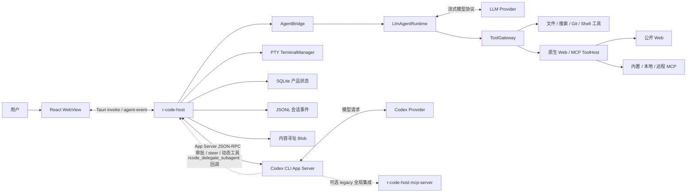
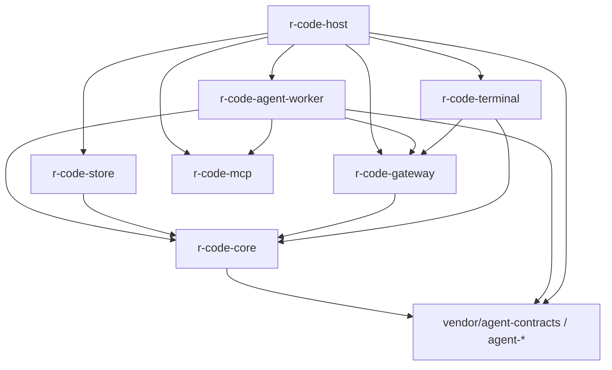
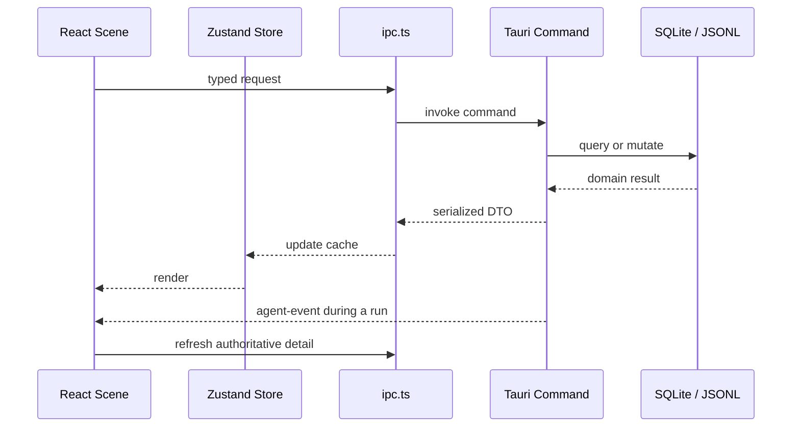
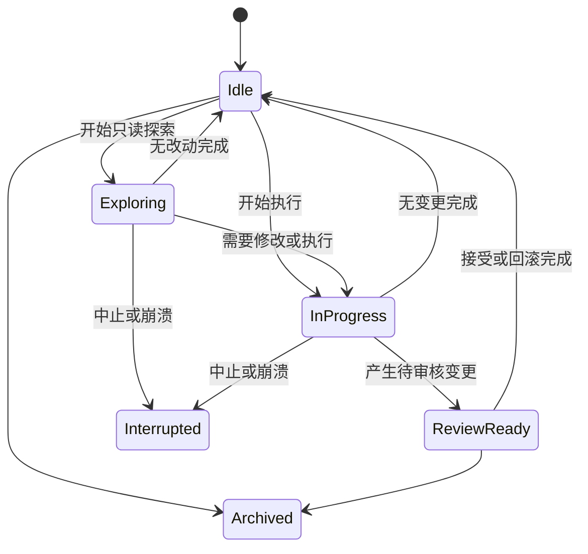
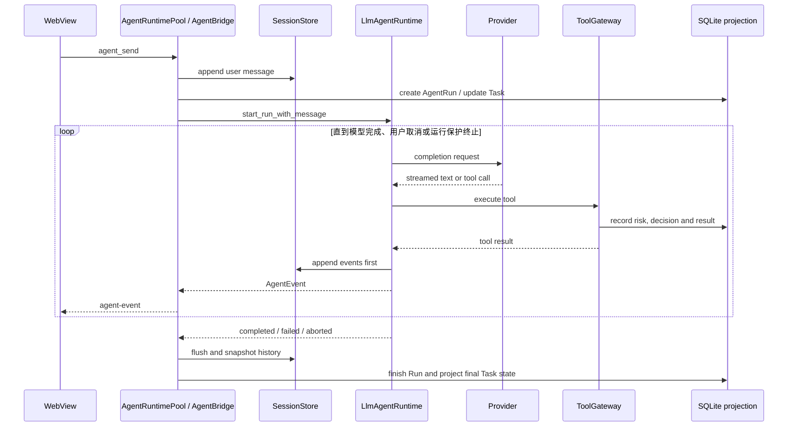
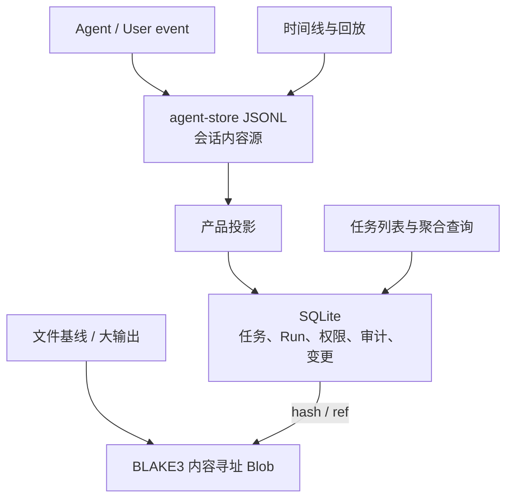
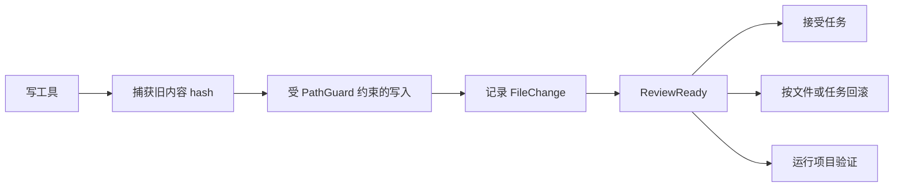
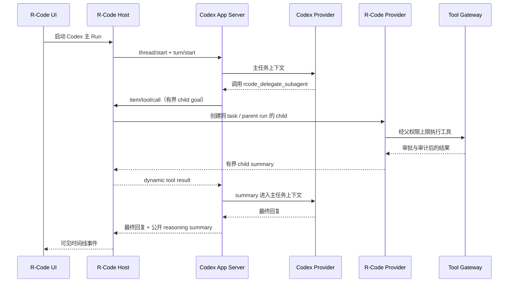

# R-Code 架构与实现细节

本文描述当前代码的实际结构，而不是历史设计目标。它面向维护者、评审者和需要扩展 R-Code 的开发者；发布操作另见 [RELEASING.md](./releasing.md)。

## 1. 系统概览

R-Code 是一个 session-first 的 AI 编程桌面应用。核心原则是：对话是长期会话，模型执行是可审计的 Run，本地改动必须经过统一工具边界，用户可以在任务、分支、变更、验证和回放之间追溯完整因果链。

正常桌面模式下，Host、原生 Agent runtime、Tool Gateway 和存储服务是同一 Rust 进程内的逻辑模块；React 运行在 Tauri WebView 中。Codex CLI、面向 Codex 的 MCP stdio server、启用后的本地 stdio MCP 等外部集成才会创建额外进程。因此，不应再把当前实现描述为固定的“Host / Worker / Renderer 三独立进程”。



### 1.1 运行边界

| 边界 | 实现 | 说明 |
| --- | --- | --- |
| 桌面 Host | `src-tauri/src/main.rs`、`tauri_commands.rs` | 进程入口、窗口、插件、命令注册、事件出口和系统集成 |
| 应用服务 | `src-tauri/src/commands.rs` 及同目录模块 | 任务编排、Provider、Codex、MCP、恢复、搜索、设置等产品逻辑 |
| 原生 Agent | `crates/r-code-agent-worker/` | 多轮模型循环、Steer、子智能体、质量复核 |
| 工具安全边界 | `crates/r-code-gateway/` | 工具注册、路径绑定、风险分类、权限等待、审计 |
| 联网与 MCP 客户端 | `crates/r-code-mcp/`、`src-tauri/src/mcp_manager.rs` | 安全网页访问、MCP 协议客户端、Registry、凭据引用、惰性连接与生命周期 |
| 产品存储 | `crates/r-code-store/` | SQLite、变更基线、Blob、Git、验证、审核和备份 |
| 终端 | `crates/r-code-terminal/` | PTY、OSC 133、增量输出、外部 CLI transcript |
| 产品 DTO 与安全 | `crates/r-code-core/` | 状态机、请求/响应类型、密钥、路径边界 |
| 公共合同 | `vendor/agent-contracts/` | `agent-*` 会话、模型、配置、IPC、MCP 与 Tauri 合同；Git 子模块 |
| Renderer | `src-tauri/frontend/` | React 场景、Zustand 状态、typed IPC、流式时间线与工作台 |

## 2. 启动与运行模式

### 2.1 桌面模式

`r-code-host` 不带 `mcp-server` 参数时进入 Tauri 桌面模式：

1. 初始化结构化日志和内存日志缓冲。
2. 注册 updater、dialog 插件并创建 WebView。
3. 在应用数据目录创建 `r-code/{db,blobs,sessions,config}`。
4. 尝试把旧 `config.toml` 中的 Provider 明文密钥迁移到平台凭据后端：macOS 使用 profile 内本地加密文件且不访问旧 Keychain，Windows/Linux 使用系统凭据库；同时一次性补写可确定的稳定 `provider_kind`，后续改名或改网关地址不会重新推断身份。
5. 在打开连接池前由 `MigrationManager` 串行执行受保护的 SQLite migration：已有数据库先做完整性校验和 WAL 安全快照，失败会恢复快照并中止启动；目前 schema 版本为 30。
6. 创建 `CommandState`，装配 SessionStore、PermissionEngine、TerminalManager、ToolGateway 和 AgentBridge。
7. 从应用数据目录装载 MCP 配置，创建一个共享的 `McpManager` 并注入所有 Agent runtime；此时不连接外部 MCP。
8. 把 Agent 事件出口绑定为 Tauri 的 `agent-event`，供 WebView 增量消费。
9. 启用真实 Provider runtime；没有有效配置时，发送消息会返回可见错误。
10. 后台启动兼容性 `agent_ipc::IpcServer`。它当前使用内存数据库，只注册 `ping` 和 `task.create`，不是桌面主数据通路。

应用数据目录由 Tauri 的 `app_data_dir` 决定，而不是仓库目录。卸载、备份或问题排查时要区分用户数据与工作区源代码。

### 2.2 面向 Codex 的 MCP stdio 模式

以下命令会在日志初始化前切换到纯 stdio MCP server：

```text
r-code-host mcp-server [--data-dir <path>]
```

该顺序是协议不变量：stdout 上任何普通日志都可能破坏 JSON-RPC。这个模式主要由 Codex 配置和拉起，入口位于 `src-tauri/src/mcp_server.rs`。

它与 R-Code 作为 MCP **客户端**连接第三方服务是两个独立方向。通用 MCP 客户端由 `r-code-mcp` 和 `McpManager` 提供，支持内置服务、stdio 与 streamable HTTP；配置、Registry 和安全边界见 [联网工具与 MCP](./mcp.md)。

### 2.3 Windows 后台运行与显式退出

Windows 主窗口遵循“关闭到托盘、退出需显式选择”的生命周期：标题栏关闭按钮和“文件 → 隐藏到系统托盘”会拦截主窗口关闭并隐藏 WebView，Host、Agent、终端和后台任务继续运行。托盘左键会显示、还原并聚焦主窗口；托盘菜单提供打开、隐藏和“退出 R-Code”。再次启动应用时，single-instance 插件会还原现有窗口，而不是再创建一个 SQLite/MCP owner。

“文件 → 退出 R-Code”、托盘“退出 R-Code”和 `cmd_app_quit` 才调用 `app.exit(0)`。真正退出时，Host 会并行关闭 `McpManager` 与 Codex App Server Registry，并给清理流程两秒总窗口。托盘创建失败时不会拦截关闭，以免应用隐藏后无法恢复；非主窗口和非 Windows 平台保留各自的原生关闭语义。

## 3. Rust workspace 分层

### 3.1 依赖方向



产品 crate 通过根 `Cargo.toml` 的 workspace dependencies 共享版本和依赖。`vendor/agent-contracts` 是构建必需子模块；`.agents` 只提供仓库内开发技能，不进入产品构建。

### 3.2 `CommandState`

`CommandState` 是 Tauri command 的共享依赖容器，主要持有：

- SQLite `Database`、数据库路径、Blob 和 Session 目录；
- `SessionStore`，负责 JSONL 会话事件；
- `PermissionEngine` 和统一 `ToolGateway`；
- `TerminalManager`；
- Provider 配置目录和当前项目根；
- `AgentBridge`，维护任务到 runtime session、活动分支和存储 ID 的映射；
- 外部 Agent、Codex MCP 连接和启动恢复状态；
- `CodexAppServerRegistry`，按 Task 隔离并复用已初始化的 Codex App Server 传输；
- 共享 `McpManager`，负责原生联网、MCP 配置、Registry、凭据引用、状态和有界关闭；
- `PlanStore`，负责 Plan/HITL 聚合、稳定 AppData Markdown 投影和 continuation；
- 向 WebView 发送 `agent-event` 的回调。

初始化时注册的工作区模型工具包括 `read_file`、`list_files`、`search`、`glob`、`git_status`、`load_skill`、`edit`、`apply_patch`、`create_file`、`delete_file` 和 `bash`。无工作区会话仍拥有固定的 `web_search`、`web_fetch`、`mcp_discover`、`mcp_call` 与 `suggest_mcp`；安装 MCP 不会动态增加模型工具 schema。所有实际调用都必须走权限与审计边界；直接在 Agent loop 中访问文件系统或外部服务会绕过不变量。

## 4. Renderer 与 Host 通信

前端不直接持有数据库或文件句柄。`src-tauri/frontend/src/lib/ipc.ts` 为 Tauri commands 提供 typed wrapper，参数使用 Tauri v2 的 camelCase 约定；Rust 侧 wrapper 位于 `src-tauri/src/tauri_commands.rs`，业务实现位于 `commands.rs`。



前端状态分为两类：

- `store/app.ts`：纯 UI 状态，如 scene、当前 Room、工作台 tab、主题、缩放和搜索。
- `store/tasks.ts`：任务、详情、工作区、仪表盘和活动流缓存；权威数据仍在 Host。

运行中的文本和工具事件通过 `agent-event` 低延迟推送；任务状态、权限、审核等权威聚合通过 IPC 重新拉取。`usePoll` 只在窗口可见且聚焦时运行，并防止重入；所有订阅共享一个最近到期定时器和一套窗口生命周期监听，Room、Deck、Dashboard 等场景仍按各自节奏补偿丢失事件或后台变化。运行时长与相对时间统一订阅 `shared-clock.ts`，同一 WebView 只保留一个按需调频的时钟，失焦后停止；`store/tasks.ts` 的跨场景派生选择器按不可变输入引用缓存，避免无关 store 更新扩散为整棵界面重渲染。浏览器原型环境可切换到 `browser-mock-runtime.ts`，但正式构建使用 Tauri IPC。

## 5. 任务、会话与 Run 模型

### 5.1 主要实体

| 实体 | 作用 | 主要存储 |
| --- | --- | --- |
| `Task` | 用户可见工作单元，关联工作区、Provider、模型和状态 | SQLite `tasks` |
| `SessionBranch` | 会话分支；重发、编辑历史或 fork 时创建 | SQLite 元数据 + 独立 JSONL storage ID |
| `AgentRun` | 一次主 Agent 或子智能体执行 | SQLite `agent_runs` |
| `TaskEvent` | 产品活动投影，如启动、完成、审核 | SQLite `task_events` |
| `SessionEvent` | 完整消息、流式文本、工具和生命周期事件 | JSONL SessionStore |
| `QueuedMessage` | 不能立即执行的用户消息 | SQLite `queued_messages` |
| `PermissionRequest` | 等待用户决定的工具调用 | 内存等待器 + SQLite 投影 |
| `ToolCall` | 工具输入、风险、状态、摘要和耗时 | SQLite `tool_calls` |
| `FileBaseline` / `FileChange` | 写入前基线与变更结果 | SQLite + Blob |
| `Verification` | 测试/验证命令及输出引用 | SQLite + Blob |

### 5.2 任务状态

常规主路径是：



Run 与 Task 状态不同：一个 Task 可以包含多个主 Run 和子 Run，也可以在不同 SessionBranch 上继续。UI 不应仅凭最后一条流式事件推断最终状态，应刷新 `TaskDetail`。

### 5.3 分支、重发和队列

- 编辑或重发旧消息时创建子分支，保留父分支 JSONL，不原地改写历史。
- 每个分支拥有独立 storage ID；主 Run、子 Run和队列项都带 branch ID。
- 原生 Provider 按 Task 分配独立 runtime 与事件通道：同一 Task 严格串行，不同 Task 可并行，流事件不会跨会话混合。
- 忙碌时消息可按 `Auto`、`Steer`、`Queue` 或 `SendNow` 处理。每个 Task 只领取自己的队列，内部再按优先级和创建时间排序；切换到新分支时旧分支待处理消息会取消。
- 附件只允许在启动新 Run 时进入，数量和总体积均有限制，并执行扩展名、MIME 与 magic bytes 校验。
- 每个项目最多保留 5 个未归档对话；归档记录不占名额且仍可用于审计。普通创建和项目“+”入口共享同一 `IMMEDIATE` 事务边界，因此并发创建也不会突破上限；项目入口同时原子分配占位标题、初始分支和创建事件，标题按该项目历史最高序号递增，首次五条依次为“新对话”到“新对话 5”。
- `/clear` 不删除历史，而是创建一条空白活跃分支并让旧分支保持只读。`session_messages_for_branch` 先校验分支归属，再读取对应 JSONL，绝不激活它；Room 的历史选择器只替换 Timeline 数据源并暂时隐藏 Composer，不改变后端活跃分支、当前 Run 或队列，未提交文本仍由 task-scoped Composer 草稿缓存保留。

同一会话的串行约束同时适用于原生主 runtime；外部 Codex 子任务拥有独立进程和生命周期，不会占用其他 Task 的 Native bridge。

## 6. 原生 Agent 执行链路

`LlmAgentRuntime` 基于 `agent-llm::LlmProvider`，执行 model → tool → feedback → model 的多轮循环。



Host 的 drain loop 大约每 40 ms 拉取 runtime 事件，先保持 JSONL 会话可恢复性，再更新 SQLite 产品投影并通知 WebView。完成时会刷新完整历史、等待外部子智能体、收束流式文本，并根据是否存在变更进入 `ReviewReady` 或 `Idle`。

### 6.1 运行保护

长任务使用“软进度检查 + 资源边界”，不再按固定工具轮次或总时长一刀切：

| 保护项 | 当前策略 |
| --- | --- |
| 主 Run / 原生子智能体工具迭代 | 无硬上限；每 24 个含工具的模型回合提醒先综合已有证据 |
| Codex 主 Run / 子智能体 | 无生产硬时长或工具调用上限；连续 5 分钟没有受认可的 JSONL / App Server 协议进度才停止，收到进度即重置 watchdog；反向审批或动态委派 handler 在途时暂停父级空闲判定 |
| 并行子智能体 | 最多 5 个 |
| 单个主 Run 的子智能体总数 | 最多 12 个 |
| 子智能体回传 | ≤6,000 字符逐字透传；更长时追加无工具总结，目标 2,000–5,000 字符 |

总结服务失败时，≤12,000 字符的原报告仍完整回传；再长才使用带明确说明的首尾保留降级，不能用省略号伪装成完整报告。资源边界、取消、审批和无进度超时都会产生明确事件，UI 不应静默重试。

### 6.2 模式和质量循环

- 无工作区时只允许聊天能力；附加工作区后才装配本地工具。
- `TaskMode::Ask` 即使有工作区也使用只读工具策略。
- Steer 消息在下一次模型请求前合入，而不是篡改已发出的 Provider 请求。
- 编排策略包含委派路由、是否允许跨引擎、质量循环模式、Reviewer 和最大轮数。
- 质量循环可以关闭、自动或总是运行；Reviewer 返回 `PASS` 或 `REVISE`，修订意见会进入下一轮可见草稿。
- 首轮工具清单锚定（固定每次请求携带的 tools 清单的首轮形状，与项目文件夹无关）是 opt-in 实验（`orchestration.first_round_catalog` / `first_round_promote_on`，默认 `full`/`either` 即现状）：非默认值时主代理首轮只看到受限清单，首轮出现任意回复（或按配置：首次工具调用）后恢复完整清单；会话级粘性保证每会话至多一次清单变化，两个旋钮纳入 runtime 重建指纹。清单裁剪只是呈现层，工具执行与审批边界不变（`docs/archive/implementation/request-audit-and-anchoring.md`）。两个旋钮可在「设置 → Agent 编排」的「首轮工具清单锚定（实验）」卡片中调整（经通用 `settings_set` 逐键写入并做类型化校验）。规划门为其 opt-in 扩展：`plan_gate` 档（零工作工具）+ `plan_complete` 晋升信号下，收窄目录注入唯一门铃工具 `plan_ready`（worker 侧拦截执行，不转发网关），工具剥夺跨回合持续至模型调用 plan_ready 声明规划完成才恢复完整目录；设置卡片以总开关滑纽控制整个实验的开/关。

### 6.3 DeepSeek 前缀缓存与请求字节稳定

DeepSeek `/chat/completions` 的前缀缓存是字节级自动的（无 API 开关）：相邻请求公共前缀逐字节一致即命中，命中部分免 prefill、按低价计费。运行时围绕这一性质设计（历史 PRD 与验收：`docs/archive/deepseek-prefix-cache.md`，基线：`docs/archive/deepseek-cache-baseline.md`）：

- **system 冻结**：system prompt 为常量拼接，run 开始构建一次、全程复用；时间（分钟级）、task_context、plan mode、委派提示等动态内容一律作为尾部 user 消息注入发送副本、迭代后摘除，不落历史（历史严格 append-only）；memory_context 以独立头部消息承载，不拼进主 system。
- **请求字节确定性**：tools 按名称排序（gateway 与 SessionToolHost 两级）；`codex_available()` 在 run 内冻结；thinking 模式恒发 `reasoning_content` 键、tool 消息恒发 `name` 键；悬空工具调用对在发送前一次性修复并固化。
- **重试与恢复**：连接层指数退避（≤10 次，仅 408/429/5xx/连接类）、未产出内容前的空闲流用冻结请求重放（≤5 次，字节与首试一致，失败不写 session）；120s SSE 空闲 watchdog；重放次数经 `AgentEvent::StreamReplay` 累计进 `usage_json.stream_retries`，UI 展示「重试 N 次」。
- **可观测**：usage 解析 `prompt_cache_hit/miss_tokens`（回落 OpenAI `prompt_tokens_details.cached_tokens`，DeepSeek 字段优先）；原生线路持久化 `usage_json`，Timeline 展示命中率；`PrefixShape`（system/tools 哈希 + `rewrite_version`）每轮请求前 capture/compare，前缀变化时 tracing 记录归因 cause（`cache_shape.rs`）。
- **分层压缩**：50% 提示 / 60% 剪旧工具结果 / 80% 摘要折叠（复用 vendor `agent-compaction` 策略 + 自实现决策状态机与机械折叠兜底），带防抖（连续 2 次暂停）与真实 usage 的 tokens/字符校准；压缩是唯一的常规缓存重置点，`rewrite_version` 计入 PrefixShape 归因。
- **守卫与探针**：`crates/r-code-agent-worker/tests/cache_guard.rs` 用字节前缀 mock 断言多轮 tail_avg ≥90%（env `R_CODE_CACHE_GUARD=1` 启用，默认 skip）；真实 API 探针 `vendor/agent-contracts/crates/agent-llm/tests/deepseek_cache_probe.rs`（`#[ignore]`，需 `DEEPSEEK_API_KEY`）。

## 7. 子智能体与 Codex 协作

子智能体由 `SubagentSupervisor` 管理，后端可以是：

- **R-Code**：复用当前 Provider，使用独立消息历史和受限工具集，不递归委派。
- **Codex**：通过 Host bridge 拉起/连接 Codex CLI，可使用 exec JSON 事件或 MCP 协作路径。

原生 R-Code 主 Agent 发起委派时默认访问模式是 `read_only`，只有父 Agent 明确请求且父运行权限上限允许时才会获得写入和命令能力。子代理的“可用工具能力”和“是否需要审批”彼此独立：显式 `read_only` 始终不开放写入或命令，但它允许的读取继承父运行冻结的项目审批模式，因此 `full_access` 父运行下的 R1 读取不会再次询问，审批型父运行仍按原矩阵询问。Codex App Server 的动态委派默认是 `inherit`：只读父运行下发只读，审批类父运行下发“工具可见但变更需审批”，完全访问父运行才可下发完全访问。每个子 Run 有稳定 ID、独立 JSONL 事件和 SQLite `agent_runs` 行；schema 25 的 `require_approval` 与 `access_mode` 共同保存 UI 展示的“只读 / 需审批 / 完全访问”，重启后不靠文案反推权限。

父上下文接收的是自适应报告，而不是固定字符切片：短报告连同 Markdown、换行和文件链接原样返回；长报告先由无工具总结回合压缩并保留结论、证据、改动、验证和风险；总结异常时使用显式降级。Codex 委派提示采用同一长度与内容契约，CLI、App Server 和 MCP 的最终正文不再额外套 8,000 字符硬截断。生命周期卡片仍只显示短 detail，但它不改变实际交给父 Agent 的报告。

Codex 集成包含 CLI 探测、安装、登录状态、模型偏好、App Server、MCP 注册和权限映射。动态同树委派要求实际选中的 Codex CLI 不低于 `0.145.0` 且 R-Code Provider 可初始化；不满足时只隐藏动态工具并产生可见降级原因，Codex 主运行与原生 R-Code 路径仍应工作。宿主只消费 App Server 的公开 reasoning summary，raw reasoning content/delta 不进入 UI 或存储。

Codex App Server 不是每次发送都新建 CLI。`CodexAppServerRegistry` 以 `task_id` 为 key 保存已初始化的进程传输，每个 Task 使用独占 lease 串行运行，不同 Task 不共享传输但可以并行。Registry 只拥有进程、stdin/stdout broker 与初始化身份；审批、委派、观察、steer 和取消仍是单次 Run 的状态，不能泄漏到下一次 lease。只有匹配当前 thread/turn 的正常 completion 且 Run-local 回调全部收束后，调用方才会把 lease 标记为可复用；EOF、脏帧、协议错配或未收束回调都会销毁传输。

## 8. Tool Gateway、安全与权限

### 8.1 单一执行入口

Gateway 的执行顺序是：工具查找 → 输入路径绑定 → 动态风险分类 → 权限规则 → 执行/等待 → 审计完成。读写工具、Shell 工具和子智能体都使用同一入口。

路径参数不是普通字符串透传。每个工具声明哪些字段是路径、是否要求目标已存在；`PathGuard` 会：

1. 把工作区根 canonicalize；
2. 对现存目标解析 `..` 和符号链接；
3. 对新目标先 canonicalize 最近的现存祖先，再拼接尾段；
4. 在 canonical 结果上再次检查 containment；
5. 遇到权限、IO 或无法证明安全的情况 fail-closed。

对既有工作区文件，安全边界不止停在路径检查：`PathGuard` 持有创建时打开的工作区目录 capability，读取、枚举、原子写入、变更回滚、审核读取和工作区图片预览都相对该句柄执行，不会在逻辑校验后再按环境绝对路径打开文件。类型化句柄（`ResolvedWorkspacePath`、`WorkspaceFile`、`WorkspaceDirectory`）把 capability 相对路径封装在内部，调用方只能拿到展示路径或已打开的文件句柄，不能拿回可被 `std::fs` 按环境路径重新打开的裸 `PathBuf`。Windows junction/reparse point 与 Unix 符号链接逃逸同等对待，均 fail-closed 拒绝。`atomic_write_path` 在 `rename` 成功后同步父目录（不支持的平台依赖操作系统元数据日志，不伪同步），保证崩溃后目录项可见。Plan 审核的跟踪写入包装器也会把同一 capability 传给内层写工具，避免包装层意外退回普通路径 I/O。Git、搜索、glob 和 Bash 等子进程仍需要把工作区路径作为 `cwd` 传给操作系统；它们先经过路径边界校验，但当前跨平台 API 没有等价的 capability-aware `cwd`，这是持续收紧的跨进程边界。

### 8.2 风险等级

| 风险 | 含义 | 示例行为 |
| --- | --- | --- |
| R0 | 纯只读、无外发 | 工作区内读取、搜索 |
| R1 | 低风险，可能泄露信息 | 受控外部交互 |
| R2 | 修改本地状态或一般命令执行 | 编辑文件、常规 shell |
| R3 | 高风险或仓库外副作用 | 删除、安装/发布包、网络命令、`git commit` |
| R4 | 策略前置拒绝 | 提权、`git push`、下载即执行、系统级破坏、凭据路径 |

项目访问模式的审批矩阵：

| 模式 | R0 | R1 | R2 | R3 | R4 |
| --- | --- | --- | --- | --- | --- |
| `request_approval` | 自动 | 询问 | 询问 | 询问 | 拒绝 |
| `risk_based` | 自动 | 自动 | 询问 | 询问 | 拒绝 |
| `full_access` | 自动 | 自动 | 自动 | 自动 | 拒绝 |

显式 deny rule 在所有模式下生效。`AllowAlways` 只对同一任务、工具以及该调用提供的精确目标生效，并以批准时风险作为上限；它可以避免 `request_approval` 对同范围调用重复询问，但不能放行其他目标或更高风险。App Server profile 请求总会生成完整请求指纹，不会落成无目标通配规则。R3/R4 不能保存为 standing allow。等待审批最长 10 分钟，并且可被 Run 中止信号打断。

### 8.3 密钥与日志

Provider API key 通过平台凭据后端保存：macOS 使用 profile 内的本地加密文件且不访问 Keychain，Windows/Linux 使用操作系统凭据库；普通配置文件只保存非敏感 Provider 元数据。结构化诊断日志在写入磁盘前遮盖 API key、Bearer、Authorization、Cookie 和常见 token 参数，按日滚动并固定保留最近 7 天；模型、工具、子代理、MCP 与恢复链路的 operational warning/error 会进入该日志，Prompt、源码正文与完整工具输出不进入普通日志。支持包通过系统目录选择器显式导出，只包含近 7 天脱敏后的 warning/error 明细（保留原始时间戳与模块）和白名单统计。支持包仍应在上传前人工检查；不要把工作区源码或原始密钥写入问题单。

更完整的漏洞报告方式见根目录 [SECURITY.md](../SECURITY.md)。

## 9. 持久化与恢复

R-Code 使用双存储，而不是让 SQLite 和 JSONL 互相复制全部内容：



- JSONL 是对话和 SessionEvent 的 source of truth，写入优先以支持崩溃恢复。
- SQLite 是产品状态 source of truth，承担列表、筛选、权限、通知、审核和审计查询。
- Blob 以 BLAKE3 hash 为 key，用引用计数保存基线、大输出等内容。
- 启动恢复先扫描 JSONL/未结束 Run，再读取 SQLite 状态；孤儿 Run 和待审批请求会出现在恢复页。
- 请求信封审计（`diagnostics.request_audit`，默认关闭）开启时，agent runtime 在每轮模型派发前向旁路文件 `sessions/request-audit/{storage_id}.jsonl` 追加 `RequestHeader` 快照（system/tools/messages 指纹、工具清单名单与输出预算）并做重建自检（只记录不阻断）。该文件由 runtime 单写、子目录隔离，不参与会话枚举/恢复/导出，canonical JSONL 与其读者零改动；只读命令 `request_audit_counters` 暴露（追加数, 不一致数）计数（`docs/archive/implementation/request-audit-and-anchoring.md`）。开关位于「设置 → 诊断」的「请求构成审计」卡片。

### 9.1 SQLite migration

`crates/r-code-store/src/migrations.rs` 维护单调递增 migration。当前主要表包括：

`tasks`、`agent_runs`、`tool_calls`、`file_changes`、`file_baselines`、`blobs`、`permission_requests`、`workspaces`、`task_events`、`verifications`、`session_branches`、`queued_messages`、`notifications`，schema 18 引入的 `memory_settings`、`memory_entries`、`memory_entry_revisions`、`memory_review_turns`、`memory_review_jobs`、`memory_candidates`、`memory_review_outcomes`、`memory_injections`，以及 schema 19 引入的 `plans`、`plan_items`、`plan_item_dependencies`、`plan_question_sets`、`plan_questions`、`plan_question_options`、`plan_change_events`、`plan_review_decisions`、`plan_reject_operations` 和 `plan_reject_operation_files`。schema 20 为 `plans` 增加可靠实施派发状态、错误、唯一队列消息和完成时间，用于批准后的崩溃恢复与显式重试；schema 21 通过 SQLite 触发器原子约束增强审核的功能组决策、文件决策与进行中拒绝操作；schema 22 为可执行 Plan 叶子事项增加展示层级路径，支持稳定的 1、1.1、1.2 编号而不让父标题进入执行状态机；schema 23 以 `tasks.goal_active` 区分普通首条任务描述和用户显式启用的 Goal 生命周期，旧会话升级后默认不启用 Goal；schema 24 为 `queued_messages` 增加持久排序位置，确保界面从上到下的顺序就是后端实际出队顺序；schema 25 为 `agent_runs` 增加受约束的 `require_approval` 审计位，和 `access_mode` 一起持久化子代理实际权限三态；schema 26 为 `memory_review_turns` 增加受约束的 `explicit_remember` provenance 位，旧记录升级后固定为 `false`，不会被追溯授权为项目记忆证据。

新增 migration 时必须：

1. 添加下一个连续版本常量；
2. 把它加入 migration 列表；
3. 覆盖从空库和旧版本库升级的测试；
4. 不修改已经发布的 migration 文本；
5. 在破坏性数据变更前使用 `BackupManager` 验证备份。

当前没有自动 downgrade migration。发布后如需回退应用，应确认新 schema 能被旧二进制读取，否则只能前滚修复。

正式桌面与独立 MCP 启动入口都会在创建连接池前运行 `MigrationManager`：同一数据目录的升级先用跨入口锁串行化；已有数据库先做完整性校验，再用 SQLite 在线备份生成可校验的 WAL 安全升级前快照；迁移或迁移后校验失败时恢复该快照并中止启动，不把部分迁移的数据库交给产品层。用户侧完整备份、恢复和卸载步骤见[安装、备份与恢复手册](./operations.md)。

### 9.2 演进记忆纵向链路

记忆默认关闭。开启后，Host 在每个顶层 Run 开始前从 `MemoryStore` 加载并冻结全局/项目快照，把同一快照注入主 Agent 与其子代理；成功结束后只把可见用户文本和最终助手文本交给脱敏缓冲。默认累计 10 个有效轮次触发一次复盘，可配置为 5–50；明确的“请记住”前缀可立即触发，管理页也能手动触发。

后台 `memory_runtime` 使用用户选定的轻量 Reviewer Provider 做无工具、非流式结构化总结。模型只能提出 proposal：项目 proposal 经确定性校验后自动写回冻结 workspace，全局 proposal 必须进入待审批列表。Reviewer Provider 不是记忆 owner，更换 Provider 不会分叉记忆。运行中切换设置或项目模式会通过 generation 使旧任务失效；应用重启会把遗留 Reviewer lease 标记为 `interrupted`。

schema 26 把“用户是否显式要求记住”作为捕获时的结构化 provenance 持久化，而不是在复盘时重新解释对话文本。当前只从可见用户输入的 `/remember `、`remember:`、“记住：”和“请记住：”前缀产生 `explicit_remember = true`；助手文本永远不能授予该权限，手动复盘为旧历史补录证据时也固定写入 `false`。Reviewer 生成项目 proposal 时必须使用 `basis=explicit_user`，且只能引用 provenance 为真的轮次；迁移前的旧行默认不受信任。

临时轮次、正文、候选与注入引用都只进入 AppData SQLite，不写项目目录。详细触发条件、清理策略、表结构和安全边界见 [演进记忆](./memory.md)。

### 9.3 Plan、HITL 与稳定投影

Plan 是 SQLite 权威聚合：`plans` 保存稳定身份和乐观修订，`plan_items`/依赖表保存可执行叶子待办及其层级展示路径，问题集与回答表保存 all-or-nothing 的结构化 human-in-the-loop 状态。层级父标题只用于投影与 UI 编号，不参与依赖推进、变更归属或审核决定。模型给出的功能、问题和选项 ID 只在自己的 Plan/问题集作用域内唯一，不能成为跨任务的全局业务主键。

Plan 模式仅由原生 R-Code runtime 执行。运行时只开放只读工作区工具和宿主 Plan 工具，禁止写入、Shell、变更型 MCP 与委派。`request_user_input` 先持久化问题集，再通过 Gateway 的 typed `SuspendForUser` metadata 结束当前 Run；suspension gate 会拒绝同一 Run 后续工具调用，并跳过子代理收集、质量复核和 `ReviewReady`。用户回答使用幂等键原子保存，Host 再 claim continuation；失败可重试，不把模型等待放进数据库事务。批准后由 durable implementation dispatch 把任务模式、确定性队列消息和 Plan 派发状态一起提交。实施 Run 使用 typed continuation gate：只要仍有 `active_feature`，普通文本收尾不会结束 Run；`plan_item_update` 只有在全部完成或进入阻塞状态时才释放终止门。独立的只读调查或验证可以在当前叶子事项内并行委派并统一收集，写入仍由主 Agent 负责以保持增强审核归属确定。启动恢复会把中断状态转成可见失败并恢复仍在队列中的任务。

每个 Plan 的人类可读投影位于 `<AppData>/r-code/plans/<plan-id>/plan.md`。投影路径由 Host 生成，后续修订只原子覆盖自己的稳定文件；SQLite 提交不等待文件 I/O，投影失败会记录错误并可显式修复。项目目录和 Git 中不创建 Plan 私有元数据。完整交互和安全语义见 [Plan 模式与增强审核](./plan-mode.md)。

## 10. 文件变更、审核与验证

写工具执行前由 `ChangeService` 捕获基线并放入 Blob；成功后记录新 hash、工具调用和关联 Run。审核服务据此计算 change set、diff、接受条件和回滚目标。



`VerificationService` 根据项目特征选择验证配置，记录命令、状态和输出。验证记录服务于审核，不等价于发布 CI；发布前仍必须执行仓库级完整验证。

文件编辑 IPC 使用 revision hash 做乐观并发控制，避免 UI 用过期内容覆盖磁盘新版本。大文件和图片预览还有独立大小限制；工作区图片和允许的 Codex 生成图片均以 capability 句柄打开，并在实际读取时再次执行大小上限，避免元数据检查后的符号链接替换或文件增长导致越界读取。

普通审核以 Git 工作区和 `.gitignore` 为边界，按行/文件记账；接受不等于 stage。增强审核只查询当前已批准 Plan 的 `plan_change_events`，按功能事项分组，不把无关 Git 变更混入。可信写工具记录 before/after Blob 和宿主当前 feature；`in_progress` 与可恢复的 `blocked` 功能只提供实时视图，进入不可继续写入的 `completed`/`failed`/`cancelled` 后才允许最终决策。执行中 Plan 没有 `in_progress` 项时 context 进入 `paused`，写工具会 fail-closed，直到模型显式把合法的 blocked 项恢复为 `in_progress`。无法可靠归属的 Shell、MCP 或外部代理写入保持 unassigned，只进入普通审核。

拒绝功能变更使用逆向三方合并：以该功能事件的 after 为 base、当前文件为 ours、before 为 theirs，从当前内容中移除该功能能证明拥有的改动，同时保留其他功能的后来写入。路径级协调器使写入捕获与拒绝使用同一把规范化路径锁；多文件操作按路径排序取锁，并先计算全部结果。冲突时 fail-closed。正式写盘前先保存 durable journal、desired/rollback Blob，原子替换失败时回滚，启动时恢复非终态 journal；实际读取、替换和删除通过同一工作区 capability 完成。

## 11. 终端子系统

`r-code-terminal` 用 `portable-pty` 管理多个 PTY。Shell integration 为 Bash、Zsh、Fish 和 PowerShell 注入 OSC 133 标记：

- `A`：prompt 开始；
- `B`：命令输入开始；
- `C`：命令开始执行；
- `D;<exit>`：命令结束和退出码。

`BlockParser` 据此区分输入、输出、忙碌状态和退出码；没有标记的外部 CLI 仍可通过原始字节游标增量读取。`ReplayParser` 能解析 Codex/Claude JSONL transcript，`CliDetector` 使用进程名而不是不稳定的窗口标题。

Agent 操作终端仍受 Gateway 的风险分类和审批约束；终端本身不是绕过 Tool Gateway 的后门。

## 12. Provider、配置与模型发现

Provider 非敏感配置保存在应用 config 目录；密钥在 macOS 保存到 `config/credentials/` 本地加密文件，在 Windows/Linux 保存到系统凭据库。配置加载顺序支持全局配置叠加工作区设置，并在保存时校验协议和必填字段。

`ProviderConfig.provider_kind` 是独立于可编辑配置名称和 URL 的稳定目录/厂商身份。新保存由前端提交所选 preset id；兼容调用者省略该字段时沿用已存身份，显式空值才清除。启动时只为旧配置做一次保守推断并落盘，之后修改 profile 名称或网关地址不会改变身份。DeepSeek 专属 Provider、缓存 usage、输出上限和 hosted-tool 路由都以该持久身份为前置条件，不能仅靠一个类似 DeepSeek 的名称或 endpoint 冒充。

`provider_catalog.rs` 定义预设、允许协议、默认 endpoint、reasoning replay 能力等；`provider_models.rs` 负责模型发现。原生请求通过 `agent-llm` 统一 Provider trait，任务可单独选择 Provider、模型和 inference options。

DeepSeek 线路的字节级前缀缓存设计见 §6.3：`deepseek.rs` 声明 `supports_prompt_caching = true`（DeepSeekProvider 独立覆盖，不影响其他 OpenAI 兼容 provider），流式请求仅对 `api.deepseek.com` 与 `api.openai.com` 启用 `stream_options.include_usage`。

修改 Provider 时要同时检查：Catalog DTO、设置页表单、模型发现、配置指纹、runtime 重建条件，以及密钥迁移/删除行为。

## 13. 常见扩展路径

### 13.1 新增 Tauri command

1. 在 `commands.rs` 或专用服务模块实现可测试业务函数。
2. 在 `tauri_commands.rs` 添加薄 wrapper，只做参数/状态适配。
3. 在 `main.rs` 的 `generate_handler!` 注册。
4. 在前端 `lib/ipc.ts` 添加 typed wrapper，并在 `lib/types.ts` 维护 DTO。
5. 为成功、权限失败、空状态和序列化边界补测试。

### 13.2 新增 Agent 工具

1. 实现 Gateway 的 Tool trait，给出静态风险和必要的动态分类。
2. 显式声明所有路径字段及 existing/new 语义。
3. 决定只读子智能体是否可见；默认不加入只读 allowlist。
4. 在 `CommandState` 初始化中注册。
5. 覆盖路径逃逸、R4 拒绝、审批等待、中止和审计测试。

### 13.3 新增前端场景

1. 在 `store/app.ts` 扩展 `Scene` 和导航动作。
2. 新建 scene 组件，并在 `App.tsx` 注册。
3. 权威数据通过 `ipc.ts` 和 `tasks.ts` 获取，不在组件中复制领域状态机。
4. 轮询使用 `usePoll`，流式 Run 使用 `onAgentEvent`，卸载时取消 listener。
5. 同时验证深色/亮色、缩放、键盘导航和失焦恢复。

### 13.4 Codex App Server 同树委派

Codex 主 Agent 通过 App Server 动态工具 `rcode_delegate_subagent` 把有界任务委派给 R-Code 子代理：

- **同树语义**：child 复用当前 task、parent run 与宿主生成的 child run，不调用 `task_create`；一次性 Codex 子代理不获得反向委派入口，R-Code child 也禁用递归委派。
- **路由不变量**：hosted App Server 只覆盖并禁用 legacy `mcp_servers.r-code`，旧全局 `r_code_delegate*` 不进入该运行的工具清单；用户其他 Codex MCP 保持可用。提示词说明链接与委派格式，但不承担这条硬隔离。
- **能力协商**：动态工具要求实际启动的 Codex CLI ≥ `0.145.0` 且 R-Code Provider 已就绪；否则隐藏该工具并让 Codex 主任务继续，不能把能力缺失误报成整轮失败。
- **权限模型**：`inherit` 继承父预设——父为完全访问时 child 全权；父为只读时 child 保持只读；审批类父运行的 child 使用 `ToolPolicy::RequestApproval`，写入与命令经 Gateway 审批。显式 `read_only` 永不升级；Plan/严格只读不暴露 generic `mcp_call`，审批模式下 generic MCP 固定为 R2，不信任第三方 `readOnlyHint`。
- **Registry 与预热**：`task_prepare` 在真实用户消息前只完成进程 spawn 和 App Server `initialize`，不发送用户内容，也不创建 `thread/start`、`turn/start` 或 `AgentRun`。prepare 与首次 acquire 共用同一 Task slot 和 single-flight lease；创建页面可以先显示新对话并在后台预热，首次发送即使抢先也会安全复用或接管初始化。
- **失效与回收**：`/clear`、归档、删除、工作区切换和主 Agent 切换只失效对应 Task；Codex CLI 偏好、CLI 安装、Codex MCP 配置和 RTK 策略变化失效全部 slot。prepare 完成后会再次核对 Task、活跃分支、工作区和 Agent engine，旧身份即使在 initialize 期间被替换也不能重新发布。应用退出时 Registry 先取消活跃 lease 和等待者，再回收空闲或随后释放的进程树。
- **子运行生命周期**：stdout 读泵与请求处理解耦，审批和动态委派以 `FuturesUnordered` 并发 dispatch；child 任务使用 abort-on-drop 句柄，取消会贯穿 Provider 建连、活跃工具、命令进程树与 MCP request。父收尾只 `drain_children_for_parent`，等待上限为 20 秒；超时后按该父运行的后代集合幂等关闭 AgentRun 和 running ToolCall，不影响同一 Task 的其他父运行。
- **协议边界**：JSONL 逐行限长，setup 与读写泵可取消并有界回收；未知 server request 返回 JSON-RPC error；steer 应答仅匹配无 `method` 的响应帧。`permissions/requestApproval` 返回协议规定的 profile，并把文件路径 canonicalize 后与物理工作区求交，拒绝 traversal/符号链接逃逸；standing target 使用完整请求指纹。
- **可观察推理**：只消费 App Server 公开的 reasoning summary 并本地持久化；raw reasoning content/delta 不进入 UI 或存储。动态 child 的可见消息、工具事件、审计和生命周期仍按普通子代理持久化。



## 14. 测试与质量门

本地最小验证：

```bash
node --test scripts/release.test.mjs scripts/release-quality-gate.test.mjs scripts/flaky-test-report.test.mjs
node scripts/release.mjs check
cargo fmt --all -- --check
cargo clippy --workspace --all-targets --all-features -- -D warnings
cargo test --workspace --all-features
cd src-tauri/frontend
npm ci
npm test
npm run build
npm audit --package-lock-only --audit-level=high
cd ../..
cargo deny check advisories
```

CI 在 Linux 检查前端、锁定依赖审计、已验证 secret 扫描、格式、Clippy、Cargo audit/deny 和子模块指针，并在 Linux、macOS、Windows 都运行 Rust workspace 测试。发布工作流除了验证 tag、版本与 CHANGELOG，还要求 tag 的 peeled commit 已进入默认分支，且该精确 commit 的完整 `CI` push run 及所有发布关键 job 都成功，随后才构建 Windows x64、macOS arm64/x64 与 Linux x64 安装包。

## 15. 已知约束与维护风险

- `src-tauri/src/commands.rs` 同时承载大量应用服务和 Codex 适配，文件体积较大；新增领域优先拆到专用模块，避免继续集中。
- 原生 Provider 为活跃 Task 保留独立 runtime；归档、删除会话或清除项目时会释放对应 bridge。大量同时活跃会话会按并发数增加 Provider client 与事件通道资源占用。
- 后台 `agent_ipc` server 是兼容路径，只有少量 handler，不能视为完整远程控制 API。
- SQLite migration 只前滚；发布 schema 后必须把兼容性纳入回退方案。
- 发布矩阵当前覆盖 Windows x64、macOS Apple Silicon/Intel、Linux x64；新增架构需要同时更新构建、updater manifest 和文档。
- updater 完整性签名与操作系统代码签名是两套机制。`PAT_TOKEN` 与 Tauri updater 私钥是硬门禁；缺少 Apple Developer ID/notarization 或 Windows Authenticode Secrets 时，稳定版会按平台降级并在 Release 显著警告，而不是伪装成已签名或静默失败，详见 [RELEASING.md](./releasing.md)。
- Release 会从锁定的 Cargo/npm 依赖图生成 CycloneDX SBOM 和第三方许可证清单；缺失许可证声明时发布失败。
- GitHub ruleset、tag protection、受审批保护的 release Environment、Secret Scanning/Push Protection 与 Dependabot 属于仓库管理员配置，不能由仓库代码自行启用；发布前必须按 [RELEASING.md](./releasing.md) 的外部控制清单确认。

## 16. 代码导航索引

| 想了解什么 | 首要入口 |
| --- | --- |
| 进程启动和命令注册 | `src-tauri/src/main.rs` |
| 应用共享状态和 Run 编排 | `src-tauri/src/commands.rs` |
| 原生 Agent loop | `crates/r-code-agent-worker/src/llm_runtime.rs` |
| 工具执行顺序 | `crates/r-code-gateway/src/gateway.rs` |
| 风险与审批 | `crates/r-code-gateway/src/classifier.rs`、`permission.rs` |
| 路径边界 | `crates/r-code-core/src/security.rs` |
| SQLite schema | `crates/r-code-store/src/migrations.rs` |
| 双存储说明 | `crates/r-code-store/src/lib.rs` |
| 会话回放 | `src-tauri/src/replay.rs` |
| Codex App Server Registry 与运行适配 | `src-tauri/src/codex_app_server.rs`、`commands.rs` |
| Codex legacy MCP server | `src-tauri/src/codex_mcp.rs`、`mcp_server.rs` |
| 通用联网与 MCP 客户端 | `crates/r-code-mcp/`、`src-tauri/src/mcp_manager.rs`、`mcp_settings.rs` |
| PTY 与 OSC 133 | `crates/r-code-terminal/src/manager.rs`、`block.rs` |
| Windows 托盘、关闭与显式退出 | `src-tauri/src/main.rs`、`src-tauri/src/tauri_commands.rs`、`src-tauri/frontend/src/components/shell/MenuBar.tsx` |
| 前端 IPC | `src-tauri/frontend/src/lib/ipc.ts` |
| 前端状态 | `src-tauri/frontend/src/store/app.ts`、`tasks.ts` |
| Room 实现 | `src-tauri/frontend/src/components/scenes/RoomScene.tsx` |

当本文与代码冲突时，以已测试的当前代码为准，并在同一个变更中更新本文。
