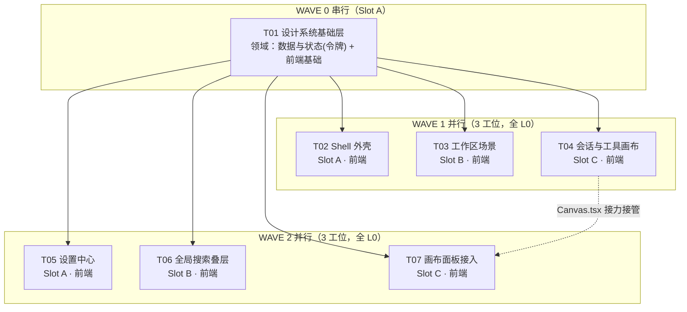

# 并行任务分解 —— design/ R2 落地（docs/design-waves.md）

> 上游契约：`docs/design.md`（令牌映射 / 状态矩阵 / opt-* 类名清单）。
> 前提事实：**全流程零依赖安装 → 全流程无 L2 副作用**；所有既有 CSS 文件一律只读，增量只进 `opt-*.css` —— 这是本分解"同 wave 零冲突"的根基。
> Shell 通道：WSL。所有命令形如 `wsl.exe -- bash -c "cd /root/project/r-code/src-tauri/frontend && <命令>"`；git 只在 WSL 内跑；文件行尾 LF。

## 依赖包列表

```
（无新增依赖 —— 契约：纯 CSS/组件改动，不得出现任何安装步骤）
```

## WAVE 结构总览



- W1 内 T02/T03/T04 之间**无 import 依赖**（各自只消费 T01 的 opt.css 类名契约 + 自己的组件树），波内互等风险 = 0。
- 波内验证能力声明：W1/W2 为并行 wave，**命令级验证 ≈ 0**（仓库级 tsc/build/全量测试是死信，禁跑）；成员 IS_PASS = **静态审查通过**；编译级验证全部押在各 wave 收口（主理人执行）。
- **每任务预估产出为非空非注释行口径**。

---

## WAVE 0（串行，单工位；共享前置 + 全部令牌改值集中在此）

### T01 设计系统基础层（opt.css + 令牌 + CSS 注册）

- **Task ID**：T01　**Task Name**：设计系统基础层
- **Wave**：W0　**Slot**：A（串行独占）　**领域**：数据与状态（tokens.css）+ 前端基础（opt.css）
- **OWNED**（8 个文件，逐条展开）：
  1. `src-tauri/frontend/src/styles/tokens.css`（仅 §1.2 增量：`--agent-name`/`--agent-shine`/`--text-hero` 三新令牌 + `--menubar-h`/`--rail-w`/`--rail-w-narrow` 三处改值，其余行零改动）
  2. `src-tauri/frontend/src/styles/opt.css`（新建：§design.md §5 骨架+基础件+叠层公共类；含 opt-drawer/opt-confirm/opt-search-* 全量样式）
  3. `src-tauri/frontend/src/styles/opt-shell.css`（新建，W0 只写头部契约注释，主体由 T02 接管）
  4. `src-tauri/frontend/src/styles/opt-scenes-workspace.css`（新建，starter，T03 接管）
  5. `src-tauri/frontend/src/styles/opt-room.css`（新建，starter，T04 接管）
  6. `src-tauri/frontend/src/styles/opt-settings.css`（新建，starter，T05 接管）
  7. `src-tauri/frontend/src/styles/opt-overlays.css`（新建，starter，T06 接管）
  8. `src-tauri/frontend/src/main.tsx`（**仅追加 6 行 CSS import**：opt.css 及 5 个 starter；其余零改动）
- **READ-ONLY**：`design/tools/proposal.css`、`design/tools/revision-2.css`、`design/renders/*.html`（对照）、`docs/design.md`、`src-tauri/frontend/src/styles/workbench-page.css`（先例规范）
- **跨任务契约**：opt-* 类名唯一定义点在 opt.css + 各 opt-*.css；五个 starter 文件的头部注释写明「本文件归 T0x 接管」。
- **命令清单**（W0 串行，允许仓库级检查）：
  - allow: `npx tsc --noEmit -p tsconfig.json`　timeout 300000　← 串行 wave 仓库级类型检查合法（构建编译档）
  - allow: `grep -nE "#[0-9a-fA-F]{3,8}" src/styles/opt.css src/styles/opt-shell.css src/styles/opt-scenes-workspace.css src/styles/opt-room.css src/styles/opt-settings.css src/styles/opt-overlays.css`　timeout 60000　← 字面色自检，预期仅 `--agent-name/--agent-shine` 定义行命中（只读档）
- **副作用等级**：L0（只写 OWNED 文件；无安装/无锁文件/无迁移）
- **预估产出**：约 580 行（opt.css ≈ 480 + tokens ≈ 35 + starters 头注释 ≈ 60 + main.tsx 6）
- **Dependencies**：无　**Priority**：P0

---

## WAVE 1（并行 3 工位；全 L0；OWNED 零交集；零仓库级命令）

### T02 Shell 外壳（menubar + rail + main 圆角）

- **Task ID**：T02　**Task Name**：Shell 外壳增量
- **Wave**：W1　**Slot**：A　**领域**：前端
- **OWNED**（3 个文件）：
  1. `src-tauri/frontend/src/components/shell/Rail.tsx`
  2. `src-tauri/frontend/src/components/shell/MenuBar.tsx`
  3. `src-tauri/frontend/src/styles/opt-shell.css`（T01 接管：sidebar-* 尺寸/间距/圆角增量、`.main` 圆角与装饰层裁剪、rail 264px/232px 断点行为）
- **READ-ONLY**：`src/styles/tokens.css`、`src/styles/opt.css`、`src/styles/shell.css`、`src/styles/signature.css`（只读对照，增量全写 opt-shell.css）、`src/components/shell/RailResizeHandle.tsx`（逻辑不动）、`src/store/app.ts`（不改 store）、`docs/design.md`
- **跨任务契约**：类名体系不变（`sidebar-brand-row`/`sidebar-nav-item`/`sidebar-task`/`sidebar-section-head` 等），只做样式对齐；`sidebar-task time` 隐藏；`.main::before/::after` 裁剪写 opt-shell.css（同选择器覆盖，不改 signature.css）。覆盖 34 页共享 chrome（keep 页内容不动）。
- **命令清单**（并行 wave，两维判据全过：只读自检，不编译、不触及同波文件语义）：
  - allow: `grep -nE "#[0-9a-fA-F]{3,8}" src/styles/opt-shell.css`　timeout 60000　← 字面色自检，预期 0 命中
  - allow: `git status --porcelain`　timeout 60000　← 确认改动仅限 OWNED 清单（只读档）
- **副作用等级**：L0　**预估产出**：约 360 行（Rail ≈ 120 + MenuBar ≈ 60 + opt-shell.css ≈ 180）
- **Dependencies**：T01　**Priority**：P0（34 页共享外壳，阻塞视觉基线）

### T03 工作区场景（home / dashboard / conversations / inbox / projects / editor）

- **Task ID**：T03　**Task Name**：工作区场景增量
- **Wave**：W1　**Slot**：B　**领域**：前端
- **OWNED**（7 个文件）：
  1. `src-tauri/frontend/src/components/scenes/HomeScene.tsx`
  2. `src-tauri/frontend/src/components/scenes/DashboardScene.tsx`
  3. `src-tauri/frontend/src/components/scenes/ConversationsScene.tsx`
  4. `src-tauri/frontend/src/components/scenes/InboxScene.tsx`
  5. `src-tauri/frontend/src/components/scenes/ProjectsScene.tsx`
  6. `src-tauri/frontend/src/components/scenes/EditorScene.tsx`
  7. `src-tauri/frontend/src/styles/opt-scenes-workspace.css`（T01 接管：opt-home/suggestions、opt-dashboard*、opt-feed-item、opt-decision-row、opt-table/toolbar/summary、opt-projects-*、opt-editor*/opt-file-tree 等页面级增量）
- **READ-ONLY**：`src/styles/opt.css`、`src/styles/tokens.css`、`src/styles/scenes.css`、`src/styles/scenes/home.css`、`src/styles/scenes/canvas.css`、`src/styles/scenes/misc.css`（**keep 页样式所在，禁改**）、`src/components/deck/**`（deck 组件只读）、`docs/design.md`
- **跨任务契约**：TSX 只消费 `docs/design.md` §5 类名；home-composer 的加宽浮起样式（proposal.css:101-104）落在 opt-scenes-workspace.css，作用域限定 `.scene-home`；不改 store 数据流。
- **命令清单**：
  - allow: `grep -nE "#[0-9a-fA-F]{3,8}" src/styles/opt-scenes-workspace.css`　timeout 60000
  - allow: `git status --porcelain`　timeout 60000　← 越界自检
- **副作用等级**：L0　**预估产出**：约 700 行（6 场景 TSX ≈ 70 行/个 + CSS ≈ 280）
- **Dependencies**：T01　**Priority**：P1

### T04 会话与工具画布（conversation / tool-launcher / runs / files / terminal / review / plan / permission）

- **Task ID**：T04　**Task Name**：会话与工具画布增量（revision-2 主体：命名子代理轨迹 + 开放式画布布局）
- **Wave**：W1　**Slot**：C　**领域**：前端
> **【W1 收口后裁定注记】**：T04 实际落地 870 代码行触发红线并停手；P04/P05/P06 + 全部 opt-room.css 定义点已验收。P07/P08/P09/P10/P11 的 TSX 消费接入拆出为 **T07**（见 W2）——原 T04 卡中这五页承载组件（files/、plan/、Permissions、EnhancedReviewPanel 等）均为 READ-ONLY，属分解缺口，非成员问题。T04 名下文件自此关闭，**唯一例外：`Canvas.tsx` 由 T07 接力接管**（见所有权矩阵）。

- **OWNED**（8 个文件）：
  1. `src-tauri/frontend/src/components/scenes/RoomScene.tsx`
  2. `src-tauri/frontend/src/components/room/Timeline.tsx`
  3. `src-tauri/frontend/src/components/room/SubagentWorkbench.tsx`
  4. `src-tauri/frontend/src/components/room/SubagentPanel.tsx`
  5. `src-tauri/frontend/src/components/room/Composer.tsx`
  6. `src-tauri/frontend/src/components/room/Canvas.tsx`
  7. `src-tauri/frontend/src/components/workbench/WorkbenchPage.tsx`
  8. `src-tauri/frontend/src/styles/opt-room.css`（T01 接管：scene-room 双栏 520px、timeline/you 气泡、opt-subagent-lines 全家、opt-tool-menu/intro/line、opt-panel-head/body/footer、opt-terminal*、opt-check-steps、opt-review-*、opt-diff-*、opt-mini-stats、opt-inline-state、opt-agent-name sheen 动画）
- **READ-ONLY**：`src/styles/opt.css`、`src/styles/tokens.css`、`src/styles/scenes/room.css`（**禁改**）、`src/styles/workbench.css`、`src/components/room/` 其余文件（ToolCard/Permissions/Markdown 等）、`src/components/plan/`、`src/components/files/`、`src/store/tasks.ts`、`docs/design.md`
- **跨任务契约**：子代理轨迹 DOM 结构 = `opt-subagent-line > opt-icon + opt-agent-kind + opt-agent-name[data-name] + opt-agent-separator + opt-agent-description`；运行态类名 `is-running`、完成态 `is-complete`、面板内 `in-panel` 由 TSX 置类、CSS 消费。sheen 动画必须带 prefers-reduced-motion 分支。`.scene-room` 双栏 + `.room-splitter` 隐藏是本任务独管面。
- **命令清单**：
  - allow: `grep -nE "#[0-9a-fA-F]{3,8}" src/styles/opt-room.css`　timeout 60000　← 预期仅 `--agent-name/--agent-shine` 引用（非定义）
  - allow: `git status --porcelain`　timeout 60000
- **副作用等级**：L0　**预估产出**：约 800 行（上限贴近，**若实际超出立即停手报主理人**，由主理人决定是否拆出 W1.5 追加任务）
- **Dependencies**：T01　**Priority**：P0（改动面最大 + revision-2 核心视觉）

---

## WAVE 2（并行 3 工位；全 L0；OWNED 零交集；零仓库级命令）

### T05 设置中心（13 个 optimize 设置页 + provider 编辑/放弃确认）

- **Task ID**：T05　**Task Name**：设置中心增量
- **Wave**：W2　**Slot**：A　**领域**：前端
- **OWNED**（10 个文件）：
  1. `src-tauri/frontend/src/components/scenes/SettingsScene.tsx`（含设置内导航 opt-settings/opt-settings-nav 骨架）
  2. `src-tauri/frontend/src/components/scenes/KnowledgeSettingsPane.tsx`
  3. `src-tauri/frontend/src/components/scenes/MemoryPanel.tsx`
  4. `src-tauri/frontend/src/components/scenes/McpPanel.tsx`
  5. `src-tauri/frontend/src/components/scenes/SubagentProvidersPanel.tsx`（provider-editor 表单态在此）
  6. `src-tauri/frontend/src/components/scenes/ExecutionEnvCard.tsx`
  7. `src-tauri/frontend/src/components/settings/ApplicationUpdaterSettings.tsx`
  8. `src-tauri/frontend/src/components/settings/ApplicationUpdaterSettings.css`
  9. `src-tauri/frontend/src/components/settings/LanguageSettingsSection.tsx`
  10. `src-tauri/frontend/src/styles/opt-settings.css`（T01 接管：opt-settings 骨架、opt-setting-line、opt-scope、opt-tabs.line、opt-field/footer、settings-prompts sticky footer、opt-agent-choice、opt-runtime-*、opt-mcp-*、opt-service-title、opt-environment-*、opt-skill-*、opt-theme-*、opt-validation-line、opt-inbox-file 等设置面增量）
- **READ-ONLY**：`src/styles/opt.css`（opt-drawer/opt-confirm/opt-field 等公共件在 T01）、`src/styles/tokens.css`、`src/components/settings/NativeNotificationSettings.tsx`（**P25 保留，禁改**）、`src/components/settings/GuideSheet.tsx`、`src/components/ui/Drawer.tsx`、`src/components/ui/ConfirmDialog.tsx`（复用，样式类挂 opt-drawer/opt-confirm）、`docs/design.md`
- **跨任务契约**：provider 放弃确认弹层复用 `ui/ConfirmDialog.tsx` 挂 `opt-confirm` 类（T01 已定义样式）；provider-editor 抽屉复用 `ui/Drawer.tsx` 挂 `opt-drawer` 类。**禁止改 ui/ 下文件**，若现有组件达不到形态 → 停手报主理人。
- **命令清单**：
  - allow: `grep -nE "#[0-9a-fA-F]{3,8}" src/styles/opt-settings.css`　timeout 60000
  - allow: `git status --porcelain`　timeout 60000
- **副作用等级**：L0　**预估产出**：约 780 行（贴近上限；13 页多为消费 opt.css 公共件的类名级改造，若超出停手报主理人）
- **Dependencies**：T01　**Priority**：P1

### T06 全局搜索叠层（search / search-empty）

- **Task ID**：T06　**Task Name**：全局搜索叠层增量
- **Wave**：W2　**Slot**：B　**领域**：前端
- **OWNED**（2 个文件）：
  1. `src-tauri/frontend/src/components/SearchOverlay.tsx`
  2. `src-tauri/frontend/src/styles/opt-overlays.css`（T01 接管：opt-search-backdrop/modal/scope/input/results/footer、opt-search-result；空结果态复用 opt-empty）
- **READ-ONLY**：`src/styles/opt.css`、`src/styles/tokens.css`、`src/store/app.ts`（searchOpen 状态消费不改）、`docs/design.md`
- **跨任务契约**：搜索遮罩背景一律 `--overlay-scrim` + backdrop-filter blur（设计稿 5px→收敛用 `--fx-blur` 或声明 5px 为遮罩模糊例外值）；modal 宽 650px 允许为字面例外（容器宽度非手感值，记录在文件头注释）。
- **命令清单**：
  - allow: `grep -nE "#[0-9a-fA-F]{3,8}" src/styles/opt-overlays.css`　timeout 60000
  - allow: `git status --porcelain`　timeout 60000
- **副作用等级**：L0　**预估产出**：约 300 行
- **Dependencies**：T01　**Priority**：P2（2 页，影响面最小）

---

### T07 画布面板接入（files / terminal / review / plan / permission）

> **【W1 收口后新增任务，主理人裁定】**：T04 触发 870 行红线停手后的拆分产物；接管 T04 名下唯一接力文件 `Canvas.tsx`。

- **Task ID**：T07　**Task Name**：画布面板 TSX 消费接入（P07 files / P08 terminal / P09 review / P10 plan / P11 permission）
- **Wave**：W2　**Slot**：C　**领域**：前端
- **OWNED**（10 个文件，逐条展开；已探查实际行数）：
  1. `src-tauri/frontend/src/components/room/Canvas.tsx`（**T04 接力接管**；3345 行 —— ⚠️ 单文件最小变更原则见下）
  2. `src-tauri/frontend/src/components/room/Permissions.tsx`（127 行，P11 权限确认面板）
  3. `src-tauri/frontend/src/components/room/EnhancedReviewPanel.tsx`（516 行，P09 变更审核面板）
  4. `src-tauri/frontend/src/components/room/LocalResource.tsx`（288 行，P07 文件面板资源行）
  5. `src-tauri/frontend/src/components/files/FileCodePreview.tsx`（122 行，P07 代码预览）
  6. `src-tauri/frontend/src/components/files/FileContextMenu.tsx`（225 行，P07 文件右键菜单）
  7. `src-tauri/frontend/src/components/plan/PlanPanel.tsx`（1006 行，P10 计划工作台面板）
  8. `src-tauri/frontend/src/components/plan/plan-description.ts`（109 行，计划文案数据）
  9. `src-tauri/frontend/src/components/plan/useTaskPlan.ts`（85 行，计划状态 hook）
  10. `src-tauri/frontend/src/styles/opt-room-2.css`（新建；T07 独占的补丁增量层，**原则为零新增 CSS，见契约**）
- **READ-ONLY**：`src/styles/opt.css`、`src/styles/opt-room.css`（T04 已关闭，禁改）、`src/styles/tokens.css`、`src/components/room/RoomScene.tsx`、`room/` 其余（Timeline/SubagentPanel/Composer/SubagentWorkbench/ToolCard/Markdown 等，T04 已关闭）、`src/components/scenes/*`（T03/T05 名下）、`src/components/workbench/WorkbenchPage.tsx`、`src/main.tsx`（import 注册见收口动作）、`src/store/*`、`docs/design.md`
- **单文件最小变更原则（Canvas.tsx 3345 行教训，硬约束）**：
  - 只允许**类名挂接**（className 增补 opt-* 已定义类）与**面板容器局部结构调整**，单次 diff 连续区块 ≤40 行；
  - 禁止抽组件、禁止重排/重命名既有变量与函数、禁止"顺手"重构 —— 发现需要结构性改动 → 停手报主理人；
  - 终端面板（P08）标记位于 Canvas.tsx 内部（TerminalPanel/TerminalViewport 段，约 L2497-2943），在原位挂 `opt-terminal`/`opt-terminal-tabs`/`opt-terminal-path` 类，**不外抽新文件**；
  - PlanPanel.tsx（1006 行）同理：只做类名消费接入，逻辑改动仅限 useTaskPlan.ts 的最小必要。
- **跨任务契约**：
  - 消费 opt-room.css / opt.css **已就位定义点**（经探查全部存在）：`opt-file-layout` `opt-file-tree` `opt-file-blank` `opt-file-tab` `opt-editor` `opt-editor-code` `opt-line-no` `opt-code-key/value/foot` `opt-terminal` `opt-terminal-tabs` `opt-terminal-path` `opt-check-steps` `opt-review-files` `opt-review-file` `opt-diff` `opt-diff-add` `opt-diff-del` `opt-panel-head/body/footer` `opt-inline-state` `opt-icon` `opt-button` `opt-pill` `opt-empty` `opt-card` `opt-help`；
  - **原则上零新增 CSS**：以上定义点不够用时才允许写 `opt-room-2.css`（T07 独占）；写完后报主理人在 W2 收口串行追加 `main.tsx` 一行 import（L1，主理人动作，不走 T07 之手）；
  - 状态类沿用共享知识第 5 条命名（`.active/.selected/.is-running/.is-complete/.in-panel`）。
- **命令清单**（并行 wave，只读档，两维判据全过）：
  - allow: `grep -nE "#[0-9a-fA-F]{3,8}" src/styles/opt-room-2.css`　timeout 60000　← 字面色自检（opt-room-2.css 未创建时 grep 无命中即合规）
  - allow: `git status --porcelain`　timeout 60000　← 越界自检：改动仅限 OWNED 10 文件
- **副作用等级**：L0　**预估产出**：约 480 代码行（Canvas ≈60 最小变更 + EnhancedReviewPanel ≈120 + PlanPanel ≈100 + LocalResource ≈60 + Permissions ≈50 + FileCodePreview ≈50 + FileContextMenu ≈20 + useTaskPlan/plan-description ≈20）
- **Dependencies**：T01（类名定义点）；T04（Canvas.tsx/opt-room.css 接力，已完成）　**Priority**：P0（W1 收口后唯一阻塞 34 页全量验收的面）

## 测试文件归属（显式选定）

| 测试文件 | 归属 | 说明 |
|---|---|---|
| `src-tauri/frontend/scripts/*.test.mjs`（新增） | **T-QA01（QA）** | **方案 A**：工程师不创建/不修改任何测试文件；自测靠命令与临时脚本（不落盘） |
| `src-tauri/frontend/src/remote/core/*.test.mjs`（既有） | 只读 | QA 亦不得改动既有测试 |

**T-QA01（QA 验证任务，不占 6 个实现任务额度）**：对照 `docs/design.md` 验收 34 页（类名消费面、令牌零字面色、keep 页零 diff、五态齐全）；OWNED = 新增测试文件；命令清单：
- prompt: `node --test scripts/<新增>.test.mjs`　timeout 180000（测试档）
- prompt: `node scripts/run-tests.mjs`　timeout 180000（全量测试，需主理人批准）

---

## 文件所有权矩阵（硬边界）

| 文件 | 归属任务 | 归属工位 | 其他工位权限 |
|---|---|---|---|
| src-tauri/frontend/src/styles/tokens.css | T01 | A（W0） | 全员只读 |
| src-tauri/frontend/src/styles/opt.css | T01 | A（W0） | 全员只读 |
| src-tauri/frontend/src/styles/opt-shell.css | T01 创建 → **T02 接管** | A（W0）→A（W1） | T03/T04/T05/T06 只读 |
| src-tauri/frontend/src/styles/opt-scenes-workspace.css | T01 创建 → **T03 接管** | A（W0）→B（W1） | 其余只读 |
| src-tauri/frontend/src/styles/opt-room.css | T01 创建 → **T04 接管** | A（W0）→C（W1） | 其余只读 |
| src-tauri/frontend/src/styles/opt-settings.css | T01 创建 → **T05 接管** | A（W0）→A（W2） | 其余只读 |
| src-tauri/frontend/src/styles/opt-overlays.css | T01 创建 → **T06 接管** | A（W0）→B（W2） | 其余只读 |
| src-tauri/frontend/src/main.tsx | T01（仅 6 行 import） | A（W0） | 全员只读 |
| src-tauri/frontend/src/components/shell/Rail.tsx | T02 | A（W1） | 只读 |
| src-tauri/frontend/src/components/shell/MenuBar.tsx | T02 | A（W1） | 只读 |
| src-tauri/frontend/src/components/scenes/HomeScene.tsx | T03 | B（W1） | 只读 |
| src-tauri/frontend/src/components/scenes/DashboardScene.tsx | T03 | B（W1） | 只读 |
| src-tauri/frontend/src/components/scenes/ConversationsScene.tsx | T03 | B（W1） | 只读 |
| src-tauri/frontend/src/components/scenes/InboxScene.tsx | T03 | B（W1） | 只读 |
| src-tauri/frontend/src/components/scenes/ProjectsScene.tsx | T03 | B（W1） | 只读 |
| src-tauri/frontend/src/components/scenes/EditorScene.tsx | T03 | B（W1） | 只读 |
| src-tauri/frontend/src/components/scenes/RoomScene.tsx | T04 | C（W1） | 只读 |
| src-tauri/frontend/src/components/room/Timeline.tsx | T04 | C（W1） | 只读 |
| src-tauri/frontend/src/components/room/SubagentWorkbench.tsx | T04 | C（W1） | 只读 |
| src-tauri/frontend/src/components/room/SubagentPanel.tsx | T04 | C（W1） | 只读 |
| src-tauri/frontend/src/components/room/Composer.tsx | T04 | C（W1） | 只读 |
| src-tauri/frontend/src/components/room/Canvas.tsx | T04 → **T07 接管（W2，最小变更）** | C（W1）→C（W2） | T05/T06 只读 |
| src-tauri/frontend/src/components/workbench/WorkbenchPage.tsx | T04 | C（W1） | 只读 |
| src-tauri/frontend/src/components/room/Permissions.tsx | T07 | C（W2） | 只读 |
| src-tauri/frontend/src/components/room/EnhancedReviewPanel.tsx | T07 | C（W2） | 只读 |
| src-tauri/frontend/src/components/room/LocalResource.tsx | T07 | C（W2） | 只读 |
| src-tauri/frontend/src/components/files/FileCodePreview.tsx | T07 | C（W2） | 只读 |
| src-tauri/frontend/src/components/files/FileContextMenu.tsx | T07 | C（W2） | 只读 |
| src-tauri/frontend/src/components/plan/PlanPanel.tsx | T07 | C（W2） | 只读 |
| src-tauri/frontend/src/components/plan/plan-description.ts | T07 | C（W2） | 只读 |
| src-tauri/frontend/src/components/plan/useTaskPlan.ts | T07 | C（W2） | 只读 |
| src-tauri/frontend/src/styles/opt-room-2.css | T07 | C（W2） | 只读 |
| src-tauri/frontend/src/components/scenes/SettingsScene.tsx | T05 | A（W2） | 只读 |
| src-tauri/frontend/src/components/scenes/KnowledgeSettingsPane.tsx | T05 | A（W2） | 只读 |
| src-tauri/frontend/src/components/scenes/MemoryPanel.tsx | T05 | A（W2） | 只读 |
| src-tauri/frontend/src/components/scenes/McpPanel.tsx | T05 | A（W2） | 只读 |
| src-tauri/frontend/src/components/scenes/SubagentProvidersPanel.tsx | T05 | A（W2） | 只读 |
| src-tauri/frontend/src/components/scenes/ExecutionEnvCard.tsx | T05 | A（W2） | 只读 |
| src-tauri/frontend/src/components/settings/ApplicationUpdaterSettings.tsx | T05 | A（W2） | 只读 |
| src-tauri/frontend/src/components/settings/ApplicationUpdaterSettings.css | T05 | A（W2） | 只读 |
| src-tauri/frontend/src/components/settings/LanguageSettingsSection.tsx | T05 | A（W2） | 只读 |
| src-tauri/frontend/src/components/SearchOverlay.tsx | T06 | B（W2） | 只读 |
| **其余全部文件**（含全部既有 CSS、App.tsx、store/*、ui/*、deck/*、room/ 其余） | — | — | **全员只读** |

**keep 页保护清单（任何任务不得列入 OWNED / 不得修改）**：
`src/components/scenes/ActivityScene.tsx`（P13）、`src/components/scenes/ArchiveScene.tsx`（P14）、`src/components/settings/NativeNotificationSettings.tsx`（P25），及 keep 页专属样式 `src/styles/scenes/misc.css`、`src/styles/scenes/room.css`、`src/styles/memory.css`。

硬校验确认：同 wave 任意两任务 OWNED 零交集 ✅；一个文件只归一个任务 ✅（跨 wave 接管 5 个 starter 均已注明「T01 创建 → T0x 接管」）。

---

## 共享知识（跨任务契约，逐字生效）

1. opt-* 类名的**唯一定义点** = `opt.css` + 本任务独占的 `opt-*.css`；TSX 只消费 `docs/design.md` §5 清单内的类名，不自造新类名。
2. **零字面主题色**：opt-*.css 中禁止 hex；例外仅 `--agent-name/--agent-shine` 定义行（tokens.css）与 accent 文字色 color-mix 锚点（先例 workbench-page.css `--_accent-text`）。
3. **几何零裸 px**：一律走 `docs/design.md` §1.3 映射；例外清单 = 图标视口 16/20、68ch 行长、2px 选中内嵌条、1px 线宽、容器宽度定案值（650px 搜索 modal / 520px room 面板 / 188-166-154px 设置导航）。
4. **既有 CSS 文件全员只读**；tokens.css 仅 T01 按 `docs/design.md` §1.2 增量。
5. TSX 状态类命名沿用现有语义（`.active` / `.selected` / `.is-running` / `.is-complete` / `.in-panel`），CSS 侧按 `docs/design.md` §2 状态矩阵消费。
6. 不改 `store/*`、`App.tsx`、`ui/*`、数据流；组件达不到设计形态 → 停手报主理人，不擅自越界改文件。
7. **【追认 ①】`opt-agent-stop` 为正式契约类名**：T04 落地时在 SubagentPanel/Timeline 消费的追加类，已在 `opt-room.css` 定义并验收；自本追认起纳入 `docs/design.md` §5 类名清单（会话与工具面板族），后续工位可正常消费。
8. **【追认 ②】`canvas-body` 不挂 `opt-panel-body` 为定案**：工作台主体容器保留 `canvas-body workbench-body` 原生类名（Canvas.tsx L513 现状），不叠加 opt-panel-body；`opt-panel-head/body/footer` 仅用于抽屉/浮层面板表面。理由：主体容器有自己的滚动与会话逻辑，套面板表面类会引入双重 padding/滚动嵌套。
9. **【追认 ③】T03 与会话画布类的跨文件关系**：T03 的 InboxScene 已消费 `opt-inline-state`/`opt-panel-body`/`opt-panel-footer`/`opt-panel-head`（定义点在 opt-room.css，归 T04→T07 所有权）。消费合法性的依据是「类名唯一定义点」契约（本清单第 1 条）而非文件所有权；T07 对这些定义点**只增不改**（如需变更 → 停手报主理人）。同关系适用于一切「TSX 在 A 任务名下、类定义在 B 任务名下」的场景。

---

## 页面 → 任务 → 工位覆盖表（34 页全量）

| 页 | pageId | 任务 | 工位 | 决策 |
|---|---|---|---|---|
| P01 | home | T03 | B | 优化 |
| P02 | dashboard | T03 | B | 优化 |
| P03 | conversations | T03 | B | 优化 |
| P04 | conversation | T04 | C | 优化 |
| P05 | tool-launcher | T04 | C | 优化 |
| P06 | runs | T04 | C | 优化 |
| P07 | files | T07 | C | 优化 |
| P08 | terminal | T07 | C | 优化 |
| P09 | review | T07 | C | 优化 |
| P10 | plan | T07 | C | 优化 |
| P11 | permission | T07 | C | 优化 |
| P12 | inbox | T03 | B | 优化 |
| P13 | activity | — | — | **保留不动** |
| P14 | archive | — | — | **保留不动** |
| P15 | projects | T03 | B | 优化 |
| P16 | editor | T03 | B | 优化 |
| P17 | settings-providers | T05 | A | 优化 |
| P18 | settings-agents | T05 | A | 优化 |
| P19 | settings-subagents | T05 | A | 优化 |
| P20 | settings-tools | T05 | A | 优化 |
| P21 | settings-knowledge | T05 | A | 优化 |
| P22 | settings-permissions | T05 | A | 优化 |
| P23 | settings-security | T05 | A | 优化 |
| P24 | settings-appearance | T05 | A | 优化 |
| P25 | settings-notifications | — | — | **保留不动** |
| P26 | settings-lifecycle | T05 | A | 优化 |
| P27 | settings-updates | T05 | A | 优化 |
| P28 | settings-diagnostics | T05 | A | 优化 |
| P29 | settings-prompts | T05 | A | 优化 |
| P30 | settings-skills | T05 | A | 优化 |
| P31 | search | T06 | B | 优化 |
| P32 | search-empty | T06 | B | 优化 |
| P33 | provider-editor | T05 | A | 优化（P34 同属一个交互流） |
| P34 | provider-discard | T05 | A | 优化 |

共享 chrome（menubar/rail/主题令牌）→ T02/T01，对 34 页（含 keep 页外壳）生效。

---

## WAVE 收口自检（主理人动作，非任务命令）

- W0 收口：`npx tsc --noEmit -p tsconfig.json`（300000）+ opt*.css 字面色 grep（60000）。
- W1 收口：同上 + grep 校验 keep 页相关文件 `git diff --name-only` 为空（60000）。
- W2 收口：`npx tsc --noEmit -p tsconfig.json`（300000）+ QA 的 T-QA01；如需构建级确认另批 `npm run build`（300000，prompt 级）。
- W2 收口附加动作（主理人串行执行，仅当 T07 用到 opt-room-2.css）：向 `src/main.tsx` 追加 1 行 `import "./styles/opt-room-2.css";`（L1，单工位串行）。
