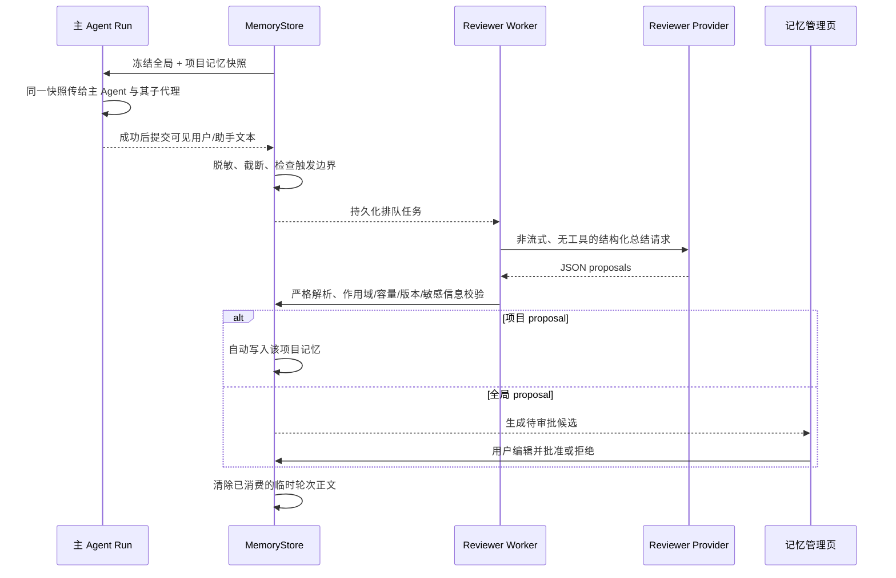

# 演进记忆

R-Code 的演进记忆是单机、单用户的产品能力。它把稳定偏好、约束、惯例、决策与易错点从成功对话中提炼出来，在后续运行开始时注入模型上下文。它不依赖登录或后端服务，也不会在项目目录中创建记忆文件。

## 默认状态与作用域

- 功能默认关闭。关闭时不采集、不总结、不注入。
- 开启时必须选择一个已配置的模型服务和模型作为轻量 Reviewer。Reviewer 只负责提出结构化建议；更换 Provider 不会创建另一套记忆。
- 全局记忆属于当前设备上的使用者，能注入所有开启记忆的运行。
- 项目记忆使用稳定的 workspace ID 归属，只注入对应项目。
- 项目模式有三种：`inherit`（读写）、`read_only`（只注入）、`off`（不注入也不采集）。模式切换采用 generation 校验，并使旧的未完成复盘失效。

全部设置和正文位于操作系统 AppData 下的 `r-code/db/r-code.db`。R-Code 不会创建 `.r-code/memory.md`，也不会自动修改 `.gitignore`、Git 索引或历史。

## 触发条件

一次“有效轮次”必须同时满足：

1. 顶层主 Agent Run 正常完成；
2. 有非空的可见用户文本与最终助手文本；
3. 最终结果不是错误回复；
4. 运行开始时该作用域允许采集，且完成时项目 generation 仍然一致。

附件正文、工具参数、工具输出、隐藏推理和子代理完整 transcript 不进入 Reviewer 缓冲。

支持三种触发方式：

| 触发 | 行为 |
| --- | --- |
| 周期复盘 | 默认每 10 个有效轮次触发一次，可配置为 5–50 |
| 明确记住 | 开启该选项后，`/remember `、`remember:`、`记住：`、`请记住：` 开头的成功轮次立即触发 |
| 手动复盘 | 在“知识与指令 → 记忆”中对当前作用域的最近会话发起 |

同一会话有失败或中断且尚未处理的复盘时，新轮次不会越过它继续生成并发候选；界面会显示重试或取消入口。

## 数据流

每个 Run 使用开始时冻结的快照，因此运行途中修改记忆不会让主 Agent 与子代理看到不同版本。下一次 Run 才会读取新版本。注入账本只保存 entry ID、版本、字符数与快照 hash，不复制正文。

## Reviewer 的安全边界

Reviewer 请求满足以下约束：

- 使用用户指定的 Provider/模型，非流式，最多 2,048 输出 token；
- 没有任何工具，也不能读项目文件；
- 输入只包含经过凭据遮盖、控制字符清理、工作区路径替换和长度限制的可见轮次，以及受容量限制的已有记忆；
- 输出必须是严格 JSON，最多 8 条 proposal；
- 模型输出不能直接落库，必须通过确定性的 schema、证据、作用域、敏感内容、容量和乐观版本校验。

项目 proposal 只能写回冻结的源 workspace。全局 proposal 始终先进入候选列表，只有当前使用者明确批准后才生效。

## 持久化、恢复与清理

演进记忆的表结构由 Migration 018 引入，后续 Migration 026/028 又扩展了 `memory_review_turns` 与 `memory_entries`。当前 schema 版本见 `crates/r-code-store/src/migrations.rs` 的 `LATEST_SCHEMA_VERSION`。相关表包括：

- `memory_settings`：全局开关、Reviewer 和触发设置；
- `memory_entries` / `memory_entry_revisions`：当前正文与版本历史；
- `memory_review_turns`：短期、已脱敏的 Reviewer 输入缓冲；
- `memory_review_jobs` / `memory_review_outcomes`：任务状态与确定性处理结果；
- `memory_candidates`：等待用户审批的全局候选；
- `memory_injections`：Run 使用过的冻结快照引用。

单分支最多保留 80 个尚未消费的轮次，每段可见文本最多 8,000 字符。成功、取消、配置/项目模式失效或容量淘汰都会把临时正文置空；失败与崩溃中断会保留脱敏缓冲，直到用户重试或取消。应用启动时，遗留的 `running` 复盘会转换为 `interrupted`，不会永久显示为运行中。

“清空记忆数据”会关闭引擎并删除正文、候选、复盘与注入账本，不会删除项目目录、对话 JSONL 或 Git 数据。

## 管理界面

“知识与指令 → 记忆”提供：

- 全局 Reviewer、触发间隔与明确记住开关；
- 各项目读写/只读/关闭模式；
- 全局与项目记忆的手工新增、编辑和删除；
- 全局候选的修改、批准和拒绝；
- 最近复盘状态、失败重试与排队取消；
- 旧 `.r-code/memory.md` 的只读元数据风险提示。

旧版文件检查不会读取正文，也不会提供导入、删除、取消跟踪或改写 Git 历史的操作。
