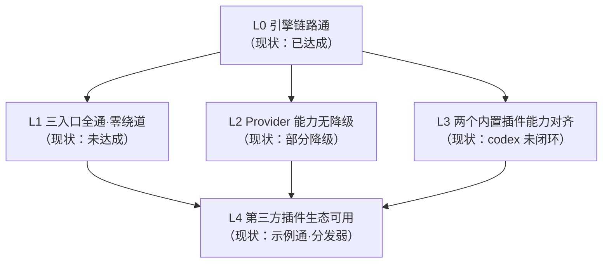
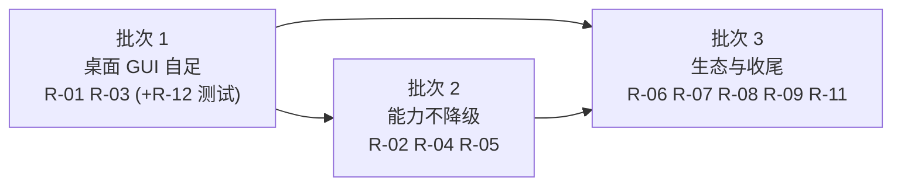

# R-Code「完全打通 Harness」端到端验收 PRD（增量）

> 作者：许清楚（PM） ｜ 日期：2026-09-13 ｜ 状态：草案，待用户拍板开放问题后转实施
> 取证基线：`docs/harness-provider-audit.md`（2026-09-13 只读审计）、`docs/prd/pluggable-harness/plan.md`、`progress.md`
> 性质：**增量 PRD**。不推翻 plan.md §1 的既有决策（首期不做插件市场 / 在线自动更新 / Rust 动态库 ABI / WASM / 自定义插件界面 / 恶意插件 OS 沙箱 / 自动学习记忆 / 远程沙箱调度）。
> 本文件只回答一个问题：**「完全打通」到底是什么意思，怎么判定它已经发生。**

---

## 0. 为什么需要这份文档

用户原话是「当前 r-code 要完全打通 harness，应该怎么做」。这句话里的「完全打通」是模糊的：

- 从**引擎**看，它已经打通了 —— T00–T42 共 43 项任务全 done（`progress.md:74-82`），旧执行链已退役。
- 从**桌面用户**看，它**没打通** —— 设置页里配的 provider 根本不进 harness 链路，必须先在 TUI 里跑一次 `/setup`（`docs/harness-provider-audit.md:140-166`）。
- 从**模型能力**看，它**打通但降级** —— 图片、推理旋钮、托管工具结果在 broker 投影层被丢掉（`models.rs:104-116`）。

三种说法都成立，取决于「打通」指哪一层。因此本 PRD 的第一产出是**把「完全打通」拆成 5 个可判定的层级**，每层配可执行命令或可观察行为，而不是形容词。

---

## 1. 分级 DoD：什么叫「完全打通」

判定规则：**每一级必须该级全部验收项通过才算达成；任一项失败即该级未达成。** 不允许「基本完成」。

### L0 — 引擎链路通 ✅ **现状已达成**

Harness 引擎本身可运行：协议 / SDK / 宿主路由 / 内置插件 / 第三方示例 / CI 门禁齐备。

| # | 验收项 | 判定方式 |
| --- | --- | --- |
| L0-1 | 架构守卫 | `node scripts/verify-harness-v2.mjs --profile full` 退出码 0（37 检查，`progress.md:81`） |
| L0-2 | 工作区回归 | `cargo test --workspace --all-features -- --test-threads=1`（`.github/workflows/ci.yml:229`） |
| L0-3 | 一致性五项硬门 | `cargo run -p r-code-evals --bin harness-conformance`（`harness_conformance.rs:88-237`） |
| L0-4 | 真实插件进程闭环 | `cargo test -p r-code-harness-native --test t26_port_the_native_model_tool_loop_to_a_harness_bin` 2 passed（真实派生进程改文件 + checkpoint + completion） |
| L0-5 | 旧链路已退役 | `crates/r-code-agent-worker`、`extensions.rs`、`work_card.rs` 均不存在（`verify-harness-v2.mjs:65-75`） |

### L1 — 三个入口全通、且无需绕道 ❌ **现状未达成（卡在 R-01）**

**定义**：桌面 GUI / TUI / MCP 任一入口，都能**独立完成**「配 provider → 建任务 → 多轮工具调用 → 拿到结果」，不需要先切到另一个入口做前置配置。

| # | 验收项 | 判定方式 | 现状 |
| --- | --- | --- | --- |
| L1-1 | **GUI 冷启动自足**：全新 profile，只开桌面 GUI（全程不碰 TUI），设置页填 provider → 新建对话 → 发「读某文件并改一行」→ 收到 assistant 回复 + 工具调用记录 | 手工冒烟 + 自动化集成测试断言「非空的 assistant 消息」 | ❌ 必然失败：GUI 保存路径不触达 daemon（`src-tauri/src/` 全量搜索 `settings.apply` / `SettingsStore` / `SettingsBackedResolver` **零命中**）；且 `harness_v2_chat.rs:104-113` 显式忽略 `_provider_name` / `_agent_engine` |
| L1-2 | **TUI 自足**：`/setup` 后发消息成功 | `crates/r-code-tui/src/engine.rs:297-314` 走 daemon `settings.apply` | ✅ 已通过 |
| L1-3 | **MCP 自足**：MCP 入口建任务并收到非空回复 | `mcp_server.rs:23,86,139,151` 复用同一个 `ChatV2Bridge` | ⚠️ **与 L1-1 同源，GUI 修好则 MCP 同步修好**；但 MCP 无独立端到端测试，**待验证** |
| L1-4 | GUI 能列出真实 provider 选择 | 前端可调 daemon `models.available`（`r-code-service.rs:284`） | ❌ 前端零命中 `models.available`（本次 grep 确认） |
| L1-5 | 无 provider 时**显式引导**，不静默失败 | GUI 首屏/设置页给出「去哪配」的可操作提示 | ❌ 仅 TUI 有（`crates/r-code-tui/src/lib.rs:395-411`）；GUI 侧缺失 |
| L1-6 | 新增架构守卫：GUI 不得存在「保存 provider 但不触达 daemon」的路径 | 在 `verify-harness-v2.mjs` 加 1 条静态 guard | ❌ 无此守卫 |

### L2 — Provider 能力无降级 ❌ **现状部分降级**

**定义**：broker 投影层不再静默丢弃能力；不支持的能力必须**显式报错**，不能伪装成支持。

| # | 验收项 | 判定方式 | 证据位置 |
| --- | --- | --- | --- |
| L2-1 | **多轮工具回传角色正确**：真实 provider（尤其 Anthropic 口）连续两轮工具调用不因协议错误失败 | 真实 key 端到端 + 单测断言 `ModelRole::Tool` → `Role::User` | `models.rs:97-103`；native 侧以 `role:"tool"` 推入（`plugins/native/src/request_projection.rs:118-126`） |
| L2-2 | 图片走真实多模态或**显式 unsupported**，不是文本占位 | 单测断言投影出的 `ContentBlock` 类型 | `models.rs:132-134` 当前投成 `[image: {blob_id}]` |
| L2-3 | `max_tokens` 走目录钳制值，非硬编码 | 单测：不同预设得到不同 `max_tokens` | `models.rs:84` 硬编码 8192 |
| L2-4 | 推理旋钮（thinking / effort）透传 | 单测断言 `inference` 非空时透传 | `models.rs:85-92`（当前只读 temperature） |
| L2-5 | `system` 按预设要求走顶层字段 | 单测：deepseek_anthropic 预设下 `system` 非 None | `models.rs:64` 恒 None；与 `provider_catalog.rs:435` 注意事项冲突 |
| L2-6 | `ReasoningDelta` / `ToolUseComplete` / `HostedToolUse` / `HostedToolResult` 至少以可观察事件透出 | 单测断言事件被投影为 wire `StreamEvent` | `models.rs:248-251` 全部丢弃 |
| L2-7 | `selections_view()` 返回真实目录 | 配置 3 个 provider 后 view 返回 3 条 | `models.rs:293-310`（4 个硬编码 `SELECTION_PROBE`） |
| L2-8 | `enable_caching` 可配置 | 单测断言可关闭 | `models.rs:91` 硬编码 true |

> L2-1 定性说明：审计已明确标注此为**源码级推断，未用真实 key 复验**（`harness-provider-audit.md:136`）。本 PRD 的建议是：**不等待真实 key 就修**（把它并入正确的 User 角色是无风险的正确方向），真实 key 只用于**确认修复有效**，不用于「是否需要修」的定性。这是 Q1 待用户拍板项。

### L3 — 两个内置插件能力对齐 ❌ **codex 未闭环**

| # | 验收项 | 判定方式 | 证据位置 |
| --- | --- | --- | --- |
| L3-1 | `plugins/codex` 能取回 App Server 事件流并完成一次真实任务 | 新增集成测试：派生 codex → 收到事件 → 推进到终态 | `plugins/codex/src/app_server.rs:127-140` 调 `codex.event.next` |
| L3-2 | 插件调用的方法必须全部在协议内 | 静态 guard：插件源码中 `host_call("...")` 的字面量 ⊆ `PLUGIN_TO_HOST_METHODS` | `codex.event.next` **不在** `crates/r-code-harness-protocol/src/rpc.rs:30-52`，也**未在** `router.rs:73-96` 注册 → 运行时 `method_not_found` |
| L3-3 | codex 与 native 走同一安装/注册/切换路径 | 复用 T34/T36 已有测试 | `progress.md:64,66` 已过；codex 的「运行」面尚未覆盖 |
| L3-4 | 明确 codex 的完成判据（自管凭据，不走宿主 provider 属架构意图，非缺陷） | 文档化 + 测试断言「codex 进程拿不到宿主密钥」 | `plugins/codex/src/lib.rs:1-7`、`plugins/codex/harness.json:23-38` |

### L4 — 第三方插件生态可用（无市场）⚠️ **示例通、分发与自证弱**

| # | 验收项 | 判定方式 | 现状 |
| --- | --- | --- | --- |
| L4-1 | 第三方 harness 可本地安装→注册→运行→完成申请 | `cargo test -p r-code-harness-sdk --test t11_...` | ✅ 3/3 已过 |
| L4-2 | GUI 与 TUI 均可安装/启用/禁用/切换插件 | T34 / T36 测试 | ✅ 已过 |
| L4-3 | 第三方作者仅凭 `plugin-author-guide.md` + SDK 可独立写出并跑通 | **外部盲测**，需用户组织 | ⚠️ **待验证**，本次无证据 |
| L4-4 | 目录外 / 自定义 provider 接入 | 见 Q3 | ❌ 当前不支持（`settings_store.rs:275-277` 不在目录即 None） |
| L4-5 | 打包产物包含 service + 双插件，跨平台可安装 | `node --test scripts/harness-packaging.test.mjs` | ✅ 在 full 档内，但 **CI 不跑 full**（见 R-07） |

---

## 2. 用户故事

站在「在桌面 GUI / TUI 里跑真实编码任务的开发者」角度。每条附**验收观察点**（即可执行的判定）。

| ID | 用户故事 | 验收观察点 |
| --- | --- | --- |
| US-1 | 作为**桌面 GUI 用户**，我想在设置页填完 API key 就立刻开始对话，这样我不用先去命令行跑一遍 `/setup`。 | 全新 profile，只开 GUI：设置页保存 → 新建对话 → 发消息 → 收到回复。**当前失败**（L1-1） |
| US-2 | 作为**桌面 GUI 用户**，我想在对话里直接切换模型/厂商，而不是被固定到某个默认 selection。 | GUI 模型下拉来自 daemon `models.available`；切换后下一次请求生效（`settings_store.rs:404-422` 每次解析重建 registry）。**当前：GUI 无此入口，且 `harness_v2_chat.rs:104-113` 忽略 provider 参数** |
| US-3 | 作为**编码任务执行者**，我想让 agent 连续调用多次工具（读文件→改文件→跑测试）而不中途因为协议问题崩掉，这样长任务可靠。 | 真实 provider 上连续 ≥2 轮 tool_use/tool_result 不失败（L2-1） |
| US-4 | 作为**TUI 用户**，我想 `/setup` 一次就全套可用，且首屏明确告诉我「没配 provider 时去哪配」。 | TUI 首屏引导存在且不降级演示（`lib.rs:395-411`）。**当前：TUI 已满足** |
| US-5 | 作为**MCP 集成方**，我想通过 MCP 入口发起任务并拿到与 GUI 一致的结果，不希望它是二等公民。 | MCP 与 GUI 共用 `ChatV2Bridge`；新增端到端断言。**当前：待验证**（L1-3） |
| US-6 | 作为**想换引擎的用户**，我想安装一个第三方 harness 并在新分支上选中它，不用改核心、不用重编译。 | 安装→选择→运行→完成：GUI/TUI 均可；`examples/repair-harness` 已跑通（L4-1/L4-2） |
| US-7 | 作为**Codex 用户**，我想用自己的 Codex 登录态跑任务，且我的模型凭据不会泄漏给宿主。 | codex 插件能真正取回 App Server 事件并推进到终态（L3-1）；凭据隔离已有断言（L3-4） |
| US-8 | 作为**注重可预期性的用户**，当某个能力（图片、超长输出、Plan 入口、/compact）在 v2 上暂不支持时，我想看到明确的「不支持」提示，而不是被静默降级成错误结果。 | 不支持项返回可操作的 unsupported 提示，而非静默占位（`models.rs:132-134` 图片占位、`progress.md:82` 三处诚实降级） |

---

## 3. 需求池

### P0（阻断「完全打通」的定性，必须先做）

| ID | 问题 | 影响面 | 验收标准 | 依赖 |
| --- | --- | --- | --- | --- |
| **R-01** | 桌面 GUI 设置页保存的 provider 写入 `config_dir/config.toml` + 凭据服务名 `"r-code"`；daemon 读 `harness_v2_root/settings.json` + 服务名 `"r-code-harness-v2"`。**两条通道完全不相通** | **所有桌面 GUI 用户**（最大的可用性断点）；`src-tauri/src/tauri_commands.rs:2147` → `commands.rs:11705` → `settings.rs:371-373`；`settings_store.rs:31,134-151` | L1-1 / L1-4 / L1-5 全过；`src-tauri/src/` 搜索 `settings.apply` 不再零命中 | Q2（迁移策略需拍板） |
| **R-02** | `ModelRole::Tool` 被映射为 `Role::Assistant`，而 agent-llm 与 Anthropic 协议要求 tool_result 落在 **user** 消息 | **所有走真实 provider 的多轮工具任务**，Anthropic 口风险最高；`models.rs:97-103`、`plugins/native/src/request_projection.rs:118-126` | L2-1 通过：单测断言 `Tool → User` + 真实 key 复验一轮多轮工具成功 | Q1（是否等真实 key） |
| **R-03** | GUI 无 provider 时静默失败（只表现为 run 失败），用户不知道要去哪配 | 所有首次使用桌面 GUI 的用户 | L1-5：GUI 给出指向设置页/`/setup` 的可操作提示 | R-01（或可独立先行做提示） |

### P1（能力降级与可信度，L2 / L3 的主要工作）

| ID | 问题 | 影响面 | 验收标准 | 依赖 |
| --- | --- | --- | --- | --- |
| **R-04** | broker 投影缺口：图片占位、`max_tokens` 硬编码 8192、推理旋钮丢弃、`system` 恒 None、四类事件全丢、`enable_caching` 硬编码 | 用图片附件 / 长输出 / 推理模型 / 服务端托管工具（web_search）的用户；`models.rs:61-94,132-134,248-251` | L2-2~L2-6、L2-8 全过 | 无（可与 R-01 并行） |
| **R-05** | `selections_view()` 用 4 个硬编码 `SELECTION_PROBE`，不是真实目录 | 任何依赖选择列表的客户端（当前仅测试用，但一旦 R-01 接上 GUI 就会暴露为 bug）；`models.rs:293-310` | L2-7 | R-01（GUI 接上后才有真实影响面） |
| **R-06** | `codex.event.next` 无宿主实现 → 运行期 `method_not_found`，codex 插件只走了生命周期面 | 选 codex harness 的用户；`app_server.rs:127-140`、`rpc.rs:30-52`、`router.rs:73-96` | L3-1 / L3-2 / L3-3 | Q4（补实现 vs 移除 vs 改走 `stream.event`） |
| **R-07** | CI 只跑 `verify-harness-v2 --profile quick`（14 检查），`full` 档（37 检查，含 `harness_v2_chat`、打包、t33/t35/t36）不在 CI | 全体：full 档的通过只在本地发生过（`progress.md:81`），无持续保障；`ci.yml:232`、`verify-harness-v2.mjs:95-109` | CI 中 full 档退出码 0，或**明确拆分**为 nightly | Q6（耗时可接受性） |
| **R-08** | `commands.rs` 约千行死函数带 `#[allow(dead_code)] // post-T42 cleanup pending` | 维护者：认知负担与误改风险；`progress.md:82` | 删除后 `cargo clippy --workspace --all-targets -- -D warnings` 仍全绿、workspace 测试不减 | 无 |
| **R-09** | 三处诚实降级（GUI Plan 入口、`/compact`、图片附件）目前是「后续版本提供」提示 | 依赖 Plan / 长对话压缩 / 图片的用户；`progress.md:82` | 每项要么实现、要么纳入明确的版本计划；不允许「既无实现也无计划」 | Q5（图片是否本期做） |

### P2（生态与加固）

| ID | 问题 | 影响面 | 验收标准 | 依赖 |
| --- | --- | --- | --- | --- |
| **R-10** | 目录外 / 自定义 provider 不支持（`settings_store.rs:275-277`） | 用自建网关、私有部署、目录外厂商的用户 | L4-4；若决定不做的，需在 UI 明确返回「不在目录内」而非静默跳过 | Q3 |
| **R-11** | 插件调用方法无静态守卫，协议外方法要等运行期才发现 | 第三方插件作者；`rpc.rs:30-52` | L3-2 的静态 guard 落入 `verify-harness-v2.mjs` | R-06 |
| **R-12** | MCP 入口无独立端到端测试 | MCP 集成方 | L1-3 | R-01 |
| **R-13** | `enable_caching` / 推理旋钮等无按 provider 的目录字段 | 有成本/延迟诉求的用户 | 目录增字段 + 投影读取 | R-04 |

---

## 4. 排序建议（3 批）

### 批次 1：桌面 GUI 自足（≈ R-01 + R-03 + R-12）

- **做什么**：按 Q2 拍板的策略把 GUI provider 配置接到 daemon；GUI 可列出真实 provider；无配置时给显式引导；补 MCP 端到端断言。
- **用户可感知的变化**：**桌面 GUI 首次可以独立使用** —— 装完 R-Code，在设置页填 key，立刻开始对话，不需要再切到 TUI 跑 `/setup`。这是「完全打通」对外观感最大的一步。
- **达成层级**：L1 全绿（L0 已绿）。
- **风险**：Q2 三种策略工作量差异大（见 §5）。

### 批次 2：能力不降级（≈ R-02 + R-04 + R-05）

- **做什么**：修工具结果角色映射；补齐 broker 投影（图片 / token 钳制 / 推理旋钮 / system / 托管工具事件 / caching）；`selections_view()` 读真实目录。
- **用户可感知的变化**：多轮工具任务在真实 provider（尤其 Anthropic）上稳定；长输出不再被 8192 截断；推理模型的思考过程可见；服务端联网工具的结果能透出；GUI 模型列表是真实目录而不是 4 个探针。
- **达成层级**：L2 全绿。
- **说明**：R-02 的单测部分**不需要真实 key** 即可落地；真实 key 只用于确认（Q1）。

### 批次 3：生态与收尾（≈ R-06 + R-07 + R-08 + R-09 + R-11）

- **做什么**：codex 插件真正闭环；full 档进 CI（或拆 nightly）；清死代码；三处降级给明确计划；插件方法静态守卫。
- **用户可感知的变化**：Codex harness 从「能启动」变成「能干活」；CI 开始守住 full 档， regressions 不再只在本地暴露；代码库认知负担下降。
- **达成层级**：L3 全绿 + L4 中 L4-1/L4-2/L4-5 加固（L4-3 需外部盲测，L4-4 取决于 Q3）。

---

## 5. 待确认问题（需用户拍板）

| # | 问题 | 选项 | PM 建议 |
| --- | --- | --- | --- |
| **Q1** | R-02（工具结果角色）是否必须先用真实 key 复验才定性？ | A. 等真实 key 复验后再改；B. 立即按「Tool→User」修 + 补单测，真实 key 仅用于确认 | **B**。静态证据（agent-llm `openai.rs:657` 只认 User 的 tool_result；`anthropic.rs:1733-1736` 测试构造 User+ToolResult；Anthropic 协议本身要求）方向一致，改动无风险；等待只会延长暴露期。**但不宣称「已验证修复」直到真实 key 跑通。** |
| **Q2** | GUI → daemon 的配置迁移策略？ | A. **双向同步**（GUI 与 daemon 各存一份并保持同步）；B. **一次性导入**（v2 首次启动把 config.toml 的 provider 导入 settings.json）；C. **GUI 改为直接调 daemon**（设置页不再自己写文件，改为经 `ChatV2Bridge`/`HarnessV2Bridge` 调 `settings.apply`） | **C**。A 的双写一致性成本最高；B 只解决存量，新保存仍然错位；C 只有一个写者，符合「daemon 是 settings.json 单一写者」（`settings_store.rs:4-5`）的既有设计。代价是 GUI 未连 daemon 时设置页不可用，需补离线降级提示。 |
| **Q3** | 是否支持目录外 / 自定义 provider？ | A. 不支持，但 UI 明确报「不在目录内」；B. 支持自定义 selection（自建 base_url + protocol） | **A（本期）**。plan.md §1 首期范围不含自定义插件界面；B 需要新的凭据与协议校验面，建议放到下一期。**当前行为（静默跳过）必须改成显式报错。** |
| **Q4** | codex 的 `codex.event.next` 怎么处理？ | A. 在宿主补实现（进 `rpc.rs` + `router.rs`）；B. 移除该调用，改走已有的 `stream.event` 桥（`app_server.rs:124-126` 注释自述通知经 `stream.event` 到达）；C. 保持现状并明确标注 codex 为「生命周期可用、运行未闭环」 | **B**。注释显示设计意图本就是走 `stream.event` 桥，`codex.event.next` 是首个切面的过渡产物；A 会为一个插件专用方法污染中性协议。**需插件作者确认**（我未做codex 端到端验证）。 |
| **Q5** | 图片/多模态本期做不做？ | A. 本期做真实多模态；B. 本期显式 unsupported（去掉静默占位） | **B（本期）**。至少消除「静默投成文本占位」这种骗人的行为；A 需要 blob→ImageSource 的物化链路，单列一期。 |
| **Q6** | `verify-harness-v2 --profile full` 是否进 CI？ | A. 进每次 CI；B. 拆 nightly；C. 维持 quick | **B**。full 含打包与真实进程测试，全量跑每次 CI 成本过高；但完全不跑（现状）等于 full 的绿色无人守护。 |
| **Q7** | MCP 入口是否纳入「完全打通」范围？ | A. 纳入（L1 含 MCP 断言）；B. 不纳入 | **A**。MCP 复用同一个 `ChatV2Bridge`（`mcp_server.rs:23,86,139,151`），复用面已存在，补一个端到端断言成本很低。 |
| **Q8** | `/compact`、GUI Plan 入口是否本期实现？ | A. 本期实现；B. 明确定到下一期并写入文档 | **B**，但必须是**显式计划**而非「后续版本提供」的空话（`progress.md:82`）。 |

---

## 6. 本 PRD 的证据边界（诚信声明）

- 全部结论来自**只读核查**（Read / Grep），未修改任何生产代码，未运行 `cargo` 命令。
- 以下为**本次未验证**、明确标注为「待验证」的项：
  1. R-02 的真实 provider 端到端复验（无可用密钥）—— 沿用 `harness-provider-audit.md:136` 的标注。
  2. MCP 入口的端到端行为（L1-3）—— 仅确认其复用 `ChatV2Bridge`，未实跑。
  3. L4-3（第三方作者独立上手）—— 需外部盲测，本次无证据。
  4. 批次工时估算 —— 本 PRD 不给工时，只给依赖顺序。
- 层级划分是本次新增的**判定框架**，不是对 plan.md 既有分期的修改；plan.md §8 的 T00–T42 分期保持不变。
