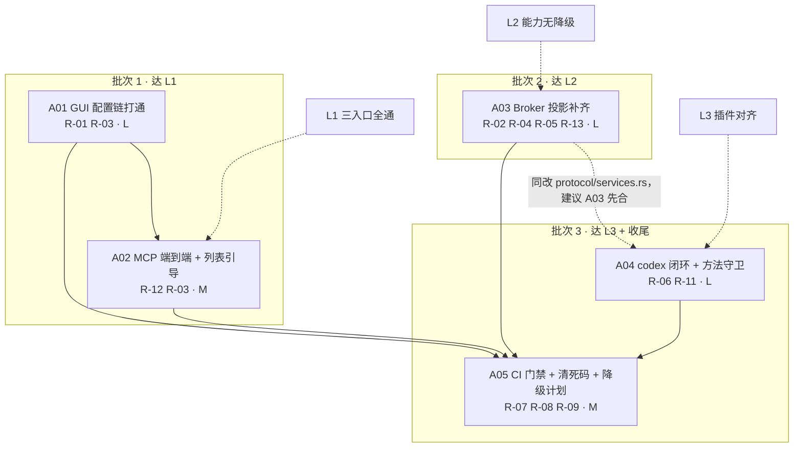

# R-Code「完全打通 Harness」增量架构设计与任务分解

> 作者：高见远（架构师） ｜ 日期：2026-09-13 ｜ 状态：待用户拍板 §5 的开放问题后转实施
> 输入契约：`docs/prd/pluggable-harness/e2e-acceptance.md`（PM 许清楚，L0–L4 + R-01~R-13 + Q1~Q8）
> 事实基线：`docs/harness-provider-audit.md`（2026-09-13 只读审计）
> 性质：**增量设计**。不推翻 `plan.md` §1 的首期范围，也不改动 T00–T42 的既有分期。
> 本次工作方式为**只读核查**（Read / Grep），未修改任何生产代码，未运行 `cargo` 命令。

---

## 0. 一句话结论

「完全打通」不是一件事，而是**四个彼此独立的缺口**：① 桌面 GUI 的配置写入根本没进 harness 链路（最致命）；② broker 投影层把工具结果角色投错、把能力静默丢弃；③ codex 插件缺的不是方法名而是**宿主的进程读能力**；④ `full` 档门禁没有持续守护。四件事可以并行，但**只有第一件会改变普通用户的观感**，所以它的优先级不可动摇。

---

## 1. 目标与分层验收映射（L1 / L2 / L3 落成技术条件）

PRD 给了「判定方式」，本节把它翻译成**「哪个函数/方法/命令达标即算达成」**，以便工程师直接照着改、照着验。

### 1.1 L1 — 三个入口全通、零绕道（对应 R-01 / R-03 / R-12）

| 验收项 | 技术条件（达标判据） | 现状根因 |
| --- | --- | --- |
| L1-1 GUI 冷启动自足 | `settingsSaveProvider`（`src-tauri/frontend/src/lib/ipc.ts:1195-1196`）最终落到 daemon `settings.apply`（`crates/r-code-runtime/src/bin/r-code-service.rs:292-310`）；随后 `models.available` 回读该 selection 的 `has_credential == true`（`settings_store.rs:216-229`）；再 `task.create` + `task.sendMessage` 能拿到非空 assistant 消息 | GUI 侧 `src-tauri/src/` 全量搜索 `settings.apply` / `SettingsStore` / `SettingsBackedResolver` / `ProviderEntry` 零命中（**本次复核：`src-tauri` 下搜 `models.available\|settings.apply\|models_available` 亦零命中**） |
| L1-2 TUI 自足 | 已达成（`crates/r-code-tui/src/engine.rs:297-314`） | — |
| L1-3 MCP 自足 | `src-tauri/src/mcp_server.rs` 复用 `ChatV2Bridge`（`harness_v2_chat.rs:44-46`）；新增端到端断言走完 create→send→非空回复 | 与 GUI 同源，无固定测试 |
| L1-4 GUI 列出真实 provider | 前端可调到 daemon `models.available`（`r-code-service.rs:284-287`），返回体为 `Vec<ProviderAvailability>`（`settings_store.rs:113-118`），**不含任何凭据** | 前端零命中 |
| L1-5 无 provider 时显式引导 | GUI 首屏/设置页显示可操作指引（指向设置页或 `/setup`），而不是 run 失败 | 仅 TUI 有（`crates/r-code-tui/src/lib.rs`，审计 §3.3） |
| L1-6 架构守卫 | `scripts/verify-harness-v2.mjs` 新增 1 条静态守卫：GUI 侧不得存在「保存 provider 但不含 daemon 调用」的路径 | 无 |

**守卫的可落地形态**（建议，避免写成无法执行的模糊检查）：扫描 `src-tauri/src/tauri_commands.rs` 中所有 `cmd_settings_save_*` / `cmd_settings_select_*` / `cmd_settings_delete_*` 命令的函数体，断言其最终调用链里出现 `harness_v2::` 或 `chat_v2::` 或 `settings.apply` 字面量之一；否则 fail。这比「全仓搜 `settings.apply`」更抗误判。

### 1.2 L2 — Provider 能力无降级（对应 R-02 / R-04 / R-05 / R-13）

| 验收项 | 技术条件 | 改哪个函数 |
| --- | --- | --- |
| L2-1 工具结果角色 | `project_message`（`models.rs:97-103`）中 `ModelRole::Tool => Role::User`；`cargo test -p r-code-runtime --test t15_...` 增加 role 断言 | `models.rs:97-103` |
| L2-2 图片 | 投影层**不再**产出 `[image: {blob_id}]` 文本占位（`models.rs:132-134`），改为返回显式 `unsupported` 错误 | `models.rs:129-135` |
| L2-3 `max_tokens` | 取 `Preset::recommended_output_tokens`，受 `Preset::max_output_tokens` 钳制（`provider_catalog.rs:209-213`），不再硬编码 8192 | `models.rs:84` + resolver 接口 |
| L2-4 推理旋钮 | `request.inference`（JSON，`services.rs:233-235`）映射到 `InferenceOptions{ thinking, reasoning_effort, verbosity }`（`vendor/agent-contracts/crates/agent-contract/src/provider.rs:46-56`），不再 `Default::default()`（`models.rs:92`） | `models.rs:85-92` |
| L2-5 `system` | 按预设策略把首条 System 消息提到 `CompletionRequest::system`（`provider.rs:62-64`），不再恒 `None`（`models.rs:64`） | `models.rs:61-103` + 目录新字段 |
| L2-6 推理/托管工具事件 | `models.rs:248-251` 的四个 `=> None` 分支改为投影成 `StreamPayload` 新变体（`services.rs:258-288`） | `models.rs:203-252` + protocol |
| L2-7 `selections_view()` | 返回真实目录，不再是 4 个硬编码 `SELECTION_PROBE`（`models.rs:293-310`） | `models.rs:290-310` + resolver 接口 |
| L2-8 `enable_caching` | 可配置（目录默认值 + entry 覆盖），不再硬编码 `true`（`models.rs:91`） | `models.rs:91` + 目录新字段 |

### 1.3 L3 — 两个内置插件能力对齐（对应 R-06 / R-11）

| 验收项 | 技术条件 | 说明 |
| --- | --- | --- |
| L3-1 codex 能取回事件流 | 新增集成测试：派生 codex 插件 → 打开 app-server 进程 → **读到进程输出** → 折叠出 `AppServerEvent::TurnCompleted`（`plugins/codex/src/app_server.rs:156-180`）→ 推进到终态 | 当前 `next_event`（`:124-140`）调 `codex.event.next` 必然 `method_not_found` |
| L3-2 插件调用方法在协议内 | 静态守卫：插件源码里 `host_call("…")` 的字面量 ⊆ `PLUGIN_TO_HOST_METHODS`（`rpc.rs:30-52`） | **该守卫一上就会抓出 `codex.event.next`，必须与修复同批次落地** |
| L3-3 安装/注册/切换同路径 | 复用 T34 / T36 已有测试，不新增 | 已过 |
| L3-4 codex 凭据隔离 | 断言 `plugins/codex/harness.json` 的 `requestedHostServices` **不含** `host.model.stream`；且新增的进程读能力**不带任何凭据语义** | 架构意图，**不要"修"掉** |

### 1.4 L4 说明

L4-3（第三方作者盲测）与 L4-4（目录外 provider）不在本次任务范围内：前者需外部组织，后者取决于 Q3。但 **L4-4 的"静默失败"必须在本期消除**（见 §2.1「目录校验」），因为它是同一个函数里的两行改动。

---

## 2. 关键设计决策

### D-1 GUI 配置链：采纳方案 C，并补三处必要修正

**结论：采纳 PM 的方案 C（GUI 改为直接调 daemon），但必须补上「目录校验」「凭据存储顺序」「可选一次性导入」三项，否则 C 落地后会留下新的静默失败。**

#### 2.1.1 通道与最小改动面（已核实）

`src-tauri` 连 daemon 的既有通道是 `HarnessV2Bridge`：

```
HarnessV2Bridge::connect()            src-tauri/src/harness_v2.rs:112-129
  → r_code_client::ensure_daemon(harness_v2_root, ipc_endpoint, profile_id, service_binary)
  → DaemonClient::connect(endpoint, profile_id, token, "desktop-gui")
  → DaemonClient::call(method, params)   // 通用字符串方法派发
```

`ChatV2Bridge` 是它的薄封装（`harness_v2_chat.rs:44-46`、`:88-98`），**没有引入第二套通道**。因此新增设置类命令的改动面是：

| 层 | 文件 | 改动 | 体量 |
| --- | --- | --- | --- |
| 桥 | `src-tauri/src/harness_v2.rs` | 新增 `models_available()` / `settings_apply(...)` / `settings_set_default(...)` / `settings_remove_provider(...)`，各约 8–12 行，复用 `self.connect()?.call(...)` | ~50 行 |
| Tauri 命令 | `src-tauri/src/harness_v2.rs` | 4 个 `#[tauri::command]` 包装（与现有 `cmd_harness_v2_ping` 等同一风格，`:280-386`） | ~60 行 |
| 注册 | `src-tauri/src/main.rs` | `invoke_handler` 追加 4 项（现有注册点在 `:1005` 附近，含 `tauri_commands::cmd_settings_save_provider`） | 4 行 |
| 前端 | `src-tauri/frontend/src/lib/ipc.ts` | 在 `:1195-1202` 的 `settingsSaveProvider` / `settingsSelectProvider` / `settingsDeleteProvider` 旁新增 v2 版 API；设置页调用点改为 v2 优先 | ~40 行 |
| daemon | `crates/r-code-runtime/src/bin/r-code-service.rs` | **零改动**——`settings.apply`（`:292-310`）、`settings.setDefault`（`:311-318`）、`settings.removeProvider`（`:319-326`）、`models.available`（`:284-287`）全部已实现 | 0 |

**这是本决策最强的技术论据：daemon 侧不需要一行改动。** 方案 A（双向同步）与 B（一次性导入）都要在 daemon 或 runtime 里新增读写逻辑，而 C 只是把已存在的 RPC 暴露给第二个客户端。

#### 2.1.2 修正一：`settings.apply` 必须做目录校验（消除两处静默失败）

`SettingsStore::apply_provider`（`settings_store.rs:155-174`）当前**完全不校验 `selection` 是否在目录内**——它直接 upsert 并 `save`。目录校验发生在更下游的 `build_provider_config`（`:275-277` `provider_catalog::find(&entry.selection)?`），而 `registry()` 对此的处理是 `continue`（`:242-244`）。

后果链：GUI 填一个目录外的 selection → apply 返回成功 → `availability()` 里它显示为「已配置」→ 实际 `registry()` 里根本不存在 → 用户发起对话得到 `unknown model selection`（`models.rs:163-165`）→ 用户无从判断是自己填错还是产品坏了。

**修正**：在 `apply_provider` 开头加

```rust
if provider_catalog::find(&entry.selection).is_none() {
    return Err(format!("unknown provider preset: {}", entry.selection));
}
```

这一行同时解决 **R-10 / Q3 / L4-4 的"静默跳过必须改成显式报错"**，且**与 Q3 选 A 还是 B 无关**——无论本期支不支持自定义 provider，静默失败都不该存在。若将来 Q3 改选 B（支持自定义），把这条校验换成「自定义分支」即可。

#### 2.1.3 修正二：凭据与文档的写入顺序

`apply_provider`（`:160-173`）当前是「先存凭据 → 再 upsert → 再 save」。若 `save` 失败（磁盘满、权限），凭据已落库但 entry 不在文档里 → 孤儿凭据，且下次 `availability()` 看不到它、用户也无法删除。

**修正**：改为「先 `save` 文档 → 成功后存凭据」，失败路径上若已存过凭据则 `self.credentials.delete(&entry.selection)` 补偿。这是幂等性的小改，建议与 D-1 同批。

#### 2.1.4 修正三：旧 `config.toml` 与 `"r-code"` 凭据库 —— 只读保留 + 显式触发的一次性导入

| 项 | 处置 | 理由 |
| --- | --- | --- |
| `config_dir/config.toml` + `SettingsService::save_global` | **保留，不删、不迁、不再作为 provider 的写入路径** | 它同时承载大量非 provider 的 GUI 设置（`src-tauri/src/settings.rs`），删除会波及面过大；plan.md §1 也未授权 |
| `"r-code"` / `"r-code-dev"` 凭据库（`src-tauri/src/app_paths.rs:19-20`） | **只读保留**，不自动迁移到 `"r-code-harness-v2"`（`settings_store.rs:31`） | 自动迁移等于让 GUI 进程批量读取并跨库搬运全部历史密钥，扩大凭据暴露面，收益（少填一次 key）不抵风险 |
| 一次性导入（存量用户） | **可选子项，用户显式点击才执行**：GUI 读取 `config.toml` 的 provider 段 + 从 `"r-code"` 服务名读取对应 key → 逐个调 `settings.apply` → 回读 `models.available` 校验 → 报告成功/失败清单 | 存量用户（含项目自身开发机）已在旧路径配过；方案 C 上线后他们的 key 会「看起来还在、实际不能用」，这是最坏的用户体验。<br>但它必须是**显式触发 + 逐条可回滚**，不能是启动期静默行为 |

> 若用户判定「不做一次性导入」也可接受，则 GUI 设置页需给出一条常驻提示：**「旧版保存的模型服务不会用于对话，请在 v2 设置中重新添加」**——即 PM 所说的「离线/未迁移降级提示」。二选一，不能两个都不做。

#### 2.1.5 凭据如何从 GUI 安全传到 daemon

- **传输面**：本机 IPC。`profile.ipc_endpoint()`（Windows 命名管道 / Unix UDS）+ daemon 签发的一次性 token（`harness_v2.rs:113-127`）。凭据不出本机、不上 Wire。
- **落地**：daemon 侧 `apply_provider` 把 key 存进平台凭据库，**`settings.json` 永不落密钥**（`settings_store.rs:147-151`，已有单测断言 `:460-462` 文件内容不含 `sk-`）。
- **远程面**：`settings.get` / `settings.apply` / `settings.setDefault` / `settings.removeProvider` **已在远程通道被显式禁止**（`remote/capabilities.rs:81-86`，执行点 `remote/listener.rs:816-820`，并有回归测试 `:877-887`）。GUI 走本地 `DaemonClient` 不受影响。
  - ⚠️ **约束**：D-1 若新增任何方法名（本设计建议**不新增**，直接复用 `settings.*`），必须同步加入 `FORBIDDEN_REMOTE_METHODS`。**最省事的做法就是不新增方法名。**
  - `models.available` 在远程是**可读**的（`capabilities.rs:117`），因为它返回 `ProviderAvailability`（`settings_store.rs:113-118`），只有 `has_credential: bool`，不含密钥——安全，无需改动。
- **日志面**：`apiKey` 参数不得进入任何 `eprintln!` / 日志。当前 `settings_store.rs:253-258` 在 provider 构造失败时只打印 selection 与 error，安全。

#### 2.1.6 失败与回滚路径

| 失败点 | 表现 | 处置 |
| --- | --- | --- |
| daemon 不可达 | `HarnessV2Error::Daemon`（`harness_v2.rs:28-41`） | 设置页报错「守护进程未就绪，请稍后重试」，**不回写 `config.toml`**，避免双写分叉 |
| selection 不在目录 | 新增的 `unknown provider preset` | 前端把该错误原样呈现，并给出目录下拉（来自 `cmd_provider_catalog`，`ipc.ts:1150-1157`） |
| apply 成功但回读 `has_credential == false` | 凭据库写入失败或 env_var 未生效 | 调用 `settings.removeProvider` 回滚，前端提示具体原因 |
| apply 成功但对话失败 | 多为凭据无效/余额/网络 | 前端把 `models.available` 的 `has_credential` 与 run 错误并列展示，避免"配好了却跑不了"的黑盒 |

**统一原则：先写 → 再回读校验 → 失败即回滚。** 回读用 `models.available`（无凭据泄露风险）。

#### 2.1.7 被否决的替代方案

| 方案 | 否决理由 |
| --- | --- |
| **A 双向同步** | 两个写者 + 两个凭据库 + 两套 schema（`config.toml` 的 `providers` map vs `settings.json` 的 `ProviderEntry` 数组）。`settings_store.rs:1-7` 明确写着 "the daemon is the single writer"，双写直接违背既有架构决策；且同步冲突的收敛规则（谁覆盖谁、按时间戳还是按版本号）本身就是一个新功能 |
| **B 一次性导入（作为主方案）** | 只解决存量，新保存仍然错位——用户第一次在新版 GUI 里加 provider 就又踩坑。作为 C 的**补充**保留，作为主方案否决 |
| **D 让 daemon 读 `config.toml`** | 把 GUI 的 schema 反向灌进 runtime，破坏「目录是唯一事实来源」（`provider_catalog.rs`）与 runtime 的中立性；且 `config.toml` 的 provider 段缺少 `protocol` 字段的强制语义（现有 `infer_legacy_provider_kind`，`commands.rs:11757-11760` 是启发式推断），会让「协议猜错」变成常态 |

---

### D-2 工具结果角色映射：立即修 + 三层无需真实 key 的回归断言

**结论：采纳 Q1 的 B（立即按 `Tool → User` 修），并把「如何不依赖真实 key 判定」落成三层断言。**

#### 2.2.1 判定（按成本从低到高）

| 层 | 做法 | 成本 | 能否定性 |
| --- | --- | --- | --- |
| **L① 静态契约断言** | 把 `ModelBroker::project`（`models.rs:61`）从私有提升为 `pub fn`（它不触碰凭据，公开无风险），在 `crates/r-code-runtime/tests/t15_...rs` 直接断言：输入 `ModelMessage{ role: Tool, content: [ToolResult{…}] }` → 输出 `Message.role == Role::User` | ~0.5 小时 | ✅ 能。它断言的是**我们自己的投影契约** |
| **L② Mock provider 端到端** | 用内核测试替身（`crates/r-code-kernel/src/testing.rs` 的 `Fake*` 系列）构造一个记录请求的假 `LlmProvider`，经 `ModelBroker::stream` 跑两轮 `tool_use → tool_result`，断言**第二轮请求体**里承载 `ToolResult` 的消息 `role == User` | ~0.5 天 | ✅ 能。它断言的是**真实请求体的形状**，与厂商无关 |
| **L③ 协议层不变量（可选加固）** | 在 broker 出口加 `debug_assert`：任何 `Role::Assistant` 的消息若含 `ContentBlock::ToolResult` 则视为内部不变量破坏。**不改 `vendor/agent-contracts`**（子模块，维护成本高） | ~1 小时 | 加固，非定性手段 |
| **L④ 真实 key 复验** | 用真实 Anthropic key 跑一次「读文件 → 改文件 → 跑测试」的两轮工具任务 | 需用户提供 key | 只用于**确认修复有效**，不用于判断"要不要修" |

**诚信声明**：审计（§2.5、`:136`）已明确「此为源码级推断，未用真实 key 复验」。本设计沿用该标注。上述 L① / L② **足以定性**——因为它们断言的是「R-Code 自己构造出的请求体是否符合 Anthropic/OpenAI 协议对 `tool_result` 落点的要求」，这一要求来自协议规范本身，不依赖某家厂商的当前实现细节。

证据链（审计给出，我复核了其中 R-Code 侧的三处）：
- `vendor/agent-contracts/crates/agent-llm/src/openai.rs:657` 只对 `Role::User` 的 tool_result 做孤儿过滤 —— *沿用审计，未逐行复核*
- `vendor/agent-contracts/crates/agent-llm/src/anthropic.rs:1733-1736` 测试构造的是 `Role::User` + `ToolResult` —— *沿用审计*
- `plugins/native/src/request_projection.rs:117-126` `push_tool_result` 以 `role: "tool"` 推入 —— **我复核，属实**
- `models.rs:97-103` 把 `Tool` 映射到 `Role::Assistant` —— **我复核，属实**
- `vendor/.../provider.rs` 的 `Role` 只有 `User` / `Assistant` 两个变体（从 `models.rs:100-102` 的用法反推），不存在独立的 `Tool` 角色 —— **我复核 `provider.rs:60-80`，`CompletionRequest.messages: Vec<Message>`，`Message.role: Role`；`Role` 的具体变体未在本轮逐一打开，标注待验证**

#### 2.2.2 修改

`crates/r-code-runtime/src/services/models.rs:97-103`：

```rust
let role = match message.role {
    ModelRole::System | ModelRole::User | ModelRole::Tool => Role::User,   // ← Tool 从 Assistant 移到 User
    ModelRole::Assistant => Role::Assistant,
};
```

**风险评估**：低。三家协议下 tool_result 都归属用户轮次；`agent-llm` 自身的不变量也指向 `User`。唯一需要留意的是 `System` 仍映射到 `User`（`models.rs:99-100`）——这在 L2-5 里会随 `system` 顶层字段一起处理（见 D-3）。

---

### D-3 投影补齐：能修的五项全修，图片显式 unsupported，目录加三个字段

#### 2.3.1 能修（本期）

| 项 | 改动 | 依赖的接口/字段改动 |
| --- | --- | --- |
| **`max_tokens`** | `models.rs:84` 从 `8192` 改为 `preset.recommended_output_tokens.unwrap_or(8192).min(preset.max_output_tokens.unwrap_or(u32::MAX))` | resolver 需能给出 selection 对应的 `Preset`（见下） |
| **推理旋钮** | `models.rs:85-92`：`temperature` 保持；新增把 `request.inference` 的 `thinking` / `reasoning_effort` / `verbosity` 三个键映射到 `InferenceOptions`（`provider.rs:46-56`），其余键忽略 | 无（读 JSON map） |
| **`system` 顶层字段** | 按目录策略：策略为 `TopLevel` 时，把首条 `ModelRole::System` 消息的纯文本抽出放进 `CompletionRequest::system`，该消息不再进入 `messages`；否则维持现状（塞成 System 消息后降级为 user） | **目录需新增结构化字段**（见 2.3.3） |
| **`enable_caching`** | `models.rs:91` 从 `true` 改为 `preset.caching.unwrap_or(true)`，允许 `V2Settings`/`ProviderEntry` 覆盖 | 目录新字段 + 可选 entry 字段 |
| **四类事件透出** | `models.rs:248-251` 的 `=> None` 改为投影 | **协议需新增 `StreamPayload` 变体**（见 2.3.2） |
| **`selections_view()`** | `models.rs:293-310` 改为 `self.resolver.list_selections()` | resolver trait 新增方法 |

**`ProviderResolver` trait 改动**（`models.rs:25-31`）——这是本批唯一的接口变更，两处新增方法：

```rust
pub trait ProviderResolver: Send + Sync {
    fn resolve(&self, selection: &str) -> Option<(Arc<dyn LlmProvider>, String)>;
    fn default_selection(&self) -> String;
    /// 新增：按 selection 返回目录预设的投影能力（None = 不在目录内）
    fn capabilities_of(&self, selection: &str) -> Option<ProviderCapabilities>;
    /// 新增：真实可用 selection 列表（替代 SELECTION_PROBE）
    fn list_selections(&self) -> Vec<String>;
}

/// 目录预设的投影相关能力（不含凭据，可安全传给客户端）
pub struct ProviderCapabilities {
    pub max_output_tokens: Option<u32>,
    pub recommended_output_tokens: Option<u32>,
    pub system_placement: SystemPlacement,   // Messages | TopLevel
    pub caching: Option<bool>,
    pub supports_reasoning: bool,
    pub vision: bool,
}
```

`SettingsBackedResolver`（`settings_store.rs:404-422`）的实现：`list_selections()` 直接复用 `availability()`（`:216-229`）取 `settings.providers` 的 selection 列表；`capabilities_of()` 走 `provider_catalog::find`（`:276`）。**均为纯读，无凭据。**

#### 2.3.2 协议扩展（`StreamPayload`）

`crates/r-code-harness-protocol/src/services.rs:258-288` 的 `StreamPayload` 已有 `ProcessStdout` / `ProcessStderr` / `ProcessExit`，但没有推理与托管工具。新增：

```rust
pub enum StreamPayload {
    // … 现有变体 …
    ReasoningDelta { text: String },
    ToolUseComplete { id: String, input: serde_json::Value },
    HostedToolUse { id: String, name: String, input: serde_json::Value },
    HostedToolResult { id: String, output: String, is_error: bool },
}
```

**守卫影响**：`verify-harness-v2.mjs:56-58` 只检查 protocol crate 的 `Cargo.toml` **依赖**是否中性（`tauri|rusqlite|r-code-gateway|r-code-runtime|r-code-store`），不检查内容。新增变体不影响任何现有守卫。新增变体是**向后兼容**的（serde tagged enum，旧插件不会收到新 kind）。

#### 2.3.3 `provider_catalog` 是否需要新字段：**需要，三个**

| 新字段 | 类型 | 为什么必须有 |
| --- | --- | --- |
| `system: SystemPlacement` | `Messages` \| `TopLevel` | 现有「deepseek_anthropic 必须走顶层字段」这条要求写在 `Preset::note` 自由文本里（审计指出 `provider_catalog.rs:435`），**不可解析**。不结构化就无法在投影层开关 |
| `caching: Option<bool>` | `None` = 沿用全局默认 | `enable_caching` 现在硬编码 `true`（`models.rs:91`），对部分国内网关会触发不支持的缓存字段 |
| `supports_reasoning: bool` | bool | 推理旋钮透传后，对不支持 `thinking`/`effort` 的厂商直接下发会 400。宁可显式丢弃，也不要静默 400 |

`vision` 不需要新增：`PresetModel.vision`（`provider_catalog.rs:163-168`）已有。

**体量提示**：`Preset` 是 `Copy` + `const` 表（`provider_catalog.rs:171-218`，30 条预设，`:239` 起）。新增 3 个字段需要给 30 条预设全部补值——机械但量大，且 `Preset` 是 `Serialize` 给前端的（`cmd_provider_catalog`，`ipc.ts:1150-1157`），新增字段会改变前端契约，需同步前端类型。这是 D-3 里**最容易被低估的工作量**。

#### 2.3.4 本期显式 unsupported（不做，但消除"骗人"行为）

| 项 | 现状 | 本期处置 | 理由 |
| --- | --- | --- | --- |
| **图片多模态** | `models.rs:132-134` 投影成文本 `[image: {blob_id}]`，模型看到一个假的占位符 | 改为返回 `ServiceError::Unsupported("image input is not supported in v2 yet")`（或在投影阶段拒绝并返回同样错误） | 真实多模态需要 blob → `ImageSource` 的物化链路（blob store 在 resolver 侧），是独立一期的工作量。Q5 选 B |
| **目录外 provider** | 静默写入 → 静默不可用 | `apply_provider` 前置校验报错（见 D-1 §2.1.2） | Q3 选 A |
| **按任务切换模型（US-2）** | `task.setPreferences.model`（`r-code-service.rs:248-263`）能存，但**没有接到 `ModelBroker` 的 selection**——`models.rs:159-162` 只认 `request.selection` 或 `default_selection` | **本期不做，明确列为下一期** | 打通它需要 `run_manager` → `harness_config` → native 插件 → `ModelStreamRequest.selection` 的整条链路（`run_manager.rs:350-357` 已把偏好塞进 `harness_config`，但 native 侧是否读取并回传 selection **待验证**）。<br>本期 GUI 提供的是「切换**默认** selection」（`settings.setDefault`，已实现），不是「按任务切换」 |

⚠️ **测试同步义务**：`crates/r-code-runtime/tests/t15_...rs` 现有断言「图片以 artifact 引用传递」（审计 §2.4）。改成 unsupported 后**该断言必须同步改写**为「图片投影返回 unsupported 错误」，否则 t15 会红。

---

### D-4 codex 闭环：**PM 的 B 方案前提不成立**，推荐 `host.process.read`

#### 2.4.1 查证结论（全部本次复核）

我先按 PM 的要求查了「协议里是否真有可复用的 `stream.event` 桥」，结论是：**有一个名字，但没有桥。**

| 事实 | 位置 | 含义 |
| --- | --- | --- |
| `stream.event` **在** `PLUGIN_TO_HOST_METHODS` 里 | `crates/r-code-harness-protocol/src/rpc.rs:51` | 名字存在 |
| `stream.event` **不在** `service_for_method` 的映射里 | `crates/r-code-runtime/src/plugins/router.rs:73-96`（`_ => return None`） | 作为**请求**调用会在 `router.rs:170-173` 拿到 `method_not_found` |
| SDK 把 `stream.event` 当**宿主→插件的通知**消费 | `crates/r-code-harness-sdk/src/lib.rs:549-558`（按 `stream_id` 分发到 `shared.streams`） | 方向是宿主推给插件 |
| 但**全仓没有任何 `stream.event` 的生产者** | 全仓 grep `stream.event` 仅 3 处命中：`rpc.rs:51`（常量）、`services.rs:152`（注释）、`sdk/lib.rs:549`（消费者） | **宿主从不发这个通知** |
| `host.model.stream` 走的是「一次性响应」而非通知流 | `sdk/lib.rs:287-296`（单次 `host_call` 返回 `ModelTurn`）；`router.rs:248-296`（`RouterStreamSink` 收集完一次性返回） | 连模型流都没用上这个通知机制 |
| `StreamPayload` **已经有** `ProcessStdout` / `ProcessStderr` / `ProcessExit` | `services.rs:276-284` | 印证：`stream.event` 本就是为**进程输出流**设计的，但从未接上 |

#### 2.4.2 真正的根因（比方法名更底层）

即使把 `codex.event.next` 换成 `stream.event`，codex 依然跑不起来，因为**宿主目前没有任何进程读能力**：

- `ProcessService` port 只有 `open` / `write` / `close` 三个方法，**没有 `read`**（`crates/r-code-kernel/src/ports.rs:198-217`）。
- `ManagedProcessService` 派生时确实 pipe 了 stdout/stderr（`processes.rs:121-122`），但 `ManagedProcess` 结构体（`:38-48`）**只保存了 `stdin` 与 `child`，从未 `child.stdout.take()`**，也没有任何泵出逻辑。
- `PLUGIN_TO_HOST_METHODS` 里同样没有 `host.process.read`（`rpc.rs:30-52`）。

即：**codex 插件写进去的帧，没有任何路径能把响应读回来。** `codex.event.next` 不是"调错了方法名"，而是插件作者对"宿主应该有个读方法"这件事的占位式假设。

#### 2.4.3 三个选项的技术判断

| 选项 | 判断 | 理由 |
| --- | --- | --- |
| **A 补 `codex.event.next` 的宿主实现** | ❌ 否决 | 把一个**插件专用**的方法塞进中性协议（`rpc.rs:30-52`），`HostService` 枚举（`manifest.rs`，19 项）也得为 codex 加一项。协议中立性是 T00–T42 的核心资产，且 `verify-harness-v2.mjs` 的守卫精神正是维护它 |
| **B 改走已有的 `stream.event` 桥** | ⚠️ 前提不成立 | 桥不存在（见 2.4.1）。要做成需要同时补：① `router.rs` 的通知分支（现在只处理 `harness.event`，`:487-494`）；② session 层的 stdout 异步泵；③ `stream_id` 关联与背压/上限；④ codex 侧从「拉一次」改成「订阅 + 缓冲」。工作量约为下面的 2–3 倍，且引入异步时序与背压问题 |
| **B′ 新增中性方法 `host.process.read`** | ✅ **推荐** | 与既有 `open`/`write`/`close` 同构，请求/响应式，语义最窄；codex 的 app-server 是「写一行 → 读一批事件」的节奏，拉模型完全够用；不需要新增异步泵与背压机制 |

#### 2.4.4 推荐实施路径（`host.process.read`）

1. `crates/r-code-harness-protocol/src/rpc.rs:30-52`：`PLUGIN_TO_HOST_METHODS` 新增 `"host.process.read"`。
2. `crates/r-code-harness-protocol/src/services.rs`：新增 `ProcessReadRequest { handle, max_bytes, timeout_ms }` / `ProcessReadReply { data_base64, eof }`。
3. `crates/r-code-harness-protocol/src/manifest.rs`：`HostService` 新增 `ProcessRead`（`wire_name()` 同步）。**注意**：这会改变 manifest 的服务清单，需确认 `HOST_API` 版本（`plugins/catalog.rs` 的 `HOST_API = v1.0`）是否需要递增——**建议不递增，按"新增可选服务 + 老插件不申请即不受影响"处理，具体是否递增待验证**。
4. `crates/r-code-kernel/src/ports.rs:198-217`：`ProcessService` 新增 `read(...)`。
5. `crates/r-code-runtime/src/services/processes.rs`：`ManagedProcess` 增字段 `stdout: Option<ChildStdout>` + `buffer: Vec<u8>`；`read` 按行/按上限读取，带 timeout（复用 `SERVICE_CALL_TIMEOUT`，`router.rs:734`）。
6. `crates/r-code-runtime/src/plugins/router.rs:73-96`：`service_for_method` 增 `"host.process.read" => HostService::ProcessRead`；`:191-483` 增分支（注意走**不**去重的路径，或显式禁止 `operation_key`——读是幂等的但结果不幂等，**建议不去重**）。
7. `plugins/codex/src/app_server.rs:124-140`：`next_event` 改用 `host.process.read`，对读回的 NDJSON 逐行 `parse_event`（`:156-180`）。
8. `plugins/codex/harness.json`：`requestedHostServices` 增 `host.process.read`；**保持不含 `host.model.stream`**（`harness.json:23-38` 的刻意旁路是 L3-4 要断言的架构意图）。
9. 新增集成测试（放 `plugins/codex/tests/`，用 fixture 进程代替真实 codex 二进制，避免依赖外部 CLI）。

#### 2.4.5 静态守卫（R-11 / L3-2）的落地与风险

在 `scripts/verify-harness-v2.mjs` 的架构守卫段（`:43-90`）新增一条：

```
guard("plugin host calls stay inside the protocol",
      字面量集合(plugins/*/src/**/*.rs 中 host_call("…") 的第一参数) ⊆ PLUGIN_TO_HOST_METHODS(从 rpc.rs 解析))
```

⚠️ **风险（必须写进任务验收）**：这条守卫一落地就会**立即抓出 `plugins/codex/src/app_server.rs:130` 的 `codex.event.next`**。因此**守卫与 codex 修复必须同批次合并**，不能先合守卫再修 codex，否则 CI 立刻红。这一点在任务分解里已体现为同一任务（A04）。

---

### D-5 CI 门禁：采纳 nightly，但要先纠正一个被高估的风险

#### 2.5.1 一个关键发现：`full` 档的真实漏网面比 PM 估计的小得多

`full` 档（`verify-harness-v2.mjs:95-109`）共 12 条命令，其中 **11 条是 `cargo test`**。而 `.github/workflows/ci.yml:229` 已经在每次 PR 上跑 `cargo test --workspace --all-features -- --test-threads=1`。

也就是说，**full 档里 11/12 的内容事实上已在 CI 中被覆盖**——测试文件都在 `crates/*/tests/` 与 `src-tauri/tests/` 下，属于 workspace 成员，`cargo test --workspace` 会跑到。full 档把它们**重跑一遍**，价值在于"任务级门禁的显式清单"，而非"补上了没跑的测试"。

真正**只在 full 档、CI 从未跑过**的只有一条：

- `node --test scripts/harness-packaging.test.mjs`（`verify-harness-v2.mjs:105`）

而这条**不能提进 `quick`**：`harness-packaging.test.mjs:29-31` 定义了 `cargo(...)` helper 且带了 10 分钟超时，说明它内部会触发 cargo 构建（T38 打包检查），成本高，放进每次 PR 不划算。

#### 2.5.2 建议方案

| Job | 触发 | 内容 | 预算 |
| --- | --- | --- | --- |
| **现有 PR job（不变）** | push / PR | `cargo test --workspace --all-features -- --test-threads=1`（`ci.yml:229`）+ `verify-harness-v2 --profile quick`（`:232`） | 现状 |
| **新增 `harness-nightly`** | `schedule: cron` 每日 + `workflow_dispatch` | `node scripts/verify-harness-v2.mjs --profile full` | 20–40 min（含 T38 打包的 cargo 构建，具体值**待验证**） |
| **新增的 L1/L2/L3 验收断言** | 随 PR | **一律落成 `cargo test`**，不塞进 verify 脚本 | —— |

最后一行是本决策的**核心原则**：本次新增的所有能力验收（L1-1 的配置回读、L2-1 的角色断言、L2-3~L2-8 的投影断言、L3-1 的 codex 事件流）都写成 `cargo test`，由 `ci.yml:229` 自动守护，从而**不依赖 full 档是否被跑**。verify 脚本只保留「静态架构守卫 + 一致性套件」这两类 cargo 测不到的东西。这样即使 nightly 某天挂了，回归也不会漏网。

#### 2.5.3 被否决的替代方案

| 方案 | 否决理由 |
| --- | --- |
| **A 每次 CI 跑 full** | `t26` 真实插件进程（审计实测 15.10s）、T38 打包触发 cargo 构建——每次 PR 增加十几到几十分钟，收益（重跑已被覆盖的 11 条 cargo test）接近零 |
| **C 维持现状（只跑 quick）** | T38 打包契约长期无人守护，`tauri.conf.json` 的 `externalBin` 漏配一项也不会被发现；`progress.md:81` 记录的 full 全绿无法持续复现 |

---

## 3. 任务分解

> 组织方式：沿用 PM 的三批，但按**功能模块**而非按需求单条拆分，合并为 5 个任务（A01–A05）。
> 体量：S ≈ 0.5 人日，M ≈ 1–3 人日，L ≈ 3–8 人日。
> 每个任务都包含 ≥3 个文件，第一批次任务自带其"基础设施"（命令注册 + 前端接口 + 守卫）。

### 3.1 任务总表

| 编号 | 任务名 | 批次 | 需求 | 依赖 | 体量 |
| --- | --- | --- | --- | --- | --- |
| **A01** | 桌面 GUI 配置链打通（含目录校验与旧配置处置） | 批1 | R-01 / R-03 | — | **L** |
| **A02** | MCP 端到端断言 + GUI provider 列表与引导 | 批1 | R-12 / R-03 | A01 | **M** |
| **A03** | Broker 投影补齐与角色映射（L2 全绿） | 批2 | R-02 / R-04 / R-05 / R-13 | —（可与 A01 并行） | **L** |
| **A04** | codex 闭环 + 插件方法静态守卫（L3 全绿） | 批3 | R-06 / R-11 | A03（同改 protocol） | **L** |
| **A05** | CI 门禁拆分 + 死代码清理 + 降级项显式计划 | 批3 | R-07 / R-08 / R-09 | A01–A04 | **M** |

---

### A01 — 桌面 GUI 配置链打通（批1，P0，体量 L）

**目标**：L1-1 / L1-4 / L1-5 / L1-6 达成；`src-tauri/src/` 里搜 `settings.apply` 不再零命中。

**改动文件**

| 文件 | 动作 | 说明 |
| --- | --- | --- |
| `src-tauri/src/harness_v2.rs` | 修改 | 新增 `models_available()` / `settings_apply(...)` / `settings_set_default(...)` / `settings_remove_provider(...)` + 4 个 `#[tauri::command]`（参照 `:147-274` 与 `:280-386` 的现有风格） |
| `src-tauri/src/main.rs` | 修改 | `invoke_handler` 注册 4 个新命令（参照 `:1005` 附近） |
| `src-tauri/frontend/src/lib/ipc.ts` | 修改 | 在 `:1192-1202` 旁新增 v2 版设置 API；`settingsSaveProvider` 改走 v2（保留旧命令作为回退路径但不再默认调用） |
| `src-tauri/frontend/src/` 设置页组件 | 修改 | 保存按钮 → v2；无 provider 时的引导提示（L1-5）；daemon 不可达时的降级提示 |
| `crates/r-code-runtime/src/services/settings_store.rs` | 修改 | ① `apply_provider`（`:155-174`）前置 `provider_catalog::find` 校验；② 改为「先 save 文档，成功后存凭据，失败补偿 delete」 |
| `scripts/verify-harness-v2.mjs` | 修改 | 在 `:43-90` 守卫段新增 L1-6 静态守卫（扫描 `cmd_settings_save_*` 命令体必须触达 v2 桥） |
| `src-tauri/tests/harness_v2_settings.rs` | **新增** | 集成测试：apply → `models.available` 回读 `has_credential`；目录外 selection 必须报错；凭据不出现在 settings.json |
| `docs/prd/pluggable-harness/progress.md` | 修改 | 记录本批达成项与"旧 config.toml 只读保留"的处置 |

**可选子项（取决于 Q2 是否要做一次性导入）**

| 文件 | 动作 |
| --- | --- |
| `src-tauri/src/harness_v2.rs` | 新增 `import_legacy_providers()`：读 `config.toml` provider 段 + `"r-code"` 凭据库 → 逐条 `settings.apply` |
| `src-tauri/frontend/src/lib/ipc.ts` | 新增 `importLegacyProviders()` + 设置页「检测到旧配置，导入」按钮 |

**验收命令**

```bash
# 1) 新集成测试（全新 profile，不依赖 TUI）
cargo test -p r-code-host --test harness_v2_settings
# 2) 架构守卫（含新增的 L1-6）+ 一致性套件
node scripts/verify-harness-v2.mjs --profile quick
# 3) 静态断言：GUI 已触达 daemon
rg -n "settings\.apply" src-tauri/src/ | head      # 必须非空
# 4) 工作区不回归
cargo test --workspace --all-features -- --test-threads=1
# 5) 手工冒烟（L1-1 的最终判据）
#    全新 profile → 只开桌面 GUI → 设置页填 provider → 新建对话 → 发"读某文件并改一行" → 收到 assistant 回复 + 工具调用记录
```

**风险**：见 §4.2 R-A01-1 / R-A01-2。

---

### A02 — MCP 端到端断言 + GUI provider 列表与引导（批1，体量 M）

**目标**：L1-3 / L1-4 / L1-5 达成；MCP 不再是"二等公民"。

**改动文件**

| 文件 | 动作 | 说明 |
| --- | --- | --- |
| `src-tauri/tests/harness_v2_mcp.rs` | **新增** | 端到端：经 `ChatV2Bridge`（与 MCP 同一入口）create → send → 轮询 `task.events` → 断言非空 assistant 消息 |
| `src-tauri/src/mcp_server.rs` | 修改（很小） | 仅补测试所需的构造入口（复用 `:23,86,139,151` 的现有 `ChatV2Bridge` 引用，不改语义） |
| `src-tauri/src/harness_v2_chat.rs` | 修改 | `:102-113` 的 `_provider_name` / `_agent_engine` 注释更新为明确说明「模型选择走 v2 默认 selection；按任务切换模型不在本期范围」，避免后人误以为是 bug |
| `src-tauri/frontend/src/lib/ipc.ts` | 修改 | 新增 `harnessModelsAvailable()`，返回 `Vec<ProviderAvailability>` 的无凭据投影 |
| `src-tauri/frontend/src/` 设置页 / 首屏组件 | 修改 | provider 下拉来自 `models.available`；无 provider 时的引导横幅（L1-5） |
| `docs/prd/pluggable-harness/e2e-acceptance.md` | 修改 | L1-3 状态从「待验证」改为「已验证」并附测试名 |

**验收命令**

```bash
cargo test -p r-code-host --test harness_v2_mcp
cargo test -p r-code-host --test harness_v2_chat     # full 档已有，本地必过
node scripts/verify-harness-v2.mjs --profile quick
```

**明确不在本期**：按任务切换模型（US-2）。理由见 §2.3.4。本期 GUI 提供的是「切换默认 selection」（`settings.setDefault`，`r-code-service.rs:311-318` 已实现）。

---

### A03 — Broker 投影补齐与角色映射（批2，体量 L）

**目标**：L2-1 ~ L2-8 全绿。

**改动文件**

| 文件 | 动作 | 说明 |
| --- | --- | --- |
| `crates/r-code-runtime/src/services/models.rs` | 修改 | ① `:97-103` `Tool → Role::User`；② `:61` `project` 提为 `pub`；③ `:84` max_tokens 走目录；④ `:85-92` 推理旋钮透传；⑤ `:64` system 按策略走顶层；⑥ `:91` caching 可配；⑦ `:132-134` 图片改 unsupported；⑧ `:248-251` 四类事件透出；⑨ `:293-310` `selections_view` 读真实目录；⑩ `:25-31` trait 新增 `capabilities_of` / `list_selections` |
| `crates/r-code-runtime/src/services/settings_store.rs` | 修改 | `SettingsBackedResolver`（`:404-422`）实现两个新方法 |
| `crates/r-code-runtime/src/services/provider_catalog.rs` | 修改 | `Preset`（`:171-218`）新增 `system` / `caching` / `supports_reasoning` 三个字段；30 条预设（`:239` 起）补值 |
| `crates/r-code-harness-protocol/src/services.rs` | 修改 | `StreamPayload`（`:258-288`）新增 `ReasoningDelta` / `ToolUseComplete` / `HostedToolUse` / `HostedToolResult` |
| `crates/r-code-runtime/tests/t15_expose_model_providers_through_a_broker.rs` | 修改 | 新增 role 断言（L2-1）、max_tokens 差异化断言、推理旋钮断言、system 断言、caching 断言、事件透出断言；**改写现有「图片以 artifact 引用传递」断言为 unsupported** |
| `crates/r-code-runtime/tests/t43_broker_projection_contract.rs` | **新增** | L② 层：fake provider 跑两轮 tool_use/tool_result，断言第二轮请求体里 tool_result 落在 `Role::User` |
| `src-tauri/frontend/src/lib/ipc.ts`（及类型定义） | 修改 | `cmd_provider_catalog` 返回的 `Preset` 新增三个字段，前端类型同步 |

**验收命令**

```bash
cargo test -p r-code-runtime --test t15_expose_model_providers_through_a_broker
cargo test -p r-code-runtime --test t43_broker_projection_contract
cargo test -p r-code-runtime --test t26_port_the_native_model_tool_loop_to_a_harness_bin   # 真实插件进程不回归
cargo test --workspace --all-features -- --test-threads=1
node scripts/verify-harness-v2.mjs --profile quick
# 可选（需真实 key，仅用于确认，不用于定性）：
#   用真实 Anthropic key 跑一次「读→改→跑测试」的两轮工具任务
```

**风险**：见 §4.2 R-A03-1 / R-A03-2。

---

### A04 — codex 闭环 + 插件方法静态守卫（批3，体量 L）

**目标**：L3-1 / L3-2 / L3-4 达成。**守卫与修复必须同批次合并**（否则守卫一落地就红）。

**改动文件**

| 文件 | 动作 | 说明 |
| --- | --- | --- |
| `crates/r-code-harness-protocol/src/rpc.rs` | 修改 | `:30-52` 新增 `"host.process.read"` |
| `crates/r-code-harness-protocol/src/services.rs` | 修改 | 新增 `ProcessReadRequest` / `ProcessReadReply` |
| `crates/r-code-harness-protocol/src/manifest.rs` | 修改 | `HostService` 新增 `ProcessRead`（`wire_name()` 同步） |
| `crates/r-code-kernel/src/ports.rs` | 修改 | `:198-217` `ProcessService` 新增 `read(...)` |
| `crates/r-code-runtime/src/services/processes.rs` | 修改 | `ManagedProcess`（`:38-48`）增 `stdout` + 缓冲；实现 `read`（带上限与 timeout） |
| `crates/r-code-runtime/src/plugins/router.rs` | 修改 | `:73-96` 增映射；`:191-483` 增分支（不走去重） |
| `crates/r-code-kernel/src/testing.rs` | 修改 | `FakeProcessService`（`:268-274`）同步实现 `read` |
| `plugins/codex/src/app_server.rs` | 修改 | `:124-140` `next_event` 改用 `host.process.read`，对读回 NDJSON 逐行 `parse_event` |
| `plugins/codex/harness.json` | 修改 | `requestedHostServices` 增 `host.process.read`；**保持不含 `host.model.stream`** |
| `plugins/codex/tests/t44_codex_app_server_event_loop.rs` | **新增** | 用 fixture 进程（非真实 codex CLI）驱动：open → initialize → sendUserTurn → 读到 `TurnCompleted` → close |
| `scripts/verify-harness-v2.mjs` | 修改 | 新增「插件 host_call 字面量 ⊆ `PLUGIN_TO_HOST_METHODS`」静态守卫 |
| `docs/prd/pluggable-harness/protocol-v1.md` | 修改 | 记录 `host.process.read`；并把 `stream.event` 标注为「设计预留，宿主侧未接线」 |

**验收命令**

```bash
cargo test -p r-code-harness-codex --test t44_codex_app_server_event_loop
cargo test -p r-code-runtime                          # 路由/进程服务不回归
cargo test --workspace --all-features -- --test-threads=1
node scripts/verify-harness-v2.mjs --profile quick    # 新守卫必须通过
rg -n '"host\.|codex\.event' plugins/*/src/**/*.rs | rg -v 'host\.(model|tools|process|context|artifacts|plan|questions|approvals|children|verification|checkpoint|completion)'   # 应为空
```

**风险**：见 §4.2 R-A04-1。

---

### A05 — CI 门禁拆分 + 死代码清理 + 降级项显式计划（批3，体量 M）

**目标**：R-07 / R-08 / R-09 达成。

**改动文件**

| 文件 | 动作 | 说明 |
| --- | --- | --- |
| `.github/workflows/ci.yml` | 修改 | 新增 `harness-nightly` job：`schedule: cron`（每日）+ `workflow_dispatch`，跑 `node scripts/verify-harness-v2.mjs --profile full`。现有 `:229` / `:232` 两步**不动** |
| `scripts/verify-harness-v2.mjs` | 修改（可选） | 把 full 档的 12 条加上耗时上报（`:113-115` 已有 ms 统计，只需在 nightly 里保留日志） |
| `src-tauri/src/commands.rs` | 修改 | 删除带 `#[allow(dead_code)] // post-T42 cleanup pending` 的死函数（审计/PRD 记为约千行） |
| `docs/prd/pluggable-harness/e2e-acceptance.md` 或新建 `deferred-capabilities.md` | 修改/新增 | R-09：GUI Plan 入口、`/compact`、图片多模态三项各写「不做 / 目标版本 / 验收判据」，替换 `progress.md:82` 的"后续版本提供" |

**验收命令**

```bash
cargo clippy --workspace --all-targets -- -D warnings      # 删死代码后仍全绿
cargo test --workspace --all-features -- --test-threads=1   # 测试数不减少
node scripts/verify-harness-v2.mjs --profile quick
# nightly 手工触发一次：
gh workflow run ci.yml -r main   # 或直接 push 后观察 harness-nightly job
```

**风险**：见 §4.2 R-A05-1。

---

### 3.2 依赖图



**并行建议**：A01 与 A03 之间**无代码依赖**（A01 动 `src-tauri` + `settings_store` 的校验部分；A03 动 `models.rs` + `provider_catalog` + `services.rs`）。唯一交叠是 `settings_store.rs` 的 `SettingsBackedResolver` 实现新方法——可由 A01 先合、A03 在其上追加两个方法，或约定 A03 只改 `impl` 块、A01 只改 `apply_provider`。建议 **A01 先合**以避免冲突。

---

## 4. 依赖与风险

### 4.1 架构守卫影响矩阵

`scripts/verify-harness-v2.mjs:43-90` 的四类守卫，逐条评估本次改动会不会被拦：

| 守卫（行号） | 检查内容 | A01 | A02 | A03 | A04 | A05 | 说明 |
| --- | --- | --- | --- | --- | --- | --- | --- |
| `:44-50` crate / 插件存在性 | 目录存在 | ✅ | ✅ | ✅ | ✅ | ✅ | 无影响 |
| `:52-54` kernel 无 tauri/sqlite/gateway/runtime | `kernel/Cargo.toml` 依赖 | ✅ | ✅ | ✅ | ⚠️ | ✅ | A04 给 `ports.rs` 加方法，不加依赖，安全 |
| `:56-58` protocol 中立 | `protocol/Cargo.toml` 依赖 | ✅ | ✅ | ✅ | ✅ | ✅ | A03/A04 只加类型与方法常量，不加依赖 |
| `:60-62` native 插件 host-free | `plugins/native/Cargo.toml` | ✅ | ✅ | ✅ | ✅ | ✅ | 不涉及 |
| `:64-85` T42 旧链退役 | `agent-worker` 等不存在；5 个 host 文件无 `r_code_agent_worker` 导入 | ⚠️ | ✅ | ✅ | ✅ | ⚠️ | A05 删 `commands.rs` 死代码时若误删含断言依赖的符号会红；A01 改 `tauri_commands.rs` 时注意别引入旧链 import |
| `:88-90` 文档存在 | 三份 md | ✅ | ✅ | ✅ | ✅ | ✅ | 无影响 |
| `:93` 一致性五项硬门 | `harness-conformance` | ⚠️ | ✅ | ⚠️ | ⚠️ | ✅ | A03 改投影若改变 journal 事件形状（`host_observations`，`router.rs:59-62`）可能影响；A04 加方法不影响既有五项 |

**新增守卫两条**（本次引入）：
- A01：GUI 设置保存命令必须触达 daemon（L1-6）。
- A04：插件 `host_call` 字面量 ⊆ `PLUGIN_TO_HOST_METHODS`（L3-2）。**必须与 codex 修复同批合并。**

### 4.2 风险与回退

| ID | 风险 | 影响 | 概率 | 缓解 / 回退 |
| --- | --- | --- | --- | --- |
| **R-A01-1** | 方案 C 使「daemon 未启动时设置页不可用」 | 用户在 daemon 拉起失败时无法配置 | 中 | 前端明确提示 + 重试按钮 + `ensure_daemon` 已自动拉起（`harness_v2.rs:113-120`），实际概率低；回退：临时允许写 `config.toml` 并标记"未同步" |
| **R-A01-2** | 旧 `config.toml` 存量用户在方案 C 下「看起来配了、实际不能用」 | 存量用户体验倒退 | 高 | 二选一必须做其一：显式触发的一次性导入，或常驻提示。见 §2.1.4 |
| **R-A01-3** | 新增目录校验可能拒绝某些当前"能写进去"的 selection | 极少数用户被挡 | 低 | 报错文案带目录链接；若确有合法遗漏预设，补目录即可（无需改代码逻辑） |
| **R-A03-1** | `Preset` 新增 3 字段需 30 条预设全量补值，且改变 `cmd_provider_catalog` 前端契约 | 工作量大、前端类型需同步 | **高（易低估）** | 先加字段并在 `Preset` 上给出默认常量（用 struct update 语法复用一个 const 基值），再逐条精细化；前端类型同步必须同 PR |
| **R-A03-2** | 图片从"占位"改为 `unsupported` 会让 t15 现有断言失败 | t15 红 | **必然发生** | 同 PR 改写断言（已写入 A03 文件清单）。若希望保守，可先只加 `unsupported` 路径而不删除占位，但这违背 L2-2「不骗人」的原则，不推荐 |
| **R-A03-3** | 推理旋钮下发到不支持的厂商会 400 | 部分厂商不可用 | 中 | 由 `supports_reasoning: bool` 显式门控；宁可丢弃也不静默 400 |
| **R-A04-1** | `HostService` 新增 `ProcessRead` 是否触发 `HOST_API` 版本递增 | 插件兼容性判定 | 中 | **待验证**：若 `negotiate()`（`manifest.rs`）对未知服务 fail-closed，则老插件仍安全（它们不申请该服务）；需读 `catalog.rs` 的 `HOST_API` 语义后定夺 |
| **R-A04-2** | 静态守卫先于修复合入 → CI 立即红 | 阻塞合入 | 中 | 强制同批次合并（已写入 A04 验收） |
| **R-A05-1** | 删 `commands.rs` 约千行死代码可能牵连编译或误删在用符号 | 编译失败 / 行为变化 | 中 | 分批删 + 每批 `cargo clippy -- -D warnings` 与全量测试；保留 git 历史可完整回退 |
| **R-A05-2** | nightly job 耗时超预算 | 资源占用 | 低 | 首次运行记录实际耗时（脚本已输出每条 ms），据此调 cron 或拆分 |

### 4.3 跨批次的整体风险

- **最大风险是 Q2 未拍板就开工**：A01 的可选子项（一次性导入）体量从 M 跳到 L，且决定要不要动 `"r-code"` 凭据库。建议**先拍板 Q2 再启动 A01**。
- **第二大风险是 `Preset` 字段膨胀**（R-A03-1）：如果 PM 后续还要更多按 provider 的旋钮，应改为「目录之外的一张 provider 能力表」而不是继续往 `Preset` 塞字段。本期三个字段是上限，超过就要重构。

---

## 5. PM 八项待拍板问题的技术侧建议

| # | 问题 | 我的技术判断 | 推荐值 | 与 PM 的差异 |
| --- | --- | --- | --- | --- |
| **Q1** | R-02 是否必须先用真实 key 复验才定性？ | 不需要。L①（把 `project` 提 `pub` 后直接断言 role）+ L②（fake provider 跑两轮，断言请求体）两层就能定性，合计约 1 人日。真实 key 只用于确认 | **B** | 一致。补充：把"如何判定"落成具体测试名（A03 的 t15 增强 + 新增 t43） |
| **Q2** | GUI → daemon 迁移策略？ | C 的技术论据是** daemon 侧零改动**（`settings.apply` 等四个方法已全部存在）。但必须补：① 目录校验；② 凭据写入顺序修正；③ 显式触发的一次性导入或常驻提示（二选一） | **C + 显式触发的一次性导入（可选）** | 一致于 C；**新增**「不做导入就必须做常驻提示」的强制二选一，以及两处静默失败的修复 |
| **Q3** | 是否支持目录外 / 自定义 provider？ | 本期 A（不支持）。但**无论选 A 还是 B，"静默失败"都必须本期消除**——`apply_provider` 当前完全不校验 selection，这是独立于 Q3 的缺陷 | **A（本期）** | 一致。补充：静默失败的修复与 Q3 解耦，本期必做 |
| **Q4** | `codex.event.next` 怎么处理？ | **B 的前提不成立**：`stream.event` 在协议里有名字（`rpc.rs:51`），但宿主侧既没有 `service_for_method` 映射，也没有任何生产者（全仓仅 3 处命中），SDK 的消费分支是死代码。真正的根因是**宿主没有进程读能力**（`ProcessService` 无 `read`；`ManagedProcess` 没取 stdout） | **B′：新增中性方法 `host.process.read`** | **与 PM 不同**。PM 的 B 会让工作量翻 2–3 倍（需补通知泵 + stream_id 关联 + 背压）。B′ 与既有 `open`/`write`/`close` 同构，语义最窄 |
| **Q5** | 图片/多模态本期做不做？ | B。但注意 t15 现有「图片以 artifact 引用传递」断言**必须同步改写**，否则测试红 | **B（本期显式 unsupported）** | 一致。补充测试同步义务 |
| **Q6** | `full` 档是否进 CI？ | 拆 nightly。但需纠正：**full 档 12 条里 11 条是 `cargo test`，已被 `ci.yml:229` 的 `cargo test --workspace` 覆盖**；真正漏网的只有 `harness-packaging.test.mjs`，而它内部会触发 cargo 构建（`:29-31`），不能提进 quick。因此"full 不进 CI"的实际风险远小于估计 | **B（nightly）** | 一致于 B；**修正风险量级**，并追加原则：本次所有新验收一律落成 `cargo test`，由现有 PR 门禁守护，不依赖 full 档 |
| **Q7** | MCP 是否纳入范围？ | A。复用 `ChatV2Bridge`（`mcp_server.rs` 与 GUI 同源），补一个端到端断言成本很低（A02，M 体量） | **A** | 一致 |
| **Q8** | `/compact`、GUI Plan 入口本期做不做？ | B（明确定到下一期）。但必须写成**带验收判据的计划条目**，写进文档（A05） | **B** | 一致。补充：落盘为文档条目，替换 `progress.md:82` 的空话 |

---

## 6. 诚信声明与待验证清单

- 本文件全部结论来自**只读核查**（Read / Grep），未修改任何生产代码，未运行 `cargo` / `node` 命令。
- 行号均为本次实际打开文件核对所得，来源文件已在正文标注。
- **以下为"待验证"，本次未确认，不得当作既成事实：**

| # | 待验证项 | 影响 | 建议验证方式 |
| --- | --- | --- | --- |
| 1 | `agent_contract::Role` 是否只有 `User` / `Assistant` 两个变体（从 `models.rs:100-102` 反推，未逐一打开定义） | D-2 的修改是否完备 | 打开 `vendor/agent-contracts/crates/agent-contract/src/*.rs` 中 `enum Role` |
| 2 | `HostService` 新增 `ProcessRead` 是否触发 `HOST_API` 版本递增 | A04 的插件兼容判定 | 读 `crates/r-code-runtime/src/plugins/catalog.rs` 的 `HOST_API` 与 `manifest.rs` 的 `negotiate()` |
| 3 | native 插件是否读取 `harness_config` 里的 per-task model 并回传 `ModelStreamRequest.selection` | 「按任务切换模型」能否在下一期低成本打通 | 读 `plugins/native/src/loop_engine.rs` 与 `run_manager.rs:350-357` |
| 4 | `cargo test --workspace` 是否确实覆盖 full 档的 11 条（按测试文件所在包属于 workspace 成员推断） | D-5 的结论强度 | 抽一条（如 `t33`）在 CI 日志里确认被执行 |
| 5 | nightly job 的实际耗时 | A05 的 cron 预算 | 首次运行后读 `verify-harness-v2.mjs:113-115` 输出的 ms |
| 6 | 真实 provider（尤其 Anthropic 口）多轮工具的端到端行为 | L2-1 的**确认**（不影响定性） | 需用户提供 key |
| 7 | `harness-packaging.test.mjs` 内部具体执行了哪些 cargo 命令 | 能否提进 quick | 读全文（本次仅读了 `:1-61`） |
| 8 | L4-3 第三方作者盲测 | L4 是否达成 | 需用户组织外部盲测 |

- 引用的审计结论中，`vendor/agent-contracts` 的两处行号（`openai.rs:657`、`anthropic.rs:1733-1736`）**沿用 `docs/harness-provider-audit.md:129-131`，本次未逐行复核**，正文已分别标注。
