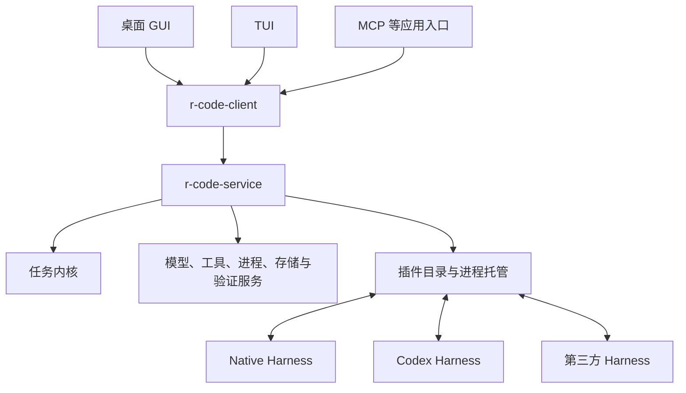

# R-Code 可插拔 Harness 重构计划

> 状态：`ready_for_implementation`（计划已发布，产品重构尚未开始）
> 发布日期：2026-09-09
> 取证基线：`88f7efe3e69ff617a4d565efc0d9c700cfed4512` 加发布前已有工作区改动。
> 任务权威源：[tasks.json](./tasks.json)；独立评审：[review.json](./review.json)。
> 旧实现参考：[重构前架构](../../support/archive/architecture-before-harness-v2.md)；[旧 TUI 资料](../../support/archive/tui-v2/)。

## 1. 目标、终态与范围

将 R-Code 重构为托管整套 Harness 的应用。Harness 插件决定规划、上下文选择、模型调用、工具调用、子任务和修复流程；R-Code 提供动作授权、执行、持久化、交互和结果验收。

完成标志：用户可以安装并选择独立构建的第三方 Harness，运行一种不同的完整工作流程，而无需修改或重新编译核心。Native、Codex 与第三方使用相同插件协议和安装路径；GUI/TUI 共享一个后台服务；只有与当前候选内容匹配的宿主验证证据才能产生“已验证”的交付结果。

用户已确定：

- 支持用户主动安装的、受其信任的本地第三方进程插件。
- 替换粒度为整套 Harness，首期交付 Native、Codex 两个内置插件。
- 保留 GUI/TUI 的完整编码主流程：会话、分支、工具、Plan、人工输入、委派、审核、验证、恢复。
- 保留文件／搜索／Git／Shell／MCP／Skills／附件及显式配置的记忆上下文。
- GUI/TUI 同时连接共享后台服务，前端关闭后任务继续；显式停止服务才取消并收束运行。
- 允许新版本重建数据模型，旧任务只读查看／导出，不自动续跑或导入旧配置与凭据。
- 首期不提供插件市场、在线自动更新、Rust 动态库 ABI、WASM、自定义插件界面、恶意插件 OS 沙箱、自动学习记忆或远程沙箱调度。
- 全部新模块位于当前 Cargo workspace；不新增 Harness 仓库或 Git 子模块。

本次发布只同步计划并整理文档。T00 在正式实施开始时负责重新核对代码与测试基线，不得覆盖已经确定的决策或重置用户改动。

## 2. 仓库事实与复用边界

环境：Rust 2021、MSRV 1.88、Cargo workspace、Tokio；桌面使用 Tauri，前端 React/TypeScript/npm；TUI 使用 ratatui/crossterm。覆盖 Windows x64、macOS arm64/x64、Linux x64。Windows shell 操作遵循 RTK + PowerShell 7。

本轮代码核查确认：

| 现有能力 | 事实与迁移策略 |
| --- | --- |
| 普通 Run | 当前收尾根据错误与变更决定 ReviewReady/Idle；新内核单独维护验证结果 |
| Plan | 已有持久化、版本、依赖与继续执行门；完成更新还需接入实际验收证据 |
| VerificationService | 现有命令／退出码／输出记录可复用，新增内容身份与检查定义绑定 |
| Gateway | 复用路径 capability、权限、类型化控制结果和审计入口 |
| RunLoopGuard | 复用已实现的预算、重复错误、无进展和测试失败信号 |
| 工作区与回滚 | 复用 worktree 绑定、基线、归属变更、逆向合并与持久 journal |
| ExtensionHost | 现有实现主要为事件回调和工具注册，没有完整生产调度接线；不作为新插件 ABI 的兼容约束 |
| WorkCard | 当前主要为模板类型，不能据此认为生产完成门已经存在 |
| TUI | 当前依赖 src-tauri 宿主；必须迁移应用、设置、会话、审批及测试引用后才能解除 Tauri 依赖 |
| Codex | 复用已核验的协议处理和行为测试；外部 CLI 动作保持其真实来源 |
| 记忆 | 当前审阅输入缺少结构化宿主结果；首期只提供显式记忆上下文，自动经验学习后续处理 |

归档前代码结构仅是取证基线，不应误写为新架构已实现。

## 3. 运行拓扑与模块责任



| 模块 | 责任与依赖限制 |
| --- | --- |
| r-code-harness-protocol | 版本化 wire DTO、Manifest、事件、内容引用和声明式进程约束；仅中性序列化依赖 |
| r-code-kernel | 领域状态机、任务合同、验收、Plan、预算、委派、恢复及 ports；不得依赖 Tauri、SQLite、Gateway、Provider 实现或插件二进制 |
| r-code-runtime | 无 Tauri 的具体服务装配、插件管理与后台服务；通过 adapter 复用现有底层实现 |
| r-code-client | GUI/TUI 的本地 RPC、命令去重与事件读取；不装配另一个运行内核 |
| r-code-harness-sdk | 插件生命周期、宿主调用、流式处理和取消的 Rust SDK |
| plugins/native、plugins/codex | 独立 executable；依赖 SDK／协议，不能直接依赖 runtime、store、Gateway 或 Tauri |

agent-contracts 在宿主内部通过适配器复用，不将其可变产品 DTO 直接作为公开插件协议。核心调度不按内置 Harness ID 写分支；差异由插件代码、Manifest 和声明材料承载。

### 3.1 共享后台服务

每个 v2 Profile 只有一个 r-code-service owner 持有数据库、任务租约、恢复权和进程资源。GUI、TUI 和其他入口都连接该 owner。服务不因前端退出而自动停止，首版不做空闲自动退出。

- 使用 OS 独占 Profile 锁；只有拿到所有权的进程能执行恢复。
- 本地通信使用当前用户专属的 Windows named pipe 或 Unix 0600 socket，并校验 Profile 私有随机 token。
- 复用 agent-ipc 的 framing 工具，不直接复用其无鉴权 listener 或启动时清理 socket 的行为。
- 命令与事件使用独立连接；长操作返回持久 operation ID，事件通过 `events.read(after_seq)` 恢复。
- 所有应用写命令使用 `(profile_id, client_id, command_id)`。客户端先持久化 outbox，再发送；重复请求返回原结果，相同 ID 对应不同 method／payload 时拒绝。
- 敏感设置通过 credential broker 的不透明引用传递，outbox 不保存明文密钥。

## 4. 插件协议与交付

### 4.1 公共方法

宿主调用插件：`initialize`、`harness.start`、`harness.resume`、`harness.steer`、`harness.cancel`、`shutdown`。

插件调用宿主：

| 服务 | 方法 |
| --- | --- |
| 模型 | host.model.stream |
| 工具 | host.tools.list / call |
| 受管进程 | host.process.open / write / close |
| 上下文与大内容 | host.context.read、host.artifacts.put / read |
| 计划与人工输入 | host.plan.publish / update、host.questions.ask |
| 授权 | host.approvals.request，仅接受宿主创建的待决动作引用 |
| 子任务 | host.children.spawn / wait / cancel |
| 验证与恢复 | host.verification.run、host.checkpoint.save |
| 完成申请 | host.completion.propose |

`harness.event` 表示插件进展；模型／进程流通过相关联的通知传递。插件上报的观察与宿主产生的执行事实必须保留不同来源。

### 4.2 传输和身份

UTF-8 NDJSON 双向 JSON-RPC 2.0；stdout 仅协议，stderr 有界诊断。单帧上限 1 MiB，较大消息和附件用 Blob 引用；队列总量默认上限 16 MiB。初始化默认 10 秒；取消先给 5 秒收尾，再结束受管进程树。长模型／工具调用使用独立期限和取消机制。

独立 reader 持续处理反向调用，不能在等待请求响应时阻塞整个协议。每个活动 Run 有自己的插件进程，连接绑定宿主生成的 task/run/generation；内容、进程和子任务 handle 不得跨 Run 使用。

JSON-RPC request ID 只负责当前连接相关性。副作用方法另带 Attempt 内跨恢复稳定的 `operation_key`，宿主存储规范化输入 hash 和结果；generation 变化不能抹去去重历史。

### 4.3 Manifest、安装与切换

`harness.json` 至少包括 schema_version、id、version、api_major/min_minor、display_name、supported_platforms、每平台 executable+argv、supported_features、requested_host_services、config_schema，以及按需声明的 ProcessProfile。

本地目录／ZIP 安装复制到 AppData 的 ID／版本／内容摘要目录。拒绝路径遍历、符号链接／reparse 逃逸、缺失入口、协议不兼容及同一身份不同字节。直接使用 executable+argv，不执行安装脚本，不从仓库自动加载插件，不启动包管理器安装过程。语言运行时如有需要由插件包自带。

Run 固定包摘要、配置 hash、有效能力、TaskContract 与 Checkpoint schema。新版本影响新 Run；被活动或可恢复 Run 引用的包不能删除。切换 Harness 必须在任务空闲时创建新分支，继承标准会话与合同，不移植私有状态。

用户信任本地插件；宿主 API 的授权与审计不能被宣传为对插件直接本机 I/O 的 OS 沙箱。

## 5. 任务合同、验收与代码快照

| 核心类型 | 用途 |
| --- | --- |
| TaskContract | 任务类型、用户目标、约束、必需验收项 |
| WorkUnit | 描述、依赖、验收项映射 |
| Attempt | 固定的插件／合同／上下文／工作区身份 |
| OperationReceipt | 稳定操作键、请求摘要、执行结果 |
| EvidenceRecord | 检查定义、候选内容、环境／工具链和宿主输出 |
| CompletionProposal | 候选结果申请，不能直接指定权威终态 |

执行生命周期、验证结果和用户审核结果分别保存。Kernel 决定 verified／unverified／blocked／failed／cancelled；插件不能直接签发 verified。

问答与计划草稿可正常结束；代码任务缺证据时只能交付 unverified。可修复检查失败返回明确 repair feedback，预算／阻塞导致终止时保留成果及恢复入口。LLM Reviewer 判断语义、遗漏和证据充分性，不能生成测试通过事实。

### 5.1 验收合同

首次修改前冻结用户／项目所需检查。插件可追加检查；削弱必需条件需要新的用户授权合同版本。

CheckDefinition 必须区分冻结的验收控制材料与允许变化的 candidate 实现／依赖材料，记录直接执行入口、控制文件摘要、源码根、依赖锁文件、工具链、关键环境和外部输入。不得仅冻结可被候选 package.json 重新定义的 npm script 名称。控制材料存储在插件可写工作区外。

实现测试可修改，但不因此自动成为可信的必需验收 oracle；相关输入变化会使旧证据失效。

### 5.2 候选内容与执行环境

默认候选集合包含 tracked 文件、非忽略的新文件、删除及模式变化。子模块、必需忽略文件和工作区外输入需明确纳入；无法提供完整输入时显示 unavailable。

1. 将候选字节复制到不可变 Blob。
2. 再取一份 live manifest，确认捕获期间内容一致。
3. 只从 Blob 和冻结验收材料生成私有验证目录。
4. 保留候选的依赖 manifests／lockfiles，执行依赖准备与检查。
5. 保存实际 exit、输出、工具链、环境与候选身份。
6. 完成裁决前再核对 live candidate，拒绝过期证据。

Rust／TypeScript 参考流程使用固定验收入口；依赖准备采用 Cargo --locked 与 npm ci --ignore-scripts，并通过宿主动作授权。需要额外 hooks 或外部输入时必须声明项目 profile，否则检查不可用。

v1 缓存只复用 checksum 校验过的 Cargo registry／npm 依赖下载。不得复用候选 build／test 输出或用户 live target／node_modules。源码或 build script 变化必须重新 build／verify；同一未变化 Attempt 内的已完成证据可以复用。

## 6. 权限、受管进程与可信来源

工具、进程和验证准备共用 AuthorizationService，输入至少包含动作类别、解析后的 executable/argv/cwd、工作区 capability、凭据引用范围、有效权限和冻结合同版本。授权通过后才能记录执行 intent 并产生副作用。

服务调用 grant 不替代具体任务授权。普通问题不能授予权限或削弱验收；host.approvals.request 只能引用宿主创建的 pending operation。

LaunchCapability 指向随已信任插件包固定的声明式 ProcessProfile，描述 framing、方法白名单、schema 和 JSON-pointer 字段约束。宿主只实现中性解释器；Codex 的具体 App Server 方法和字段映射放在插件包内。

NDJSON 受约束进程先收到完整帧，校验后才写入子进程 stdin。未知方法、坏帧和超出宿主权限／cwd／sandbox／approval 范围的请求拒绝。原始 opaque byte stream 在只读／Plan 等受限模式禁用。使用不同协议字段的第三方 fixture 必须证明接入不需修改 core。

Codex 的内层 CLI 动作保持 external observation 来源，不伪装成已由 Gateway 执行的事实。Provider 凭据留在宿主，通过 broker／受控环境引用提供给实际服务，不回传给 Harness。

## 7. 持久化、Plan、委派与恢复

### 7.1 数据权威和 Profile

SQLite v2 保存 tasks、branches、runs、work_units、operations、checks、evidence、questions、review 与有序追加事件日志。领域状态和对应事件同事务提交；大内容使用现有内容寻址 Blob；JSONL 只作导出／投影。

RuntimeProfile 在任何存储、插件、配置或 Provider 服务初始化前确定。GUI 显式传当前 build flavor；TUI/service 接收 --profile，开发脚本使用 development、打包程序默认 production。runtime 不通过 Tauri custom-protocol feature 推断身份。

新数据位于原 dev/prod 根下的 harness-v2，使用独立 v2 credential service。LegacyReader 不调用旧 Database::open、MigrationManager 或会写配置的 SettingsService。

旧 SQLite 用 READ_ONLY 源事务加 online backup 复制到 v2 临时库，启用 rusqlite 0.32 backup feature，默认 30 秒期限并支持 busy retry／取消。JSONL 只导出捕获字节边界内完整记录。无法安全读取活 WAL 时提示关闭旧 App 或由旧 App 导出，不使用 immutable=1 忽略活 WAL，也不在源事务内执行 VACUUM INTO。

### 7.2 Plan 与子任务

Plan／问题／委派是所有 Harness 可调用的宿主服务。Plan 校验归属、revision、依赖和合法状态，代码 WorkUnit 必须取得当前必需证据才能 completed。问题先持久化再暂停，答复和 continuation 去重。

子任务可选择不同 Harness，继承父任务权限上限和根预算。父任务不能在仍有活动／未收束子任务时完成。报告保留证据、已验证／推断／无法验证的区别。

### 7.3 操作恢复与输入消费

副作用执行前持久化 intent；已完成操作重放 receipt；同 key 不同 input 拒绝。文件效果通过预期内容 hash 核实，未知 shell／network／CLI 效果标记 indeterminate，不能盲目自动重执行。

输入具有宿主 message_id/input_seq。Checkpoint 原子保存私有状态和 consumed_input_seq，并验证其为已投递的连续前缀。宿主接纳和队列领取去重；恢复后插件可能重收未确认输入，不对外部 CLI 的实际应用声称 exactly-once。

Checkpoint 只恢复相同插件包／配置／合同身份。丢失 Codex acknowledgement、缺失外部 thread 或不匹配的包需要核实、显式重启或新尝试。

### 7.4 进程生命周期和写屏障

取消先撤销 generation，再终止子任务、模型、工具和进程；确认 drain 后才释放写入权，拒绝迟到回调。

Windows guardian 使用 kill-on-close Job Object，子进程开始执行前完成归属。Unix guardian 监测 daemon pipe EOF，持有受管进程组并按 TERM／KILL 收束。持久化 owner nonce、PID／start／boot identity 和进程组元数据，不能只按 PID 杀进程。

跨 Profile 使用按物理目录身份建立的用户级工作区锁，Git 元数据另按 common_dir 协调。guardian 在副作用可能存在期间保留写锁；共享持久 barrier 保存存活进程信息。锁刚释放不代表旧进程已停止，无法证明终止则 blocked／indeterminate，不允许新写任务进入。

回滚复用 baseline-aware 与持久化 inverse merge，保留用户原有及后来修改，不采用全仓 reset-hard 作为通用恢复。

## 8. 分期执行与任务表

tasks.json 是实施者消费的权威源，每项含文件动作、原子步骤、依赖、测试命令与验收标准。按 order 顺序执行；先完成当前任务的真实验收再进入依赖它的任务。不得因为文档落盘就标记产品实现完成。

| 阶段 | 交付面 | 任务数 | 任务 |
| --- | --- | ---: | --- |
| P0 | PRD与基线 | 1 | T00 |
| P1 | 协议、领域与v2数据 | 8 | T01, T02, T02a, T03, T04, T04a, T05, T06 |
| P2 | 后台服务与插件交付 | 7 | T07, T08, T09, T10, T11, T06a, T06b |
| P3 | 宿主能力与进程边界 | 10 | T12a, T12b, T12, T13, T14a, T14b, T14, T15, T16, T17 |
| P4 | 验收、Plan、委派与恢复 | 9 | T18, T17a, T19, T20, T21, T22, T23, T24, T25 |
| P5 | Native与Codex插件化 | 6 | T26, T27, T28, T29, T30, T31 |
| P6 | GUI/TUI及旧数据读取 | 6 | T32, T33, T34, T35, T36, T37 |
| P7 | 交付验收与旧链路退役 | 5 | T38, T39, T40, T41, T42 |

| ID | 目标 | 依赖 | 估算新增／重写 LOC |
| --- | --- | --- | ---: |
| T00 | 文档发布与实施基线复核 | 无 | 160 |
| T01 | 插件身份、Manifest 与能力合同 | T00 | 330 |
| T02 | RPC、流与大内容协议 | T01 | 400 |
| T02a | 持久操作与输入消费协议 | T02 | 320 |
| T03 | 任务领域模型与状态机 | T02 | 400 |
| T04 | 内核服务接口与测试替身 | T03 | 300 |
| T04a | 显式 Profile 与 v2 隔离 | T04 | 240 |
| T05 | v2 存储与原子事件日志 | T04, T04a | 400 |
| T06 | 任务、分支、队列与运行租约 | T05, T02a | 400 |
| T07 | 插件包安装与校验 | T01, T05, T04a | 400 |
| T08 | 插件目录与版本生命周期 | T07, T06 | 330 |
| T09 | 有界双向进程传输 | T02, T07 | 400 |
| T10 | 宿主调用路由与运行身份绑定 | T04, T08, T09, T02a | 400 |
| T11 | Rust SDK 与独立 Harness 示例 | T09, T10 | 400 |
| T06a | 单一后台服务与本地客户端 | T05, T06, T02a | 500 |
| T06b | 客户端命令持久去重 | T06a | 350 |
| T12a | 统一动作授权与启动能力 | T04, T05, T10 | 360 |
| T12b | 声明式外部进程协议约束 | T12a, T02 | 350 |
| T12 | Gateway 工具服务适配 | T05, T10, T12a | 400 |
| T13 | 统一命令执行服务 | T12 | 400 |
| T14a | Windows Job Object 进程管理 | T13 | 380 |
| T14b | Unix guardian 与进程组管理 | T13 | 380 |
| T14 | 受管交互进程服务 | T13, T14a, T14b, T12a, T12b | 400 |
| T15 | 模型请求代理与凭据隔离 | T10, T05, T04a | 400 |
| T16 | 上下文、附件与内容投影 | T05, T10, T15 | 400 |
| T17 | 工作区快照与跨配置写锁 | T05, T12, T06a | 400 |
| T18 | 验收定义与证据有效性 | T03, T05, T16, T17 | 380 |
| T17a | 冻结验收材料与依赖准备 | T17, T18, T13 | 380 |
| T19 | 宿主验证执行器 | T13, T17, T18, T17a, T12a | 400 |
| T20 | 候选结果验收裁决 | T06, T10, T18, T19 | 350 |
| T21 | Plan 与持久化人工输入 | T06, T10, T20 | 400 |
| T22 | 子任务监督与共享预算 | T06, T10, T20 | 400 |
| T23 | 变更审核与归属回滚 | T17, T21 | 400 |
| T24 | Checkpoint 与副作用恢复 | T05, T14, T17, T23, T02a, T14a, T14b | 400 |
| T25 | 取消、隔离代次与终态收束 | T14, T22, T24, T06a | 320 |
| T26 | Native 模型／工具循环插件化 | T11, T12, T15, T16, T20 | 600 |
| T27 | Native Plan、引导与上下文恢复 | T21, T24, T26 | 400 |
| T28 | Native 委派、复核与策略 | T22, T25, T27 | 400 |
| T29 | Codex App Server 插件适配 | T11, T14, T16, T12a, T12b | 600 |
| T30 | Codex 交互与完成申请 | T20, T21, T25, T29 | 450 |
| T31 | Codex 委派与恢复 | T22, T24, T30 | 380 |
| T32 | 后台 ApplicationService 装配 | T08, T20, T21, T23, T25, T28, T31, T06a, T06b | 400 |
| T33 | 桌面任务主流程接入客户端 | T32, T06a, T06b | 450 |
| T34 | 桌面插件管理与 Harness 选择 | T08, T33 | 380 |
| T35 | TUI 与 Tauri 宿主解耦 | T32, T06a, T06b | 450 |
| T36 | TUI 插件管理命令 | T08, T35 | 300 |
| T37 | 旧数据只读读取与导出 | T05, T32 | 350 |
| T38 | 跨平台后台服务与插件打包 | T28, T31, T34, T36, T06a, T14a, T14b | 400 |
| T39 | 插件协议一致性与故障测试 | T20, T24, T25, T32 | 400 |
| T40 | 真实编码任务配对评测 | T28, T31, T39 | 380 |
| T41 | 统一验收、架构守卫与开发文档 | T33, T34, T35, T36, T37, T38, T39, T40 | 400 |
| T42 | 生产切换与旧调度链路退役 | T41 | 450 |

LOC 是规划估算，不包括大量机械移动；T06a、T26、T29、T30、T33、T35、T42 保留 450–600 LOC 的规模提醒，独立评审认可其抽取／整合边界。不要为了满足行数把一次切换拆成无法编译的中间状态。

## 9. 测试与验收

1. 独立构建的第三方 Harness 可本地安装、选择并完成不同工作流程，不修改核心、不增加内置引擎分支。
2. 非 Codex 协议通过不同 ProcessProfile 接入；坏帧、拆帧绕过、cwd／权限扩张在转发前拒绝。
3. 两个客户端、竞争 daemon、断线、丢回复和重启不产生重复任务／消息／安装或双 owner。
4. 缺检查、假通过、跨 Run 证据、过期结果及通过后继续改代码不能获得 verified。
5. noop npm script、删除检查入口、合法依赖增加、子模块变化、dirty/new/deleted 文件和快照并发编辑有真实 fixture。
6. tools/process/verification 三条路径遵守同一任务权限，审批拒绝时零 spawn。
7. 强杀 daemon、wrapper 退出而后代存活、guardian 失联、取消超时与迟到写入不绕过恢复屏障。
8. Plan 问题／continuation、跨 Harness 委派、子任务取消、报告收集与父终态通过实际协议路径验证。
9. 旧 DB/WAL/config/JSONL 内容不因 v2 首次启动或导出改变；dev/prod/Profile 身份互不混淆。
10. TUI Cargo 依赖树无 Tauri/wry；协议、SDK、Kernel、客户端不存在对宿主实现或内置 Harness 的反向依赖。
11. Windows/macOS/Linux 包含 service、guardian 和 Native/Codex 插件，通过真实安装目录、空格路径、启动与取消测试。
12. 现有行为测试迁移到新边界并通过；不能通过删除真实场景来制造绿色结果。

主要配对评测为同一 Harness／模型／配置的 baseline 与 v2，或同一 v2 Harness 的两种策略；跨 Native/Codex 比较独立报告。记录 verified completion、false completion、人工介入、恢复率、耗时和成本；不可得指标为 unavailable。CI 采用确定性 fixture 和协议一致性作为硬门槛。

实施验收入口：`node scripts/verify-harness-v2.mjs --profile full`（T41 创建）。常规回归为 cargo fmt/clippy/workspace tests，以及前端 npm test/build；发布仍遵循现有签名、依赖与平台验证要求。

当前计划校验：

```text
python .agents/skills/plan-loop/tools/validate_plan.py --tasks docs/prd/pluggable-harness/tasks.json
```

## 10. 评审与执行约定

三轮独立 principal-engineer 评审得分为 78 → 90 → 95，最终 pass，无 blocking／major。主要修正覆盖 daemon 所有权、进程权限、冻结 verifier、宿主崩溃清理、跨恢复操作身份、Profile 前置初始化、客户端去重和声明式外部协议。

使用已有 workspace 的 Tokio、serde、rusqlite、Blob、权限与进程基础；需要的 Windows API 使用已存在的 windows-sys 0.61.2，SemVer 可复用现有 1.0.28。对现有测试与私有子模块做基线核对后再实施，不推定未提交变更已入库。

无待用户决定的架构问题。遇到环境差异，先执行任务定义的诊断／测试并记录；不得静默降低验收、启用未经授权的能力或把不确定结果算为通过。

## 11. 文档归档边界

docs 顶层保留导航、prd 和 support。重构前 architecture.md 归档为 support/archive/architecture-before-harness-v2.md；tui-v2 整目录归档到 support/archive/tui-v2。现有 support/guides、operations、platform、contracts 继续保留其用途。

冻结 PRD 的规范／任务正文、digest 和历史 evidence 记录不因移动而改写。只更新位置元数据、实际导航和活跃脚本路径，并在归档索引记录迁移。新基准报告写入 artifacts，不覆盖已归档报告。

后续实现的新架构说明、protocol-v1.md 和 plugin-author-guide.md 均在本 PRD 目录维护；不重新建立顶层旧 architecture.md 入口。
