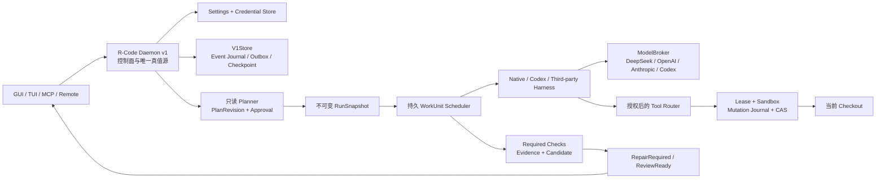

# R-Code v1 统一架构与实施 PRD

> 状态：`frozen / implementation_in_progress`
>
> 公开协议与 Harness 统一为 **v1**；本 PRD 取代旧的“可插拔 Harness 重构 PRD”，并吸收 Provider 路由、默认 Prompt、Planning、M-GATE、安全执行、O-GATE、迁移、客户端与发布要求。
>
> 当前恢复入口：[current.md](./current.md)；机器任务合同：[worklists/](./worklists/)；进度证据：[progress/](./progress/)。

## 0. 执行导航

新 agent 不需要从头重做规划：

1. 先读本页的“当前进度”“冻结约束”和 [current.md](./current.md)。
 2. **当前唯一实施项是 O-GATE（已用 plan-loop 拆解定稿：4 轮 58→74→79→92 pass，8 任务 O00/E05/E06/E07/E08/E09-R/E09-C/E10）——从 O00 开始**。Wave 3 Safety 已 39/39 全 KEEP，机器任务 52/52（100%）；详细合同见 [o-gate.tasks.json](./worklists/o-gate.tasks.json) 与 [o-gate-plan-ledger.tsv](../../sandbox/r-code-v1-safety/o-gate-plan-ledger.tsv)。
3. 对照 `sandbox/r-code-v1-safety/iter/P23/before/` 审计现有 WIP（8 个声明文件快照），保留所有用户与既有 agent 改动，禁止 reset/checkout 覆盖。
4. 继续采用 `swe-loop`：Engineer 只写 production source，QA 只写测试；任务测试、累计回归、Clippy、rustfmt/diff 与质量门全部通过后才能 KEEP。
5. 不创建 worktree，不自动 stage、commit、push，不写 Git refs/index/submodule。

## 1. 当前完成度

<!-- VOLATILE:START -->

| 范围 | 状态 | 完成度 | 证据 |
| --- | --- | ---: | --- |
| P-GATE：Provider → 只读规划 → exact-hash 批准 | 已完成 | 9/9 | [任务](./worklists/p-gate.tasks.json) · [ledger](./progress/p-gate.ledger.tsv) |
| M-GATE：单 WorkUnit 修改 → 检查 → Review → 接受/回滚 | 已完成 | 4/4 | [任务](./worklists/m-gate.tasks.json) · [ledger](./progress/m-gate.ledger.tsv) |
| Wave 3 本地进程安全边界 | **已完成** | 39/39 KEEP | [任务](./worklists/safety.tasks.json) · [ledger](./progress/safety.ledger.tsv) |
| 当前任务 | **O-GATE 执行中（O00/E05/E06 KEEP，下一个 E07）** | 3/8 | [任务](./worklists/o-gate.tasks.json) · [ledger](./progress/o-gate.ledger.tsv) |
| O-GATE：并行 WorkUnit、LeaseFamily、ChildSupervisor | 已拆解定稿（pass 92） | 3/8 | [任务](./worklists/o-gate.tasks.json) |
| 历史迁移、四客户端一致性、Harness 完整接线、三平台发布 | 未开始 | 0 | §9 后续里程碑 |

当前已机器验收并 KEEP 的执行任务为 **52/52（100%）**：P-GATE 9、M-GATE 4、Safety 39/39（P00–P09+P10–P18+P11R+P19A+P19B-R+P19B-C+P20+P21+P22+P23+P24A+P24B+P24H+P25+P29+P26A+P26+P27+P28+P30+P31+P32）（P08 s08、P09 s09、P10 s10、P11 s11、P16 s16、P17 s17、P18 s18、P23 的 Linux/macOS 臂按合同在原生 Linux/macOS CI 执行）。这个比例只覆盖已经拆成机器任务的三个 tranche，**不是整个产品总完成率**；F/G/H/I 等后续里程碑尚未进入分母。

最近完成：

- P11：macOS write 执行 SafeDisabled——`proc_listallpids`+逐 pid `PROC_PIDTBSDINFO` 的身份核验枚举（零手工结构偏移）、纯 `MacosContainmentVerdict` 状态机（SnapshotReachable 仅诊断/Escaped/Unverifiable）、逐信号前活体复探的 PID-reuse 围栏 best-effort 清扫、supervisor 侧终态 `SafeDisabled` 持久化（`start_with_write_profile` 在 spawn 前持久拒绝）；Windows 门禁 830/831，s11（13 tests）在原生 macOS CI 执行。
- P12：SafetyCapabilityReport 内容寻址持久化——store 报告表+head（幂等 put/reload/prune，FK 顺序缺陷由 QA 钉死后修复）、runtime `SafetyReportMaterial`（时间戳无关 identity digest）+ fail-closed `evaluate_safety_activation`（boot/platform/backend/policy/helper/executable/probes 七序陈旧检查；SafeDisabled/Unsupported 永不激活）、脱敏只读 `safety.report.get`；诚实累计口径修正（Store fail-fast 低估→417），930/929/1（仅声明 plan_schema 基线）。
- P13：sandbox profile 语义与 probe 协议——三档网络类目、git-hidden INV-06 的 profile material（policy digest 进报告）、真实版本化 deny-probe helper（8 探针：写越界/.git/网络/凭据库/设备/IPC/子进程逃逸/env 泄漏，严格 schema+exit 2 纪律）、backend 契约+确定性 fake、`platform_activation_gate` 发现门（本 wave 全平台诚实 Unsupported）；router/run_manager 的 Process/Verification 授权绑定精确激活报告。938/939。
- P14：Windows ACL delta 记账——acl_operations 仓库（prepared/applied/restored/conflict 状态机，Conflict 终态）、FILE_ID 物理身份、self-relative 捕获（GetSecurityInfo 本就返回自相对描述符的 OS 真相已钉死）、SID 级容忍的崩溃恢复分类 + 字节级 CAS restore（外部编辑永不覆盖）；本机即原生 Windows 平台真实执行，944/945。
- P15：Windows AppContainer 策略与启动——creation-time Job+HANDLE_LIST+SECURITY_CAPABILITIES 三属性组合、AppContainer profile/capability 机器（RAII 清理）、P14 记账式 ACL 授予仪式（死亡证明后才 reconcile）、真实 lowbox 七探针 e2e；两条 OS 真相钉死（AppContainer 显式环境块需 11 键基础系统变量否则 203；无 internetClient 时公网 connect 被 WSAEACCES 拒绝）；QA 钉死 4 缺陷（死栈指针/遍历授予/F2 回归/授予内 deny 目标）后全绿，953/952。
- P16：非激活 bwrap launch plan（Linux-only）——pinned 二进制校验（root:root+mode+真实 --version ≥0.8.0）、单 --unshare-pid 的 argv/挂载表构建（.git 白名单式隐藏）、NamespaceIdentityHandoff（outer+PID1 双半才完整）、永久 Err 的 plan backend（P09/P17 前 Linux 恒 SafeDisabled）；s16 七测真实 bwrap e2e 在原生 Linux CI 执行，953/952。
- P09：bwrap PID namespace 精确证明（Linux-only）——`--info-fd` 交接获取 namespace PID1 的 pidfd/starttime/ns inode（P09.1 持久化于监督前）、证明=PID1 死亡（pidfd 可读 + monitor reap 后 /proc 消失；leader/PG 退出永不作证；setsid/double-fork 由内核随 PID1 之死收编）、terminate 经 PID1 pidfd+monitor 双带、`--die-with-parent`；QA 内核级审查钉死 4 缺陷（zombie inode/宿主 ns inode/leader 形状/varargs 缺参）后重构全绿，s09 六测在原生 Linux CI 执行，953/952。

- P19A：Shell effect/network 合同冻结（API v1.2）——WorkUnit 两个 additive 公开字段（`effect_class` read-only/workspace-mutation/dependency-preparation 有序、`network_ceiling` offline/public-internet-client/host-network）与 `work_unit_payload_hash`（七键 canonical，**description 故意排除**，文案编辑不失效审批）；serde 默认停在保守地板 + skip-when-default，pre-P19A 计划字节与哈希不变（QA 用旧 wire 结构体副本逐字节对照钉死）；`HOST_API_VERSION=(1,2)` 单一真值源、`requiresEffectFields` 低于 apiMinor 2 直接拒绝而 1.0/1.1 包继续可协商；HostNetwork 在 plan 校验即拒；`work_unit_effect_approvals` 不可变精确审批表（one-active 唯一索引、CHECK 枚举、scope='effect.approve'、六列精确匹配、supersede 仅未来运行）；runtime `EffectApprovalSource` 扩张门 fail-closed（无 source 则只有 ReadOnly/Offline 能冻结）。QA 钉死 3 缺陷后全绿：**出货桌面清单** `src-tauri/plugins/native/harness.json` 仍是 apiMinor 0（与 P19A 二进制同包出货，违反 P19A.4；packaging 测试只对 codex 做 staged==source 对照）、重复审批分类字符串匹配 rusqlite 永不输出的 "PRIMARY KEY"（IdConflict 死代码）、幂等重存忽略 actor/session（同一审批 id 可静默保留首个归属）。987/986/1（仅声明 plan_schema 18-vs-35 基线）。

- P19B-R：认证式 effect 审批运行时流——`ApprovalStore::register_effect` 由 host 独占创建 pending，并把 task/plan-revision/WorkUnit/class/network/payload-hash 的**精确绑定**从「当前已批准计划头」派生（绝不来自客户端参数或可变设置）后 additive 地写进 `approval.requested` 事件（重建可恢复）；`approvals_decide_with_session` 在 grant 时**恰好**物化一条不可变审批（actor=连接身份、session=command id、scope=`effect.approve`），陈旧校验发生在**写日志之前**，deny/expiry 不落任何审批，同一决策重放收敛到首条记录（归属永不漂移）；`approvals.effect.request/list/revoke` 三个 RPC 暴露同一份 camelCase canonical 材料（供 P19B-C 渲染），revoke 走 supersede 且仅影响未来运行并留 `effect.approval.revoked` 归属事件；生产 `StoreEffectApprovals`（fail-closed）接进执行冻结路径（`run_manager.rs` 2 行机械偏差）。插件无法铸造审批（router 无 effect 面、store 级 decide 不落库）、远端被 unknown-method 能力门拒绝、伪造 `actorId/sessionId/decidedBy` 参数被忽略。QA 14 测零正确性缺陷，仅质量门失败（application.rs 2856>2600、注释块 18/27>12），refine 轮把 effect 面移入子模块 `application/effect_approvals.rs`（438 行，`pub use` 保持所有既有路径不变）后全绿：1001/1000/1。

- P19B-C：effect 审批三端接线——桌面 `harness_v1.rs` 四个 scoped 命令 + `lib.rs` 的 `HARNESS_V1_EFFECT_COMMANDS` 注册 + `ipc.ts` 六键 camelCase canonical 材料与四个 typed 包装；`Permissions.tsx` 是**唯一渲染器**（`EFFECT_MATERIAL_FIELDS`/`effectAuthorityRows`/`effectGrantUi`/`effectErrorCode`），`Canvas.tsx` 只 import 复用不再实现第二份；remote 投影丢弃任何缺 canonical 键的行（失败关闭、绝不补默认值伪造授权），能力缺失时控件隐藏而非禁用；TUI overlay 用同一键序。三端都可见「撤销仅影响未来运行 + 审批 id 终身不复用 + 拒绝/过期不留记录」。QA 钉死并修掉本轮自身一个 fail-open： `from_list_row` 原先接受任意 `state`，而 `is_active()` 是两态判断，未知状态会被渲染成「已撤销」——冒充一条 daemon 从未记录过的撤销（remote/桌面均已拒绝该集合，只有 TUI 失败开放），现限定为 active|superseded。另发现并修复：`run-tests.mjs` 只发现 `scripts/*.test.mjs`，故任务指定的 `src/remote/core/` 路径必须在 `verify-remote.mjs` 注册才会真正执行。21 测全绿，house 五组累计 1001/1000/1 与 P19B-R 逐字节一致。

- P20：必需 Check 迁移到 supervisor+sandbox（两轮）——第一轮把生产 checks 路径从 `LocalShellBackend` 挪到激活门：`VerificationRunner::sandboxed(store, boot)` 由 `platform_activation_gate` 解析出 `SandboxedCheckBackend`，非 Activated 一律以 sandbox-disabled 理由拒绝且零 spawn（哨兵文件永不出现，并有绑定 native 的对照臂证明陷阱非空洞），`run_manager.rs:1883` 是唯一生产调用点、`new()` 降级为文档化的仅测试真实执行缝；`CHECK_NETWORK_CEILING=Offline` + `check_permissions(allow_network:false)` 钉死验收②，`evidence_identity=current_platform_material(boot).digest()` 进 `environment_fingerprint` 的 reportIdentity 钉死验收③。QA 那轮门禁全绿（454/0、1010/1009/1）却在自己的 verdict 里承认 subtask P20.1 未建仍写 pass=true——按铁律不予 KEEP，重开 refine 轮。第二轮把「Offline 是常量」升级为「Offline 是 spawn 材料的属性」：`CheckSpawnSpec` 冻结 executable/逐字 argv/绝对 cwd/声明 toolchain/canonical read roots，且 ceiling 由 `build()` 赋值而非调用方传入，拒绝任何含路径分隔符的程序名、任何可被 shell 重新解释的字节（`; & | CR LF < > ` $ "`）、相对 cwd、空 toolchain、绝对或 `..` 逃逸的 source root、以及任何 `.git` 可见的 read root（INV-06）；`run()` 的 descriptor/workspace/命令行/指纹全部源自同一份 spec（新 `ExecutionService::run_check`），不可 spawn 的材料直接 Unavailable 且零 spawn，`environment_fingerprint` 用 `spec.digest()` 取代 `"cwd":"."` 占位与松散 program/argv，验收③因此变成精确的——改动参数/目录/toolchain/read root 与改动平台身份一样使旧证据失效；`CheckDefinition.source_roots` 自诞生起第一次有生产消费者。QA 自读代码提出的两点都改掉而非辩解：git 拒绝消息混用 canonical 与宿主分隔符形式，以及基于 `file_name` 的「裸程序名」规则是宿主相对的（Windows 盘路径在 Unix 上被当成合法程序名）——现统一为「任何平台都不得含路径分隔符」。另补第一轮记录的 `collect()` 未查门洞（Closed 门绑定 native 时仍可排空句柄），并有测试钉死。诚实披露：生产仍 `native: None`，因为本 wave 尚不存在平台沙箱命令执行后端、`current_platform_material` 如实 Unsupported，故激活不可达且即便 Activated 也继续拒绝而非无沙箱运行（SafeDisabled 永不冒充 Activated）。s20 19 测、Runtime 466/0（86 行未过滤计数，扣两次 s00 子进程重播即 464 by suite）、house 1022/1021/1（仅声明的 plan_schema 18-vs-35 基线红）。

- P21：依赖准备与不可变 cache 晋升（两轮，含一次「门禁全绿仍判 NOT KEEP」）——起点是一个失败开放的桩：`prepare_dependencies` 无视注入的 ExecutionService、自己造 `LocalShellBackend`、用 `EffectivePermissions::full()` 授权抓取（默认给网络与全进程权）、再用 `split_whitespace` 反解自己拼的命令行，而 `cache_identity` 算出来什么都不接。第二轮后：材料冻结成 `DependencyPrepSpec`（程序必须是声明类工具链的裸名、cargo 必带 `fetch --locked`、npm 必带 `ci --ignore-scripts` 以杜绝包生命周期钩子、overlay 必须在私有树内而 promoted slot 必须在其外、`node_modules` 永不被晋升出树、任何路径含 `.git` 即拒（INV-06）、HostNetwork 直接拒、任何指向 provider 凭据的环境键（API_KEY/TOKEN/PASSWORD/SECRET/AUTHORIZATION/PROVIDER/COOKIE/CREDENTIAL/裸 KEY）在构造期即拒，于是「带凭据的 prep 材料」根本无法存在）；网络只认已解析的 `PrepNetworkAuthority::Approved{effect_class, ceiling}`，`authorize()` 对未被精确 effect 审批证明的 prep 网络一律拒绝，插件面与既有决策路径不变；cache 侧是真实状态机（cold/warm/poisoned 只由磁盘字节决定、host lock + 锁内二次校验、staging 校验后单次 `fs::rename` 原子发布、warm 读重验 marker digest、失败即持久投毒且下次拒绝而非重用）。**第一轮 QA 全绿（26 测）却测出 4 个缺陷并判 NOT KEEP**：发布目标父目录从未创建导致所有 cold prep 死于 PromotionFailed 且自我投毒（Cold 不可达，Engineer 的内联测试靠手建 slot 掩盖）；`poison()` 在建目录前 rename 且 `let _` 吞错，失败不留 marker；把 prep 走 `CommandExecutionBackend` 使 `CommandSpec`（只有 command/cwd/timeout）无法递交挂载与环境白名单，探针实测 prep 子进程继承了宿主 provider token——P21.1 的「挂载」与验收②因此不成立；P21.3 的 Check 侧挂载不存在。第二轮用 `DependencyPrepRoute`（run() 直接收整份 spec）替换该路由并彻底删掉 prep 的 `CommandExecutionBackend` 实现，未越界改动 gateway crate；补 `CheckSpawnSpec::with_promoted_cache`（与 overlay 双向嵌套、落在自己私有树内、git 可见者皆拒；挂载进 read_roots 因而进 digest，旧证据随之失效）。诚实披露三项：prep 仍**零生产调用者**（s20 的源码钉住它）、生产不绑 prep 路由故 v1 不能真的抓取依赖（fail-closed 而非无沙箱抓取，SafeDisabled 永不冒充 Activated）、`s21` 文件 2599 距 2600 门仅 1 行。另有两处过程缺陷如实入账：Engineer 越界在三个 production 文件里写了 17 个 `#[cfg(test)]` 测试（已剥离归档，production 行未因此改动）；orchestrator 剥离时按「首个 cfg(test) 到文件尾」一刀切，误删了 `authorization.rs` 既有的 141 行单测模块（`--lib` 78→75），靠**逐 suite 计数比对**发现并从 before/ 逐字节恢复——此后门禁差异一律按 suite 对账，不再只看 crate 总数。Runtime 500/0（87 行未过滤计数，按 suite 498）、house 1056/1055/1（仍仅 plan_schema 基线红）；首轮全量曾测得 499/1（`s07` 终止前 marker 是否进入存储 tail 的断言），随后独立复跑 3/3 全绿且全量重跑亦绿，如实记为并行负载下的输出 tail 捕获竞态（本轮新增真实子进程 suite 使其更易发生），不因只保留绿 Run 而隐瞒。

- P22：交互 Process 服务迁到 supervisor（三轮，含「七测红→迁移→补测」链条）——删掉 `processes.rs` 里那条 `tokio::process::Command::new(..).spawn()` 直接通道，`open_profiled` 变为「授权 → 平台激活门 → profile effect 解析 → 冻结材料进 `process_supervisor::SpawnSpec`（可执行文件/参数/scratch cwd/显式环境/完整继承句柄集/输出上界）→ `validate()` → `start_with_write_profile`（**resume 之前**journal 落盘）→ 订阅输出」；`read_bounded` 有界并带游标 CAS（同一段字节不会被两个读者各消费一次）、`write_validated` 仅整帧校验后转发（部分帧与畸形帧一律先拒）、`close_confirmed` 必须收到「指名这棵树」的终止证明才 `ProofAccepted`，否则 `Unverifiable` + 隔离、`restart_fenced` 要求更高的 ownership epoch 且对非终态孤儿先 recover 再拒。验收③把「不可发现」做在两个位置：router 在 grant/generation 检查**之前**对上界以上 profile 回 `method_not_found`（不泄露 profile 名，也无法被探测成策略消息），service 自己再独立拒一次。`ProcessProfileEffect` 是 router 与 service 共享的唯一判据。第一轮门禁全绿却留下 7 个红（旧世界钉住直接 spawn），QA 迁移而非删除（s00 现在同时禁止任何直接 spawn 原语、两处「过早接线」守卫改为允许交互路径但继续禁止 `run_manager.rs`/服务二进制、t14 四个真实子进程用例搬到 supervisor 缝上），迁移过程中测出三个真缺陷并据此判 NOT KEEP：`tree_id` 不含 epoch 且序号计数器按 service 实例重置，于是合法围栏后的重启会与自己的 journal 记录撞 operation identity——**任何重启进程都起不来**（P22.3 未成立）；router 的隐藏检查排在 grant 之后等于死代码而文档声称相反；grant 剔除是全局的，一个越界 profile 会把同 run 内合法 profile 的能力一起剥掉。第三轮把 operation 身份改成 `tree-{attempt}-{epoch}-{seq}`（序号只在材料校验通过后消耗）、隐藏检查前置、剔除仅当 run 内无任何可接纳 profile；截断虚报**故意不半吊子修**——需要 harness-protocol 的 `ProcessReadReply` 增加续读信号，越出本任务文件，故作为已披露限制保留并写成测试。第三份声明套件 `s22_managed_process.rs` 14 测（前两次委派空手而归，已如实记为流程偏差），每个「零副作用」断言都配对照臂。如实披露：v1 无平台后端实现 stdin 边界，故 `write_validated` 在生产形态恒回 `NoInputChannel`；生产**不构造** `ManagedProcessService`（s04/s05 钉住），激活门诚实 Unsupported，所以桌面「交互进程」工具现在是以门因拒绝而非起无沙箱子进程——这是合同与 INV-07 要求的结果，也是对 app 端可见的收窄，写在这里而不是藏在数字里。全量两次都报：516/1（`t14a owner_identity_uses_start_time_not_bare_pids`，随即独立 2/2 绿）与 517/0，即 s07 那族并行竞态被本轮放大而非掩盖；house 1073/1072/1（仍仅 plan_schema 基线红）。

- P23：Harness PluginProcess 迁移到受监督通道（两轮委派撞限后由降级轮收尾）——每次启动先冻结校验 `HarnessSpawnPlan`（env 清空+白名单回填、offline/no-workspace、INV-06 拒 .git）再创建任何进程；Windows 挂起创建即入 kill-on-close job、挂起态回读证明、Running 落盘后才 resume（resume=首指令）；Linux `process_group(0)` pre-exec 建组+立证；macOS 预产拒绝（连 Activated 报告也不得在无收容下创建进程，声明包要到后续任务才真正施加 profile）；supervisor 词汇全复用（SpawnSpec/SupervisorJournal CAS/全相位梯/Quarantined），不走 `start_with_write_profile`（唯一 backend 是 fake，走它反而更弱——open_question 7 的 otherwise 分支，已记录论证）；HOST_API 推进 v1.3+安装期降级拒绝+additive 兼容；src-tauri 出货镜像逐字节同步（P19A 镜像缺陷重现，记录 deviation）；s23 五测（真实 native 二进制受监督首执行→Drained、Windows 孙进程 tasklist OS 级证明、Linux /proc 臂、macOS 三态拒绝臂走原生 CI、1.3 安装门）；s03/s19a 版本钉按原判据强度迁移。house 1078/1077/1。
- P24A：启动旁路清点+固化——production 四区裸 spawn 全量入册（guardian/supervisor/transport/helper/Codex-account 例外/bwrap + gateway 五处 LEGACY 归 P28/P29 + 两处 test-only SEAM），`check-process-launch-boundary.mjs` 17 站点允许面进 CI（新旁路即红、缺扫描根即红、async-task 模式不误伤；首跑就抓到 grep 漏掉的两处缝构造器）；组合体里的 `FakeProcessService` 换成真休眠 `ManagedProcessService`（无 binding+read-only 地板，一切拒绝）；TUI `!` 撤 LocalShellBackend 改诚实 Unsupported（P28 前 fail-closed）；r-code-service 启动调激活门幂等再生育诊断（不激活，s12 头断言随之合法迁移）；s24a 三测+guard 测试四测。house 1081/1080/1。
- P24H：guardian/safety-probe helper 打包与解析——runtime 自有 `HelperBinaryResolver`（显式 `--helper-dir` 优先，否则 daemon 旁已验证 sibling；regular+64KiB 地板+本机魔数，绝不搜 PATH；Tampered/Missing/Unbound 三态拒绝，digest 缝留给 P32 签名钉死）；profile/client 全链传递（client 自启 daemon 默认绑 service 同目录——打包与 dev 布局同构成立）；Windows/macOS 两条真实打包脚本 target-triple staging + build.rs 校验-only + 两份 tauri conf 同一 sidecar 集（deepEqual 钉住）；s24h 四测（优先级/结构性 never-PATH/篡改缺失拒绝/独立 daemon `--helper-dir` e2e 冒烟）。测得并修掉 dev 流程真实缺陷：host check 会让 tauri-build 用占位文件覆写 target/debug 真实产物（打包模式不受影响，已记录）。house 1081/1080/1。
- P25：进程副作用操作持久化——`process_effect_operations` 表在 resume 前冻结完整启动材料（逐字 command/lease/before manifest+digest/scan policy/ephemeral roots），prepare 拒绝不可解析材料于持久化之前、字节同 replay 收敛/分歧冲突；唯一共享围栏推进（owner+epoch 双精确，对齐 mutation 围栏）：prepared→running→receipted 单调幂等，quarantine 从 prepared/running 均合法（初版单期望态缺陷被 QA 抓出并以显式许可集修复），receipt 终态钉 digest 且不可降级为 quarantine；恢复查询 `incomplete_process_effects` 是冻结命令的唯一来源（重启对账、绝不重跑）；`tree_quarantine_lift_eligible` 把隔离解除耦合到终态 receipt（无操作/未 receipt 即隔离维持）；每状态崩溃重开存活。s25 五测。house 1086/1085/1。披露：仅 store 层——transport 的内存 supervisor journal 尚未换接（后续组合轮）；P26 delta 扫描器将消费这些行。
- P29：受限 gix status/log 只读器——gix 钉 `=0.88.0`（默认特性关，仅 status/revision/sha1）；`open_read_only` 只收规范化 .git 目录（HEAD 签名拒绝 worktree 根/陌生路径——初版误开 worktree 被 QA 抓出）+ `Options::isolated()`（仅本地 config、includes 关、全 env 拒——外部 includes/alternates 通道封闭）+ **不信任任何 filter 配置段**（repo 自己 .git/config 里的 filter driver 也读为不存在，管线零 driver，命令管道结构性不可能 spawn）；有界纯数据 status（HEAD→index+index→worktree+untracked，1 万上限）与 log（1 千上限），gix Repository 句柄私有；与真实 git oracle（独立副本+GIT_OPTIONAL_LOCKS=0）逐元组/逐 id 对账；恶意 filter 测试带对照臂（真 git 执行同款 filter 证 fixture 真恶意）；.git 指纹读前读后逐字节一致。s29 六测。house 1091/1090/1。两条新 Windows/测试真相入册：git-filter 命令经内嵌 sh 会吃反斜杠（marker 路径必须正斜杠）；改进程 env 的测试必须在子进程里跑（首轮全量跑抓到 env 泄漏进兄弟测试的 git oracle）。
- P26A：effect 工件配额/去重引用/崩溃安全 GC——store 侧 `effect_artifact_refs`（operation+digest 引用计数，release 仅限 receipted 态+exact-owner 围栏）与 `artifact_reservations`（resume 前持久预留，receipt 同事务释放，崩溃重开仍为零）；runtime 侧 `EffectQuota::preflight_and_reserve`（存量+已预留+请求 ≤ 画像上限，默认 2GiB，真实卷余量 GetDiskFreeSpaceExW/statvfs，拒绝即拒绝启动）、`put_effect_bytes`（CAS 按摘要去重 + `.effect` 标记 + 持久引用行；崩溃在 blob 与 journal 之间留下孤儿由下次 GC 自愈）、`effect_gc`（只扫标记、只收零活引用摘要、无标记的任务附件结构性豁免、幂等）。s26a 六测。house 1098/1097/1（双跑零竞态）。披露：磁盘耗尽臂机测到共享代码路径为止；store 失败映射进 Io 变体（新变体会破坏未声明 router 的穷尽 match）。
- P26：有界稳定 before/delta 扫描器——ScanBounds 硬上限（20 万条目/20GiB 逻辑字节/120s，任何溢出=Unavailable，无界扫描永不能 receipt）；ScanPolicy 单一根域+ignored+ephemeral 前缀（外来字节永不读改，`.git` 默认忽略，`TaskWorkspaceBinding::scan_policy` 暴露原语）；确定性捕获（排序遍历+路径排序结果；域内任何链接/重解析点拒绝；每文件 content sha256+物理 stat 对+binary 旗标，读取被双 stat 包夹——飞行中编辑整扫中止于用户代码之前）；delta 路径排序 create/edit/delete+binary 区分（重复摘要零条目）；revalidate 全身份复验（一次外来编辑即拒释放）；退出后双捕获漂移检测；cas_manifest 把 manifest+每文件字节全形态入 P26A journal（去重+引用计数，陈旧内容拒记）。s26 六测（并发中止测试从空洞通过收紧为必须观测到中止）。house 1104/1103/1。披露：扫描器尚未接入任何 launch 路径（P27 包裹进程并拥有 delta 应用/外来字节 CAS 恢复）；Windows 测试主机无符号链接特权 1314，链接拒绝臂用 mklink /J 联接（重解析点同被 is_symlink 检出）。
- P27：免重执行的进程副作用恢复 envelope——begin（repo 独占锁，并发第二持有者当场拒；重放校验：同冻结材料收敛 already_journaled=true=不得再 spawn，分歧即 Conflict；捕获 before→P25 行（manifest+digest+scan policy+ephemeral）→P26A CAS 全 before 形态→配额预检预留→释放前逐身份复验）→complete（从持久行重建冻结 before——绝不读漂移后的树；settle 时记录 resume（Prepared→Running）；单扫确定性 delta；每变更文件 after 字节落 delta-blob+delta 列表；delta digest 即 receipt（同事务释放预留、引用可释放）；丢收据重放收敛同 digest）；崩溃即启动隔离（compose 在写入口前恢复，fail-closed，永不重跑）；`checkout_delta_applies` 仅 CurrentCheckoutWrite（NoWorkspace/ScratchOnly 构造性跳过）；prep 扫描排除 ephemeral overlay；写入口 `persist_measured_delta` 多文件 delta 入册。QA 抓出并修掉两个真缺陷（complete 未提升 Running、complete 未落逐文件 after 字节）。s27 六测+s22/t14 钉迁移。house 1110/1109/1。披露：尚无真实 launch 路径在 envelope 内运行（P24B 激活）；application.rs 距文件门仅 32 行（记录在案的压力点）。
- P28：仅暴露精确批准的沙箱 Shell——authorization 新增纯 ShellAuthority 解析器（HostNetwork 对所有人拒绝；read-only 单元不携带任何 shell 权限——shell 天生产生本地副作用，离线与否皆然；Offline 为效应能力单元的免证明默认；PublicInternetClient 需要恰好 (class,ceiling) 的活跃审批——六列存储查找喂入，过期/异己/更弱审批永不以匹配者身份到达；三个参数的纯函数，零设置输入）；tools.rs 的 shell 工具携带冻结 Option 权限（None=不可发现+全部拒绝）、五字段+ceiling 的规范化 spec 哈希（一个 operation key 永不携带两次启动）、决策入 operation receipts（重放返回记录结果不再决策、同 key 异 spec 拒为猜测/陈旧）、诚实的 SafeDisabled 拒启（本波无沙箱后端，INV-07）；run_manager 的 resolve_shell_surface 是可测的最终谓词（冻结 wire 单元+精确存储查找+解析器，一切 Denied 形态=不可见）并在 execution-tools 构造时注入。首轮 house 抓出真缺陷：read-only 曾得 OfflineExact 使 shell 描述符泄入 m03 工具清单钉——拒序修正（read-only 先于 offline），m03 未动保持绿。s28 五测。house 1115/1114/1。披露：本波 shell 永不 spawn（精确批准+SafeDisabled 拒启+全程留痕）；envelope 接线归 P24B 激活；run_manager 距文件门 107 行。
- P24B：恢复后才激活生产服务——ActivationReadiness 在组合体内、效应恢复之后求值（recovered=零未完成操作、activation=精确平台裁决、granted=唯一可发布授权集：仅两个不触 checkout 的能力且仅限 Activated），脏启动发布 not-recovered+空授权集且隔离跨重开持久；服务二进制在 ingress 绑定前公布 readiness；capability_granted 精确谓词（NotActivated 拒绝一切；Activated 恰好授予 noxworkspace+scratchonly；checkoutwrite 按名不可授予——其 launch 臂永久要求 P27 envelope）；processes.rs 的 checkout-write 拒绝改为陈述永久规则（不再「直到 P24B」）；router 零代码增量（猜测调用已是 method-not-found，测试钉住）。s24b 四测。house 1119/1118/1（双跑零竞态）。披露：本波无真实激活（Unsupported 使全集为空=诚实结果，Activated 臂由测试证明）；application.rs 现 2612 行超文件门 12 行（记录为下一个拆分点）。
- P30：有界 diff 与只读 git 适配器——diff_blobs（LCS 行级 diff；DiffBounds 2000 hunks/500 行每 hunk/1MiB 字节；二进制（前 8KiB 含 NUL）短路为纯元数据；字节上限在分配前 Unavailable；hunk/行上限置 truncated 旗标绝不静默部分流）；恰好三个只读描述符（git_status/git_log 经 P29 受限读器+绑定工作区的 canonical git_dir——未绑定时目录为空；git_diff=对调用方内容的纯计算）；无通用 git 描述符、不经 gateway；application/service-bin 的 git.read RPC 只 status/log。s30 四测（diff 对独立无锁 oracle 对账+二进制元数据；上限拒绝/截断干净；恰三工具+未绑定空；源卫兵无 git 可执行无写面）。五个旧工具清单钉跨三套件迁移（排除臂逐字保留）。house 1123/1122/1。披露：git_diff 按设计是调用方内容 diff（仓库侧 diff=status+blob 组合，后续）；application.rs 现超文件门 95 行——下一次触碰必须拆分。
- P31：确定性安全一致性门——s31 五测（激活缺失矩阵：缺报告/SafeDisabled/Unsupported/异 boot activated/Activated-无探针全部 NotActivated 且各有具体理由，唯精确摘要+同 boot+探针全过才 Activated；P24B 谓词对五种 NotActivated 形态全拒；fake 后端六故障点 walk：surface+重试成功+persist/resume 二次 InvalidState=单次 resume 无跳态；operation-id 重放拒绝；摘要排除 wall-clock 故确定性；干净恢复零授权）+ verify-safety-v1.mjs 门跑器（14 套件+P24A 守卫+打包声明；三个原生专属目标 executed_here=false 诚实分离；逐目标 16-hex 摘要；报告脱敏（blob+凭据键值含带空格形式——测试抓到后加固）；仅执行型失败才 exit 1；首跑 16/19 activated/exit 0，且首跑自身抓出 s25 包名错）+ verify-safety-v1.test.mjs 五测。house 1128/1127/1。披露：原生专属目标永不 fail 门（P32 拥有安装布局探针策略）；门是组合而非重测。
- P32：原生探针进打包与发布策略——ci.yml 挂 P31 安全门；release.yml 每矩阵目标先按 target-triple 构建+stage 两个 helper（set -euo pipefail，缺失即红）+linux 验 bwrap + 打包后跑安装布局策略步；packaging.rs 的 verify_installed_helpers 对最终布局做存在/64KiB/原生魔数/sha256 四重检查（缺失/截断/错魔数=硬失败）；docs-consistency 把 operator runbook 变为必需文档；safety-boundary.md（新）写明 helper 前提/SafeDisabled 是出货姿态（四 write 面隐藏而非禁用）/quarantine 恢复路径/降级单向。s32 三测（策略矩阵：本波无一平台广告 write 故 SafeDisabled 合法出货、广告臂仅收 Activated、macOS 恰藏四表面；缺/篡 helper 双层拒绝+真实构建对验证；runbook 内容钉）。house 1128/1127/1（双跑零竞态）。轮内自伤一处 SHA 单字符损坏被 before/ 对照 grep 当场抓回。**至此 Wave 3 Safety 39/39 全 KEEP，机器任务 52/52（100%），O-GATE 解锁。**

<!-- VOLATILE:END -->

## 2. 产品目标与 Definition of Done

R-Code v1 的终态是一个 Provider 中立、daemon 单一真值、可恢复且可审计的本地编码 Agent 平台。用户从 GUI、TUI、MCP 或 Remote 选择 DeepSeek/OpenAI/Anthropic/Codex 路由，提交 PRD，系统完成：

`Provider 选择 → 不可变 RunSnapshot → 只读 PlanRevision → exact-hash 批准 → WorkUnit DAG → 受控工具执行 → Required checks → ReviewReady → 接受/拒绝/修复`。

`implementation_verified` 必须同时满足：

- 全系统公开命名仅保留 Harness/API v1；pre-v1 迁移常量只能存在于兼容入口。
- daemon 是 Provider、模型、Prompt、权限、任务、审批、审计和生命周期的唯一真值源。
- Planning 阶段不可发现写能力；Execution/Repair 必须绑定未失效的精确 Plan hash 批准。
- 当前 checkout 上的所有副作用都受批准范围、路径租约、fencing、Mutation Journal、CAS 和 sandbox 约束。
- Required checks 与 Evidence 绑定 Candidate、输入、环境和完整进程树；漂移会使证据失效。
- ReviewReady 后由用户接受；默认不 stage、commit、push 或修改 refs。
- Windows/macOS/Linux 能力必须由真实 probe 证明；无法证明时返回 Unsupported/SafeDisabled，不存在 unsandboxed fallback。
- P-GATE、M-GATE、O-GATE 和最终发布 Harness 均返回 0，并保存机器可读证据。

`production_release_ready` 另需真实三平台安装/升级、受信凭据后端、真实 Provider 密钥环境和发布演练；编码 agent 不得把 fake/local 结果冒充生产放行。

## 3. 非目标

- 不创建或依赖 Git worktree；始终操作用户当前 checkout。
- 不自动 stage、commit、push、改 refs、写 submodule 或通用化任意 Git 可执行能力。
- 不把网络副作用包装成可 CAS 回滚；网络默认关闭，显式批准后单独审计。
- 不在缺少 Credential Store、进程树控制或写 sandbox 时降级到明文/无隔离实现。
- 不让第三方 Harness 自带密钥绕过 HostProvider；Codex account 是唯一 Harness-managed 登录例外。
- 历史 authority 切换越过 point-of-no-return 后不做自动 reverse export。

## 4. 目标架构



## 5. 一次完整 PRD 对话

1. 客户端从 daemon 读取 Provider/model 目录；用户选择路由，密钥只进入 OS Credential Store。
2. daemon 创建 Task，绑定 canonical checkout、repo/common-dir、branch、HEAD 与 dirty baseline。
3. Planning Run 冻结 Provider、模型、推理、Prompt、工具目录、权限、验收与 workspace revision。
4. Planner 只能读、搜、取上下文和提问，输出不可变 `PlanRevision` 与 WorkUnit DAG。
5. 用户批准精确 `PlanRevision.hash`；route/prompt/permission/workspace/check 变化会使批准失效。
6. daemon 在同一事务验证批准并创建 Execution/Repair RunSnapshot。
7. Scheduler 按 DAG 派发 Attempt；副作用带稳定 `operation_id`，文件写入走 lease + journal + CAS。
8. 在派发、写入、验证和接受前重验读集；外部编辑导致 Candidate/Evidence stale 或 Conflict，绝不覆盖用户新内容。
9. Required checks 全部结束且通过后进入 ReviewReady；接受为 `VerifiedAccepted`，拒绝进入 RepairRequired；失败检查只有带原因的显式 override 才能形成 `UnverifiedAccepted`。

## 6. 冻结约束

| ID | 约束 |
| --- | --- |
| INV-01 | 公开协议只使用 `apiMajor=1`；能力演进使用 additive minor，不重新引入 v2 品牌。 |
| INV-02 | 每个 Run 使用不可变 snapshot；运行中设置变化只影响后续 Run。 |
| INV-03 | Prompt = kernel invariant + resolved default/append/replace + task context；kernel/协议/安全层不可覆盖。 |
| INV-04 | 锁表示并发所有权，不表示用户授权；所有效果还必须位于批准的 Plan/Permission scope。 |
| INV-05 | 用户外部编辑优先；rollback 只在当前 bytes 等于 recorded after-hash 时执行。 |
| INV-06 | Shell/Check 默认 offline，且看不到 `.git`；Git 读取只能通过 daemon 内部只读 `gix`。 |
| INV-07 | 任一 sandbox/probe/进程树死亡证明失败时能力不可发现；无 unsandboxed fallback。 |
| INV-08 | 取消必须收束完整进程树；无法证明死亡时 quarantine workspace/lease。 |
| INV-09 | 不自动修改 Git index、refs、objects、配置或 submodule。 |
| INV-10 | 当前 checkout 的并行是带漂移检测的乐观并发，不宣称具有 worktree 级隔离。 |

## 7. 需求追踪

| Requirement | 能力与任务 | 当前状态 |
| --- | --- | --- |
| REQ-ROUTE | daemon Provider/settings、task route、snapshot：T01–T05 | 已验证 |
| REQ-PROMPT | Default/Append/Replace 与 run freeze：T01–T03；最终 UX/发布审计 | 核心已验证，发布审计待办 |
| REQ-PLAN | 只读 planning、PlanRevision、exact approval：T06–T08B | 已验证 |
| REQ-MUTATE | scope/lease/journal/CAS：M01–M02 | 已验证 |
| REQ-VERIFY | Candidate/Evidence/Review/rollback：M03–M04 | 单 WorkUnit 已验证 |
| REQ-PROCESS | ownership/quarantine/ProcessRead/supervisor/sandbox：P00–P32 | P00–P18+P11R+P19A+P19B-R+P19B-C+P20+P21+P22+P23+P24A+P24H+Safety 全部 39 任务已验证（含 P32） |
| REQ-PARALLEL | DAG 并行、LeaseFamily、ChildSupervisor、repair：O-GATE | 已解锁（P32 通过） |
| REQ-MIGRATE | 设置/凭据/完整历史 authority 迁移：F01–F04 | 未开始 |
| REQ-HARNESS | Native/Codex/第三方 conformance：G01–G06 | 旧骨架存在，目标态未终验 |
| REQ-CLIENT | GUI/TUI/MCP/Remote 生命周期等价：H01–H05 | 未开始目标态终验 |
| REQ-RELEASE | 三平台安装、升级、恢复、发布：I01–I07 | 未开始 |

## 8. 主 Checklist

### P-GATE（9/9）

- [x] **T01** Persist immutable planning and execution run snapshots
- [x] **T02** Make daemon provider settings revisioned and snapshot-resolvable
- [x] **T03** Freeze the selected provider, prompt and checkout before dispatch
- [x] **T04** Carry GUI provider and engine selection into the daemon task
- [x] **T05** Preserve canonical transcript roles in ModelBroker
- [x] **T06** Persist exact PlanRevision approvals
- [x] **T07** Route plan, context, artifact and verification host services
- [x] **T08A** Run the durable read-only planning backend
- [x] **T08B** Project exact plan approval through the desktop P-GATE

### M-GATE（4/4）

- [x] **M01** Persist authorized path leases and mutation operations
- [x] **M02** Execute mediated file mutations through the journal
- [x] **M03** Dispatch one WorkUnit and bind verification evidence
- [x] **M04** Complete ReviewReady acceptance and CAS rollback

### Wave 3 Safety（39/39 KEEP — 完成）

- [x] **P00** Implement stable cross-process boot identity
- [x] **P01** Persist process-tree ownership and quarantine
- [x] **P02** Expose read-only quarantine diagnostics
- [x] **P03** Add the complete API v1 process output/read contract
- [x] **P04** Define concrete supervisor and backend contracts
- [x] **P05** Implement supervisor state machine and fault matrix
- [x] **P06** Build raw suspended Windows child primitive
- [x] **P07** Add Windows Job proof and recovery
- [x] **P08** Implement Linux guardian-as-spawner launch gate
- [x] **P10** Implement macOS gated spawn and birth identity
- [x] **P11** Classify macOS write execution SafeDisabled
- [x] **P12** Persist runtime-consumed SafetyCapabilityReport
- [x] **P13** Define sandbox profiles, native probe protocol and activation gates
- [x] **P14** Journal Windows AppContainer ACL deltas
- [x] **P15** Implement Windows AppContainer policy and launch
- [x] **P16** Build non-activating pinned bwrap launch plan
- [x] **P09** Prove the exact bwrap PID namespace or delegated cgroup
- [x] **P17** Compile and attach Linux seccomp policy
- [x] **P18** Implement macOS Seatbelt diagnostics and a single-process Harness profile
- [x] **P11R** Retry quarantine proof with complete platform provers
- [x] **P19A** Freeze Shell effect/network contracts and storage
- [x] **P19B-R** Implement authenticated effect approval runtime flow
- [x] **P19B-C** Connect effect approvals to TUI, Remote and Desktop
- [x] **P20** Migrate required Checks to supervisor + sandbox
- [x] **P21** Separate dependency preparation with immutable cache promotion
- [x] **P22** Migrate interactive Process service for non-workspace profiles
- [x] **P23** Migrate Harness PluginProcess to supervisor
- [x] **P24A** Inventory and guard all launch bypasses without activation
- [x] **P24H** Package guardian and safety-probe helpers
- [x] **P25** Persist durable process-effect operations
- [x] **P26A** Manage process-effect artifact quota and retention
- [x] **P26** Implement bounded stable before/delta scanner
- [x] **P27** Recover process effects without command re-execution
- [x] **P28** Expose only exact-approved sandboxed Shell
- [x] **P24B** Activate production services only after recovery
- [x] **P29** Implement restricted gix status/log reader
- [x] **P30** Add bounded gix diff and read-only adapters
- [x] **P31** Build deterministic safety conformance gate
- [x] **P32** Integrate native probes into packaging and release policy

详细依赖、文件范围与验收条件以三个 JSON worklist 为准；Checkbox 是本 PRD 的唯一人工可读完成状态。

### O-GATE（3/8 — 执行中）

- [x] **O00** Create headroom in application.rs and run_manager.rs（纯代码搬迁 review_flow.rs/run_drive.rs；file_loc 1966/2251，余量 634/349；house 1132/1131/1）
- [x] **E05** Generalize the kernel task state machine for concurrent units（unit_records/UnitSettlement + 读集 fixpoint + legacy serde fold；23 文件环同任务迁移；house 1137/1136/1）
- [x] **E06** Dispatch dependency-ready WorkUnits concurrently with durable attempt records（wave 调度 + work_unit_attempts 表 + 漂移复验；QA 种子泄漏探针抓真缺陷后 refine 收口；house 1141/1140/1）
- [ ] **E06** Dispatch dependency-ready WorkUnits concurrently with durable attempt records（work_unit_attempts 表 + 有界调度 + 读集漂移复验）
- [ ] **E07** Group every attempt's leases into one durable LeaseFamily（复用 workspace ownership epoch）
- [ ] **E08** Supervise every in-flight native child under one ChildSupervisor（注册缝=session.rs/processes.rs 出生点）
- [ ] **E09-R** Persist immutable unverified-override audit records with a read RPC（表为真值、journal 行为派生投影）
- [ ] **E09-C** Project the override record to all four clients（Desktop/TUI/MCP/remote 同一 canonical 材料）
- [ ] **E10** Recover the full chain after a daemon fault（resume-once 或 quarantine，绝不重执行）

## 9. 后续里程碑

Safety P32 通过前不得开放并行或通用 Shell。之后按以下顺序继续：

1. **O-GATE**：E06 DAG 并行、E07 LeaseFamily、E08 Native ChildSupervisor、E09 Unverified override，全链故障恢复。**已拆解定稿（[o-gate.tasks.json](./worklists/o-gate.tasks.json)，plan-loop 4 轮 pass 92；kernel 多单元/持久 attempt 表为新增前置 O00/E05）**。
2. **完整历史迁移**：F01–F04，H0/H1、authority marker、writer freeze、forward-only recovery。
3. **Harness 一致性**：G01–G06，Codex account 边界、第三方 SDK、Native/Codex/第三方 conformance。
4. **四客户端一致性**：H01–H05，问题/等待/取消/Review/Artifact/cursor replay。
5. **安装与发布**：I01–I07，Windows/macOS/Linux 安装、升级、凭据恢复、fault injection、真实 DeepSeek 发布门。

这些后续项仍需在开始前用 `plan-loop` 拆成当前仓库事实下的 PR-size task，不得把旧 master ID 直接当作“已实现”。

## 10. 验收与证据

统一累计门：

```powershell
rtk cargo test --workspace --all-features -- --test-threads=1
rtk cargo check --workspace --all-features
rtk cargo clippy --workspace --all-features --all-targets -- -D warnings
rtk cargo fmt --all -- --check
```

任务计划结构门：

```powershell
rtk proxy python.exe .agents/skills/plan-loop/tools/validate_plan.py --tasks docs/prd/r-code-v1/worklists/safety.tasks.json
```

证据规则：

- 已完成任务必须在 [progress/](./progress/) 有 KEEP ledger；较新的严格 verdict 复制在 [evidence/](./evidence/)。
- 早期 P/M 任务只保留 ledger 汇总时，不伪造缺失 verdict；需要重新声称全量通过时必须重跑累计门。
- 当前唯一允许过滤的既有基线是 Store `plan_schema` migration-count 旧断言；其他失败不得列为“已知失败”。
- P05 只有 `change.json + QA verdict(pass=true) + 累计门` 全部存在后才能勾选。

## 11. 恢复协议

中断恢复固定流程：

1. 读取 [current.md](./current.md) 与对应 task JSON。
2. `rtk git status --short`；把已有改动视为资产。
3. 对照当前任务的 `sandbox/.../before/`，只计算该任务增量。
4. 若已有失败 verdict，先按 fixes 做单一聚焦修复；没有 verdict 时先完成 Engineer change record，再交独立 QA。
5. QA 只能写任务声明的测试文件；Engineer 不得写测试。
6. 任务绿后更新 ledger、复制最终 verdict、勾选本页，然后立即进入 DAG 中编号最小的 ready 任务。

## 12. 历史文档

旧“可插拔 Harness”PRD、任务、评审、进度与 E2E 规划已归档到 [pluggable-harness-prd](../../support/archive/pluggable-harness-prd/README.md)。仍由构建与插件作者使用的协议、架构和开发指南保留在 [pluggable-harness](../pluggable-harness/)。

