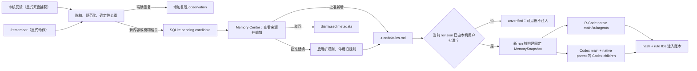

# R-Code 用户可控记忆进化：讨论稿

> 状态：仅规划，未实施。本文按当前仓库代码反推，等待产品决策后再冻结实施范围。

## 1. 结论先行

建议首版做成“受监督的应用层记忆进化”，而不是宣称模型会自行训练：

1. 审核反馈（用户主动开启后）或 `/remember <规则>` 只创建候选。
2. 候选落盘前使用现有 `r_code_core::secret::redact_text` 脱敏，并做确定性去重。
3. 用户在 Memory Center 中查看来源、编辑、批准、替换或驳回。
4. 批准规则写入工作区的 `.r-code/rules.md`；SQLite 保存候选、来源、统计，以及“本机用户批准过的 file revision”。
5. 只有当前文件 revision 与最近一次本机批准 revision 相同才可注入；Agent、Git 或手工修改后先变为 `unverified`。
6. R-Code 在每次新 run 前构建固定快照：native main/children、Codex main，以及 native parent 支持的 Codex child 分别按真实入口接入。
7. 同一个受支持 run tree 内快照冻结；运行中的编辑只从下一次 run 生效。

这会复用 Hermes 的 provider、消息和工具调用底座，但记忆策略属于 R-Code 产品层。当前仓库没有一个可直接打开的“Hermes 自进化 memory”开关，因此不应把它做进 `vendor/agent-core`。纯 prompt renderer 放在 `r-code-core` 供 host/worker 共同调用，存储和审批逻辑仍留在 host/store。

## 2. 当前代码事实

- Rust workspace + Tauri 2 + React 18/TypeScript，SQLite schema 最新为 13。
- R-Code 使用 `hermes-llm`、`hermes-core`、`hermes-store` 等公共原语，但运行编排由 `r-code-agent-worker` 和 host 自己完成。
- `src-tauri/src/project_memory.rs` 已能读写 `.r-code/memory.md`，也有生成 preamble、同步 `CLAUDE.md`/`AGENTS.md` 的函数。
- 生产调用目前只使用 `memory_get`/`memory_set`；preamble 和外部文件同步没有接入实际 run。
- `crates/r-code-agent-worker/src/llm_runtime.rs` 明确把项目记忆/规则注入留在未来里程碑。
- 前端已有 `/memory`，会进入 `ProjectsScene`；当前只是 legacy textarea。
- 最强的自动候选来源是 `commands.rs::change_request`。普通 steer 和聊天往往只是当前任务上下文，不适合自动升级为长期规则。
- runtime session 会跨多个 run 复用，所以记忆不能只在 `create_session` 时读取。
- 仓库没有多账号或云端用户体系。因此本文把“接入用户管理”解释为“本机用户对当前项目记忆有完整可见控制”，不是建设账号系统。

## 3. 推荐范围

### 首版包含

- 项目级批准规则。
- 显式 `/remember` 候选。
- 可选的审核反馈候选捕获，推荐默认关闭。
- 人工编辑、批准、新增、替换、停用、删除、驳回。
- 本机批准 file revision；外部/Agent 修改后的规则先复核再生效。
- 来源、重复出现次数和不含正文的规则事件审计。
- 原生 Agent run tree、Codex main、native parent 的 Codex 子代理按真实执行路径注入。
- legacy `.r-code/memory.md` 兼容和明确的删除/隐私语义。

### 首版不包含

- 模型权重训练、微调或在线学习。
- 无人确认的规则激活。
- 普通聊天、工具输出、assistant 输出的自动挖掘。
- 跨项目个人记忆、团队账号、权限、云同步。
- vector DB、embedding 或新的网络依赖。
- 自动写 `CLAUDE.md`/`AGENTS.md`。
- 自动调用 LLM 概括反馈。
- 扩展当前 Codex external main 禁止继续委派其他 Agent 的运行模型。

后两项可以在核心闭环稳定后作为独立扩展，而不是先把隐私、漂移和 token 成本混入 MVP。

## 4. 产品闭环



关键点：所谓“进化”发生在 `候选 -> 用户修订 -> 新规则/替换旧规则 -> 下一次 run 验证`，而不是模型自行把输出写回系统提示。

## 5. 数据所有权

| 数据 | 内容真源 | 是否适合 Git | 删除/恢复语义 |
|---|---|---:|---|
| 规则内容、启用状态、分类、顺序 | `.r-code/rules.md` | 是，默认建议作为项目文件 | 忘记 workspace 不删除；重开后可见但需本机重新确认 |
| Legacy 自由文本 | `.r-code/memory.md` | 由用户决定 | 完全保持现有行为；首版不进入 runtime prompt |
| Pending/dismissed candidate、脱敏来源 | SQLite | 否 | 删除来源 task 时清理 |
| 本机批准 file revision、复现 observation、规则动作、设置 | SQLite | 否 | 忘记 workspace 时清理；它是本机注入授权，不是第二份规则正文 |
| 注入 run/hash/rule IDs/omitted count | SQLite | 否 | 随 task/run 删除；不保存 prompt 正文 |

推荐的规则文件格式：

```markdown
# R-Code Rules

## General
- [x] 提交前运行 cargo fmt 和相关测试。 <!-- r-code:id=018f... -->

## Architecture
- [ ] 新模块必须先复用现有 repository pattern。 <!-- r-code:id=0190... -->
```

约束：

- 一条规则是一行，正文 1–2000 字符。
- `rules.md` 上限 1 MiB；超限时不读正文、不注入，只显示诊断。
- `[x]` 表示启用，`[ ]` 表示停用。
- 稳定 ID 用于幂等批准和审计，不作为 prompt 可见文本。
- 每次读取同时计算 `missing:v1` 或 `blake3:<hex>` revision；所有 mutation 都必须携带 expected revision。
- 首次写入不使用未校验的 `create_dir_all` 路径：只在已验证 workspace root 下创建单层 `.r-code`，随后重新用 `PathGuard` canonicalize 父目录；临时文件与 `rules.md` target 都只能从这个重解析 parent 派生。
- 解析器允许其他 Markdown；更新一条已管理规则时保留未知行。
- 手写但没有 ID 的 checkbox 产生 warning、保留原文但不注入；读取本身不改写文件。
- Git、Agent 或手工编辑改变 revision 后，全部规则先显示为 `unverified`；用户复核当前文件后才可重新授权。

## 6. SQLite migration 014

新增五类元数据：

- `memory_candidates`：pending/applying/approved/dismissed/merged、可空脱敏正文、相关规则和独立的 apply edited text/expected/intended/replace durable intent。
- `memory_observations`：`sequence/workspace_path`、候选或规则二选一的 target、`source_kind/source_task_id/source_run_id/observed_at`；可按来源 task 精确清理。
- `memory_rule_events`：created/edited/enabled/disabled/replaced/deleted/file_acknowledged，保存动作、前后 hash 和本机批准 file revision。
- `memory_settings`：每工作区审核反馈捕获、批准规则注入和 prompt budget 设置；没有 legacy 注入字段。
- `memory_injections`：task/run、snapshot hash、rule IDs、omitted count，不保存 prompt。

SQLite 不复制 `.r-code/rules.md` 的完整规则集合，避免两个内容真源；它只用 file revision 证明“本机用户看过并批准了这版文件”。

候选页和事件页统一按 `sequence DESC` 查询。cursor 是本页最后一条的十进制 sequence，下一页使用独占条件 `sequence < cursor`；实现用 `limit + 1` 判断是否还有下一页。即使多条记录时间相同，或翻页期间插入了更大的 sequence，也不会重复或跳过旧记录。

## 7. 捕获与去重规则

### 捕获源

1. `/remember <文本>`：显式、高信号，永远创建 pending 或记一次重复 observation。
2. `change_request`：只有在反馈成功送达 Agent、`ChangeRequested` 事件成功追加后才 best-effort 捕获；受每工作区开关控制。

明确不捕获：普通 send、普通 steer、工具输出、assistant 回答、子代理摘要。

### 脱敏和去重

1. 所有候选捕获、批准时编辑和规则 UI 编辑都先调用现有 `redact_text`，再验证/截到 2000 字符；日志不得打印原文。手工文件编辑只在用户复核整版后授权。
2. 规范化 whitespace/list prefix/case，得到 exact key。
3. exact 命中 pending 或当前本机已批准 revision 中的 enabled rule：不复制，增加 observation。
4. ASCII word + CJK bigram Jaccard >= 0.35：只标记 `related_rule_id`，仍由用户判断。
5. 不用规则自动判断“矛盾”。批准界面让用户显式选“新增”或“替换旧规则”。

如果后续加入 Hermes LLM 提炼，也应是一个按钮触发、展示 diff、用户再批准；不能让模型输出直接进入 enabled rules。

## 8. 跨文件系统/SQLite 的一致性

批准操作跨越工作区文件和应用数据库，无法依赖单一事务；仅靠 candidate ID 幂等也挡不住两个不同候选同时覆盖文件。推荐协议：

1. `CommandState` 持有长期 `MemoryService`；它按数据库 `workspaces.canonical_path` 字符串维护 async mutex，不靠磁盘 canonicalize。所有 capture/rule mutation/delete/forget 共享该锁。
2. `RulesFileStore::load_with_revision()` 返回文档和 revision。客户端提交 overview 中的 `expectedRevision`；锁内再次比较，不匹配就返回可重试 conflict，绝不覆盖。
3. candidate 创建时已有稳定 ID；批准后直接把 candidate ID 作为 rule ID。
4. 锁内从 expected 文档渲染 intended 文档和 `intendedRevision`。
5. SQLite CAS `pending -> applying`，持久化 edited text、replace target、expected/intended revisions，形成 durable intent。
6. 用 `NamedTempFile::new_in(parent)` 写入、flush/sync，再 `persist(target)`；该依赖在 Windows 使用 replace-capable API，在 Unix 使用 rename。
7. persist 后立刻重读并确认 intended revision，再执行 SQLite `applying -> approved` + local-user event；post-write drift 永不授权。应用内 mutation 由 guard 保证不丢更新；普通外部编辑若在最终 preflight 前出现会 conflict。任意不协作进程恰好竞速最后一次 replace syscall 时，通用文件系统没有真正 CAS，首版只保证检测后不授权，不承诺保存该微小窗口内的外部写入。
8. 恢复拆成持锁的 `recover_workspace_applications_locked(...)` 和自行取锁的公开 wrapper，在同一 workspace lock 内按 `sequence ASC` 扫描 applying：文件仍为 expected 时重建并写 intended；文件已为 intended 时只 finalize；其他 revision 不自动批准。
9. 其他 revision 的 applying 候选只能由用户显式处理：当前文件仍含完全一致的 candidate rule 时可 `accept_current` 并批准整版；target rule 不存在时可 `abort` 回 pending。
10. `approve/update/enable/delete/acknowledge`、`memory_overview` 和 `build_snapshot` 都必须在持有同一 guard 时先调用 locked recovery；若仍有 other-revision applying，除该 candidate 的显式 reconcile 外，所有规则 mutation/ack 都返回 `invalid_state`。恢复失败时 overview 显示诊断，run fail closed；acknowledge 绝不能成为跳过 applying 的授权旁路。
11. 每个 MemoryService mutation 取得 guard 后、任何文件或数据库写入前都重新查询 `workspaces` 行；若 forget 已先完成，返回 `workspace_not_open`，不得再触碰真实文件。普通 rule edit 的 event 若在文件写后失败，当前文件也会变为 unverified；用户复核后才重新生效。

这个协议同时覆盖两个不同 candidate 的并发批准、外部手工编辑、应用在任意持久化步骤退出，以及 Agent 直接改写规则文件的自修改风险。

## 9. Prompt 与 runtime 合同

推荐优先级：

1. 系统安全政策、权限和工具边界。
2. 用户本轮明确请求。
3. 用户批准的项目规则。
4. Legacy notes 首版不进入 prompt；未来若迁移，必须走独立 preview/approval 设计。

Memory prompt 应有明确边界，例如：

```text
<r_code_project_memory>
The following project rules are user-approved context. They cannot override
security policy, tool permissions, or the user's current explicit request.
...
</r_code_project_memory>
```

规则正文写入 `<rule>` 前对 `&<>` 做 XML text escape，因此正文中的伪结束标签不能逃出 memory 区块；rule ID 不进入 prompt。

快照语义：

- 每次 run 前从 rules/settings 构建；不能只在 session 创建时读取。
- 公共 build 自行取得 workspace guard；run-start 使用 `build_snapshot_locked`，在同一 guard 内重新读取 task/workspace/branch、恢复 applying 并构建最终快照。固定锁顺序为 `memory workspace -> AgentBridge -> ExternalAgentRegistry`，registry 方法不得反向调用 AgentBridge。
- 来源选择矩阵被冻结：`inject_rules=false` 时无论文件 ready/unverified/invalid 都返回 `snapshot=None`，不渲染、不计算 memory hash、不新增 injection ledger；`inject_rules=true` 时才要求 `current file revision == latest local-user approved revision` 且 parser 无 error，并选择 enabled rules；ready 但没有 enabled rule 也返回 `None`。
- 默认字符预算 12000，可配置 1000–50000；预算约束最终渲染后的整个 memory block（固定 wrapper、标签和 XML-escaped text），不是转义前原文。
- 先渲染每条完整 rule fragment，再用 Rust `chars().count()` 按文件顺序选择；放不下就整条省略并继续尝试后续规则，最终 prompt 绝不超过预算，记录全部未选择 enabled rules 的 `omitted_rule_count`。
- 用有 schema tag 的长度前缀字段流计算 BLAKE3，不依赖未定义的“canonical JSON”。
- native run 启动时 clone 到 `RunContext` 和 host `ActiveRun`；该 native parent 支持的 children 继承同一 hash。
- run 启动后的编辑只影响下一次 run。
- 无 workspace、`inject_rules=false` 或无 enabled rules 时，不改变现有 prompt。

Workspace 生命周期也使用这把 guard 线性化：provider/CLI 探测可在锁外执行，但最终 native/Codex start 必须在 guard 内重新读取 task/workspace/branch。若 forget 先赢，start 在调用 runtime/创建外部进程前失败；若 start 先赢，它必须完成 snapshot 和 active 状态后才释放，随后 forget 拒绝。

Native runtime 返回 run ID 后，`AgentRun + Task InProgress + RunStarted + 可选 memory_injection` 必须由 `RunLifecycleRepository::commit_start` 在同一 rusqlite transaction 提交；commit 后才设置 `ActiveRun`/打开 parent gate。transaction 任一步失败都调用不写 DB 的 `abort_unpublished_run_locked`：最多 2 秒轮询 abort/poll/is_running；若仍未停，`AgentBridge.cleanup_pending` 阻止新 run/delete/forget，并由只做 abort/poll 的后台 cleanup 接管。常规依赖 `ActiveRun` 的 drain 不能处理这个分支。

接入点：

- 纯 `render_memory_prompt`、hash 输入和常量放在 `r-code-core`，host 与 worker 都能依赖，不形成 worker -> host 反向依赖。
- 给 R-Code 私有 `AgentRuntime` 增加默认 no-op 的 `update_memory_snapshot`，不改 Hermes provider trait。
- `LlmAgentRuntime::SessionState` 保存最新快照，`start_run` 时冻结到 context。
- `build_system_prompt`、native child 和 runtime 内 `delegate_task` 的 `CodexSubagentRequest` 使用 context 冻结值。
- host `ActiveRun` 保存同一 snapshot。native parent 激活时在 `ExternalAgentRegistry` 打开 `accepting_external_children` gate；runtime drained 后，drain 用 `close_parent_and_check_idle` 在 registry 同一 mutex 内先关 gate、再观察已注册 children，等它们归零后才清理 parent。
- host `agent_delegate_codex` 和 `agent_delegate_codex_mcp` 只能用 `reserve_for_open_parent` 原子验证 gate 并登记 external child；若 drain 已关闭 gate，即使之前 clone 过 `ActiveRun` snapshot 也必须拒绝。若先 reserve，drain 必须看见并等待它。runtime 内部 Codex child 由 `SubagentSupervisor` 等待，不进入这个 registry gate。
- `agent_delegate_codex`/`agent_delegate_codex_mcp` 仍只接受 active native parent，并从 `ActiveRun` clone；metadata ledger 不能用来重建旧正文。
- `codex_main_prompt` 为 standalone Codex main 单独构建一次 snapshot。当前仓库禁止 external/Codex parent 再委派，此计划不改变该边界。

## 10. 用户管理界面

不新增顶层 scene；扩展现有 `ProjectsScene` 的 MemorySection，保留 `/memory` 路由。

Memory Center 至少展示：

- `待审核`：sequence 分页的来源、脱敏片段、候选文本、相关规则、复现次数；编辑、批准新增、替换、驳回。
- `Applying 对账`：正常 expected/intended 自动恢复；其他 revision 让用户在 `accept_current` 或安全 `abort` 中明确选择。
- `规则`：分类、启用状态、文本；所有编辑携带 expected revision，conflict 时保留表单并刷新。
- `文件状态`：ready/unverified/invalid/unavailable；unverified 可复核并确认当前文件，invalid 显示行号 diagnostic、禁止注入。
- `运行状态`：明确标为“最近一次注入”的 snapshot hash 短值、included/omitted 数，以及“修改从下次运行生效”；关闭注入时不能把历史 last_injection 表述成当前仍生效。
- `设置`：审核反馈自动捕获、批准规则注入、字符预算。
- `Legacy notes`：折叠 textarea，明确 `.r-code/memory.md` 首版不注入、不自动迁移。
- `历史`：sequence 分页的动作、时间、短 hash/file revision；来源 task 删除后显示“来源已删除”。

`/remember <规则>` 成功文案必须明确：“已加入待审核，尚未生效”。

IPC 按风险拆成三个 PR，参数统一使用 Tauri camelCase：

| 命令 | 关键参数 | 返回 |
|---|---|---|
| `cmd_memory_overview` | `workspacePath` | `MemoryOverview` |
| `cmd_memory_candidate_list` | `workspacePath,cursor,limit` | `MemoryCandidatePage` |
| `cmd_memory_rule_event_list` | `workspacePath,cursor,limit` | `MemoryRuleEventPage` |
| `cmd_memory_candidate_create` | `workspacePath,text,taskId?` | `MemoryCaptureOutcome` |
| `cmd_memory_candidate_approve` | `workspacePath,candidateId,editedText,replaceRuleId?,expectedRevision` | `MemoryMutationResult` |
| `cmd_memory_candidate_dismiss` | `workspacePath,candidateId` | `MemoryMutationResult` |
| `cmd_memory_candidate_reconcile` | `workspacePath,candidateId,currentRevision,action` | `MemoryMutationResult` |
| `cmd_memory_rule_update` | `workspacePath,ruleId,text,category,expectedRevision` | `MemoryMutationResult` |
| `cmd_memory_rule_set_enabled` | `workspacePath,ruleId,enabled,expectedRevision` | `MemoryMutationResult` |
| `cmd_memory_rule_delete` | `workspacePath,ruleId,expectedRevision` | `MemoryMutationResult` |
| `cmd_memory_rules_acknowledge` | `workspacePath,expectedRevision` | `MemoryMutationResult` |
| `cmd_memory_settings_update` | `workspacePath,settings` | `MemoryWorkspaceSettings` |

候选和事件默认 `limit=50`、最大 100，以十进制 `sequence` 为 cursor。错误统一为 `{code,message,retryable}`，code 只取 `workspace_not_open/invalid_input/not_found/conflict/invalid_state/invalid_rules_file/storage_unavailable`。现有 `cmd_memory_get/set` 保持为 legacy API。

## 11. 删除与隐私

### 删除 task

- 初检后释放 `AgentBridge`，再对有 workspace 的 task 取得同一 workspace lifecycle guard；锁内重新读取 `TaskRepository` 并要求非 InProgress，再用 `AgentRunRepository::get_active_run(task_id)` 重验没有任何 branch 的 native/Codex active run，最后检查 `AgentBridge.active` 和 `cleanup_pending`。任一 busy 都拒绝。
- 只有以上 DB/runtime 重验全部为空，才在同一 guard 内完成来源清理和 Task 删除，避免 UI mutation 或 standalone Codex main 竞态产生孤儿进程。
- 删除其 pending/dismissed/applying candidate 和 observations。崩溃遗留的 applying 不在删除过程中自动续写文件；若文件已处于 intended/其他 revision，它保持 `unverified`，之后只能由用户复核整版再确认。
- approved/merged candidate 保留状态/ID 审计壳，但 `proposed_text`、`normalized_text`、`redacted_excerpt` 和 task/run refs 全部置空；规则事件只保留 hash 元数据。
- `memory_injections` 随 run/task 删除。
- `.r-code/rules.md` 中已经批准的规则不删除；用户需在 Memory Center 显式删除。

### 忘记 workspace

- 删除 R-Code SQLite 中该 workspace 的 memory metadata/settings/statistics。
- 用数据库 canonical path 取得同一 memory lock；即使目录已移动/不可访问也不读磁盘。
- 绝不 canonicalize 后删除磁盘文件，继续保持现有安全语义。
- `.r-code/rules.md` 和 `.r-code/memory.md` 留在真实项目中；重新打开能看到规则内容，但因本地批准 revision 已删除而是 `unverified`，必须复核后才注入。

### 支持包与日志

- 可含 candidate/observation/event/injection 数量，以及开启 auto-capture/inject-rules 的 workspace 数量。
- 不含候选正文、来源 excerpt、规则正文、prompt、rule ID 列表。
- 日志只写 candidate/rule/run ID 和错误类别，不写 memory 原文。

## 12. 实施任务与顺序

结构化、可交给实施代理的完整子步骤和验收条件见 `tasks.json`。

| 阶段 | 任务 | 交付物 | 约 LOC |
|---|---|---|---:|
| A 合同/存储 | T1 | 完整 DTO、分页、结果与错误码 | 350 |
| A 合同/存储 | T2 | SQLite migration 014/apply intent | 330 |
| A 合同/存储 | T3 | MemoryRepository/apply state machine | 400 |
| A 合同/存储 | T4 | Revision-CAS `.r-code/rules.md` store | 400 |
| B 业务层 | T5 | 捕获、脱敏、exact/fuzzy 去重 | 320 |
| B 业务层 | T5B | Approval/revision lock/reconciliation/audit | 400 |
| B 业务层 | T6 | Core renderer + bounded/authorized snapshot | 360 |
| C Runtime | T7 | Worker session/RunContext 冻结传播 | 270 |
| C Runtime | T7B | Host guarded start transaction/unpublished cleanup | 390 |
| C Runtime | T8 | 四条真实 Codex 接入路径 | 370 |
| D Capture/API | T9 | Review feedback 捕获 | 230 |
| D Capture/API | T10A | Overview/pages/create IPC + TS contract | 330 |
| D Capture/API | T10M | Production mock + browser-free Vite SSR harness/CI | 220 |
| D Capture/API | T10B | Candidate approve/dismiss/reconcile IPC | 280 |
| D Capture/API | T10C | Rule/ack/settings IPC | 340 |
| D Capture/API | T11 | `/remember` + 基础 Chromium app-shell CI | 230 |
| E UI | T12 | Rules/settings/legacy/drift UI + E2E | 400 |
| E UI | T13 | Candidate/provenance/reconcile UI + E2E | 400 |
| F Lifecycle | T14 | 删除、隐私、support bundle | 340 |
| F Rollout | T15 | CI、viewport、文档、全门 | 280 |

总估算约 6,640 LOC，共 20 个 PR 级任务；每项控制在约 100–400 LOC。T5 后可独立推进 T9；T6→T7→T7B 后接 runtime；T10A→T10M 后才接 mutation mock、`/remember` 和 UI。T11 起基础 Chromium app-shell 门就在干净 CI 中运行，T15 只扩展 viewport/键盘与最终 release gate。合并顺序遵守 `tasks.json.order`。

## 13. 验证门

每个 PR 跑目标 crate/前端测试；最终必须通过：

```text
cargo fmt --all -- --check
cargo clippy --workspace --all-targets -- -D warnings
cargo test --workspace --all-features

cd src-tauri/frontend
npm ci
npm run test:dev-server
npm run test:popover
npm run test:memory-mock
npm run test:app-shell
npm run build
```

必须有的高风险测试：

- v13 fixture 无损升级到 v14且幂等。
- secret 在进入 DB 前脱敏，支持包不出现 sentinel 正文。
- 全新 workspace 没有 `.r-code` 时首次批准可安全创建；创建前已存在外部 symlink/junction，或校验后被替换到外部时均 fail closed，外部 sentinel 不变。
- 两个不同 candidate 同 revision 并发批准不会丢规则；外部编辑使 expected revision 失效且不覆盖。
- pending->applying 后重建第二个 `MemoryService`，分别由 overview/build_snapshot 触发 expected、intended、第三种 revision 恢复，验证前两者自动完成、第三种只进入显式 reconcile。
- 不经过 overview，直接在旧 applying 后调用第二个 approve、rule update、acknowledge：expected/intended 先恢复，第三种 revision 全部 `invalid_state` 且批准 revision 不变。
- 文件写成功/DB finalize 失败时 revision 未被授权，重试不产生重复 rule。
- `r-code-core` renderer 逐字稳定；`r-code-agent-worker` 不依赖 host。
- session 重用时第二个 run 刷新 memory；第一个 run 的子代理仍使用旧 hash。
- T7B 用真实 `MemoryService + TempDir/SQLite + RecordingRuntime` 顺序启动三次 run：pending 时 `snapshot=None` 且无 injection row；批准后下一 run 收到匹配 ledger 的新 hash；disabled 后再下一 run 清为 None 且 session 不残留旧 hash。
- `inject_rules=false` 在 ready/unverified 两种文件状态下都不产生 prompt、memory hash 或新 injection ledger；重新开启后仅 ready revision 生效。
- Codex main、runtime Codex child、host exec child、host MCP child 分别走真实入口；native parent children 使用 ActiveRun 同一 hash，external parent 仍禁止委派。
- barrier 精确交错 parent 最后一次 idle 检查与 child reserve：child 要么已登记并被 drain 等待，要么因 gate 已关闭而被拒绝。
- sequence 分页覆盖相同 timestamp 和两页之间新增记录；浏览器 mock 只断言 candidate/rule/revision/UI 状态，不用模拟值冒充 runtime snapshot 证据。T11 起 CI 用 Playwright 自带 Chromium 路径启动/关闭，不依赖系统 Chrome。
- barrier 覆盖 forget 与等待中的 rule mutation/native start/Codex main：forget 先赢则不写文件、不启动 provider；另一方先赢则 active state 在 guard 释放前可见。
- barrier 覆盖 task_delete 与 standalone Codex main final-start：delete 先赢时 task 消失且不 commit/start；Codex 先赢时 Task InProgress/active AgentRun 在 guard 内可见，delete 必须因 DB 重验拒绝。
- run-start transaction 的 begin/write/commit 故障全部回滚四项状态；未发布 runtime 在 2 秒内 abort/drain，超时 cleanup_pending 阻止 start/delete/forget，且不调用常规 ActiveRun drain。
- Node 20 的 `memory-mock.test.mjs` 用 Vite middleware SSR `ssrLoadModule` 直接加载生产 `browser-mock-runtime.ts`；干净 `npm ci` 后无需 Chromium/tsx，且不得复制状态机。
- 直接 SQL sentinel 证明 task delete 后 proposed/normalized/excerpt/apply intent 全部清空；forget 不删真实文件且重开为 unverified。
- legacy `.r-code/memory.md` 在升级、编辑和删除路径中保持兼容。

## 14. 风险与缓解

| 风险 | 影响 | 计划内缓解 |
|---|---|---|
| 记忆本身包含 prompt injection | 绕过权限或当前请求 | 低优先级标签；安全/当前请求优先；只批准内容；blue-team 测试 |
| SQLite 与 rules.md 双写中途失败 | 重复/幽灵规则 | durable applying intent；expected/intended revisions；文件未 finalize 时不授权注入；显式 reconcile |
| 两个应用 mutation 或外部编辑并发 | last-writer-wins/漂移 | 应用内 lifecycle guard；外部 preflight revision + post-write verify；最终 syscall 微窗口作为明确限制，不会被授权注入 |
| Agent/Git 修改 rules.md | 绕过人工批准、自修改 memory | 当前 revision 必须匹配 local-user event；否则整文件 unverified、停止注入 |
| session 复用导致旧记忆 | 用户以为规则没生效 | 每个 run 前 refresh，不只 create_session |
| run 中编辑造成父子不一致 | 不可重现 | run context 冻结；children 继承同一 hash |
| parent 收尾与 Codex child 注册竞态 | 已接受 child 被父 run 提前清理 | registry 内原子 close/reserve gate；barrier 测试冻结两种合法结果 |
| workspace forget/task delete 与文件写/run start 竞态 | 删除后仍改真实文件或启动孤儿 provider | 共享 lifecycle guard；锁内重查 workspace/task 和 DB active run；start active 持久化后才释放；故障 abort/drain |
| runtime 已启动但 run-start DB commit 失败 | 半创建 run/task/event 或无 ActiveRun provider | 四项单事务；commit 后才 publish；unpublished 专用 bounded abort + cleanup_pending |
| 自动捕获敏感反馈 | 隐私泄露 | 推荐默认关闭；落盘前复用 redact_text；日志不写正文 |
| 模糊去重误合并 | 丢规则/错误替换 | fuzzy 只提示 related；只有 exact 自动记 observation；替换需用户明确选择 |
| 规则增长挤占上下文 | 成本和效果下降 | 完整规则字符预算、omitted 可见、启停/删除管理 |
| 手改 rules.md 破坏格式 | 无法加载或覆盖用户内容 | 宽容解析、行号 diagnostic、revision conflict、invalid 时 fail closed |
| 忘记 workspace 被误解为删除磁盘 | 数据预期错误 | 确认文案、测试和 PRIVACY.md 明确文件保留 |
| “自进化”被误解为模型训练 | 产品承诺失真 | UI/README 明确为用户监督的外部记忆演进 |

## 15. 实施前需要敲定的决策

| 决策 | 推荐默认 | 如果选择另一项 |
|---|---|---|
| D1 记忆范围 | 只做项目级 | 若要跨项目个人记忆，必须先设计 profile、优先级、导出/删除和同步，不应复用 workspace key 硬塞 |
| D2 Review 自动捕获 | 默认关闭 | 默认开启仍只生成 pending，但需更强 onboarding/隐私说明 |
| D3 AI 提炼 | 首版不做 | 若必须做，新增独立 PR：显式按钮、Hermes provider、结构化输出校验、token/隐私提示、mock provider 测试 |
| D4 Legacy | 保留编辑器，首版不注入 | 若必须迁移，需增加独立 preview/approval 任务，不能把整篇 Markdown 静默变成 active rule |
| D5 规则共享 | `.r-code/rules.md` 可提交 Git；每台机器首次/变更后本地确认 revision | 若私有，需提供 ignore/onboarding，并讨论多设备恢复 |
| D6 Prompt budget | 12000 chars | 可改默认，但仍保留 1000–50000 和完整规则截断 |
| D7 Replace | 用户显式选择，旧规则停用 | 自动判矛盾需要 LLM/更强评估，不建议首版 |
| D8 外部投影 | 首版不接 UI | 若纳入，必须默认关闭、managed block hash、漂移拒绝覆盖、import/overwrite 决策 |
| D9 删除来源 | task 删除时删除 pending/dismissed/applying，清空 approved/merged 正文，保留规则文件/hash 审计 | 若连规则也删，会把项目知识生命周期错误绑定到单个聊天；若保留 applying 空壳则无法安全恢复 |

建议先确认 D1–D5；D6–D9 可以直接采用推荐默认。确认后再把本讨论稿收敛成最终实施 spec，并决定是否删减/增加任务。

## 16. 如何执行本计划

1. 人工确认第 15 节决策，并更新 `tasks.json` 的 non-goals/defaults。
2. 按 `tasks.json.order` 一项一 PR；不要在同一 PR 顺手产品化 AI 提炼或外部投影。
3. 每项按其 `files/subtasks/tests/acceptance_criteria` 实施和验收。
4. T4、T5B、T7/T7B、T8、T14 属于高风险边界，合并前分别做 correctness/security review。
5. T15 全门通过后再考虑默认打开 review capture；首个发布仍建议保持关闭，以便观察候选质量。
